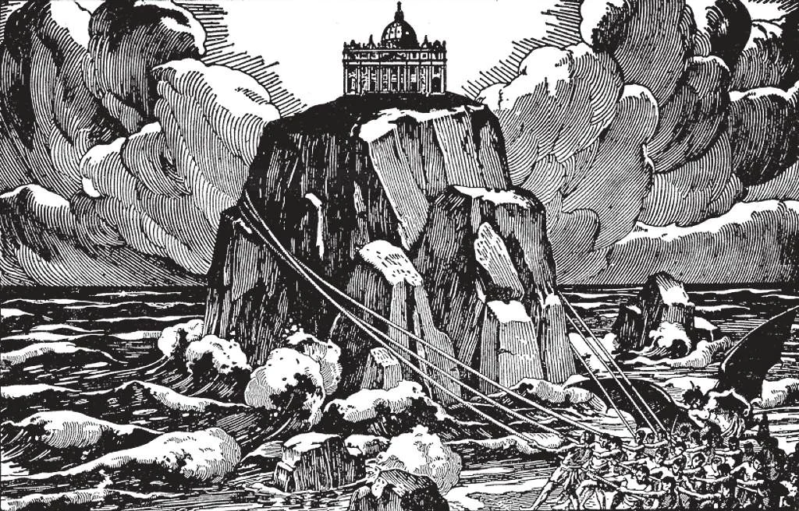

# 69. Indefectibilidade da Igreja

*A Igreja Católica perdurará até o fim dos tempos, pois está fundada sobre uma rocha. Os poderes do mal baterão em vão contra ela. Quebrar-se-ão e perecerão, mas a Igreja permanecerá, indefectível. O testemunho de quase dois mil anos prova a perpetuidade da Igreja. Nada que malícia e inveja pudessem inventar; nada que o mundo, a carne e o diabo pudessem fazer foi deixado sem tentar nos últimos 1900 anos. Ainda a Igreja está conosco, exatamente como Cristo a fundou, e mais forte do que nunca.*

**O que se entende pela indefectibilidade da Igreja Católica?**

— Pela indefectibilidade da Igreja Católica entende-se que a Igreja, como Cristo a fundou, durará até o fim dos tempos.

> O Arcanjo Gabriel anunciou a Maria que Cristo "será rei sobre a casa de Jacó para sempre; e de seu reino não haverá fim" (Luc. 1:32-33).

1. Cristo pretendeu que Sua Igreja perdurasse até o fim do mundo. Deve ser indestrutível e imutável; possuir indefectibilidade. Cristo, o Próprio Deus, dificilmente teria vindo, e com tão incrível dor e trabalho fundado uma Igreja que morreria com os Apóstolos.

> Veio para salvar todos os homens. Aqueles que viveriam em idades futuras precisavam de salvação tanto quanto o povo dos tempos Apostólicos.

2. Cristo disse a Pedro: "Sobre esta pedra edificarei Minha Igreja, e as portas do inferno não prevalecerão contra ela" (Mat. 16:18). Pelas "portas do inferno," quis dizer todo o poder do diabo; todos os tipos de ataques, violência física bem como falso ensino.

> Cristo promete aqui que a Igreja seria assaltada sempre, mas nunca vencida. Esta promessa de Nosso Senhor foi provada por quase 2000 anos pelos fatos da história. Nem um dos perseguidores da Igreja prevaleceu sobre ela. Ao contrário, muitos deles vieram a um fim temível. Sempre haverá Papas, bispos e leigos, para compor a Igreja; as verdades ensinadas por Nosso Senhor sempre serão encontradas em Sua Igreja.

3. Após dizer a Seus Apóstolos para ensinar a todas as nações, Cristo disse: "Eis que Estou convosco todos os dias, até a consumação do mundo" (Mat. 28:20).

> Como os Apóstolos não deveriam viver até o fim do mundo, Cristo deve ter estado dirigindo-se a eles como representantes de uma Igreja perpétua.

4. Os Próprios Apóstolos entenderam que Cristo quis dizer que Sua Igreja deveria perdurar. Após organizar comunidades Cristãs, nomearam sucessores em seu lugar, para viver após eles e levar adiante a Igreja.

> Os Apóstolos instruíram estes sucessores a ordenar por sua vez outros bispos e sacerdotes. Todos estes atos foram para assegurar a perpetuidade da Igreja.

5. Cristo pretendeu que a Igreja permanecesse como Ele a fundou, para preservar o inteiro do que ensinou, e as marcas brilhantes que lhe deu no princípio. Se a Igreja perdesse alguma das qualidades que Deus lhe deu, não poderia ser dita indefectível, porque não seria a mesma instituição. Indefectibilidade implica imutabilidade.

> Nosso Senhor prometeu permanecer com a Igreja, assisti-la, e enviar o Espírito Santo para permanecer nela. Deus não muda: "Eis que Estou convosco todos os dias, até a consumação do mundo" (Mat. 28:20).

6. Por causa de sua indefectibilidade as verdades reveladas por Deus sempre serão ensinadas na Igreja Católica. Santo Ambrósio disse: "A Igreja é como a lua; pode minguar, mas nunca ser destruída; pode ser obscurecida, mas nunca pode desaparecer."

> Santo Anselmo disse que a barca da Igreja pode ser varrida pelas ondas, mas nunca pode afundar, porque Cristo está lá. Quando a Igreja está em maior necessidade, Cristo vem em sua ajuda por milagres, ou levantando homens santos para fortalecê-la e purificá-la. É a barca de Pedro; quando a tempestade ameaça afundá-la, o Senhor desperta de Seu sono, e comanda os ventos e as ondas à calma: "Cala-te, emudece!"

**A Igreja Católica de fato provou-se indefectível?**

— A Igreja Católica tem, através de sua longa história, provado-se indefectível, contra todos os tipos de ataque de dentro e de fora, contra toda perseguição e toda heresia e cisma.

> Como seu Fundador foi perseguido, assim a Igreja Católica tem sido e sempre será perseguida. "Sereis levados perante governadores e reis por Minha causa" (Mat. 10:18). "E sereis odiados por todos por causa do Meu nome" (Mat. 10:22). "Nenhum discípulo está acima de seu mestre, nem o servo acima de seu senhor" (Mat. 10:24). "Entregar-vos-ão a concílios, e sereis açoitados nas sinagogas" (Mar. 13:9). "Prender-vos-ão e perseguir-vos-ão" (Luc. 21:12).

1. A Igreja sobreviveu a trezentos anos de incrível perseguição sob a Roma pagã. Dos 33 Papas que governaram antes do Édito de Milão, 30 morreram como mártires. Aquele poderoso Império, com sua força colossal, perante cujo estandarte as nações tremiam, não pôde matar a Igreja infante ou parar seu progresso. Em pouco tempo, os Papas estavam governando onde os imperiais Césares haviam emitido éditos contra a Igreja Cristã.

> O Império Romano travou dez ferozes perseguições contra a Igreja, mas não pôde destruí-la. No ano 313, o Imperador Constantino foi convertido, e concedeu à Igreja liberdade pelo Édito de Milão.

2. Então por dois séculos, hordas de bárbaros varreram sobre a Europa civilizada, destruindo o velho Império Romano. A Igreja não apenas sobreviveu, mas converteu e civilizou os bárbaros.

> A providência sempre vigilante de Deus trouxe a conversão do rei Franco Clóvis, com um grande número de seus guerreiros. Este foi o princípio do firme estabelecimento da Igreja no reino Franco, embora missionários tivessem ido lá desde o primeiro século. No oitavo século, São Bonifácio converteu a Alemanha Central e Setentrional, até então o lar do violento paganismo.

3. Por nove séculos, o Maometanismo ameaçou a civilização Cristã. Foi a Igreja sob os Papas que instou as nações a ligarem-se contra o Maometanismo.

> No décimo sexto século, a ameaça Maometana foi removida.

4. Não apenas não-Cristãos, mas seus próprios filhos rebeldes têm perseguido a Igreja. Desde o princípio, a heresia tem atacado-a de dentro. E ainda a Igreja vive maior do que nunca, imutável, indefectível.

> A longa história da Igreja Católica é acompanhada por cisma e heresia, mas cada ataque apenas a fortaleceu. Continuou a viver e espalhar-se apesar de tudo e todos.

5. A Igreja é a ***Esposa de Cristo***, lançada na prisão, faminta, atirada às feras, pisada sob os pés, cortada, torturada, crucificada e queimada. Mas esta bela Esposa emerge de tudo isto no viço e frescor da juventude, serena, calma, imortal.
