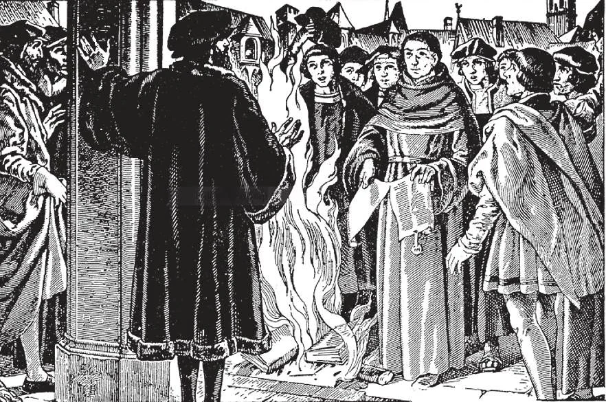

# 72. Igrejas Protestantes

*Sobre a recusa de Martinho Lutero de retratar suas declarações sobre os ensinamentos da Igreja, foi excomungado. Mas Lutero orgulhosamente rasgou a bula papal de excomunhão, e a queimou. O fogo que aquele incidente iniciou ainda não se apagou.*

**Quem são os Protestantes?**

— Em geral, Protestantes são aderentes das organizações religiosas que se separaram da Igreja Católica no décimo sexto século, ou de qualquer corpo religioso formado a partir delas.

1. O termo "Protestante" foi primeiro dado àqueles que protestaram contra o decreto da segunda Dieta de Speyer em 1529. Mais tarde o termo foi aplicado a todos os reformadores, todos opondo-se às doutrinas da Igreja.

> Mesmo hoje, o termo está incluído na nova fórmula da Declaração de Fé que o governante da Inglaterra deve fazer na coroação, dizendo: "Declaro que sou um Protestante fiel."

2. No décimo sexto século, ocorreu a revolta Protestante, este início de uma multidão de heresias, este evento triste que tem dividido a Cristandade por séculos. Martinho Lutero, um monge Agostiniano de Erfurt, ofendendo-se com o que acreditava ser uma falta de apreço por ele em Roma, combateu o ensino da Igreja sobre indulgências no ano 1517.

> O Papa ordenou a Lutero retratar seus ensinamentos; sobre sua recusa, foi excomungado em 1520. Seus ensinamentos heréticos espalharam-se como fogo selvagem sobre a Alemanha, ocasionando guerras religiosas; a paz veio apenas com a Paz de Augsburgo em 1555.

a. O Concílio de Trento reuniu-se (1545-1563) para expor de maneira clara os erros dos Protestantes, explicando a verdadeira doutrina da Igreja sobre aqueles pontos. Naquele tempo, o treinamento religioso havia relaxado; muitos não conheciam as verdadeiras doutrinas.

> Entre os erros de Lutero estavam estes: que não há poder supremo de ensino na Igreja; que governantes temporais têm o direito de interferir em questões eclesiásticas; que a Bíblia é o único guia para a fé; que cada homem deve interpretar a Bíblia segundo sua própria mente; que a fé é suficiente para a salvação; que o sacerdócio não imprime um caráter especial na alma de um homem, e que todos são ou podem ser sacerdotes, como resultado; que a Penitência não é um sacramento, mas uma mera invenção da Igreja; que a Missa não dá graça especial; que não há purgatório, etc.

b. No princípio, o Protestantismo espalhou-se rapidamente. Países inteiros, liderados por seus governantes, adotaram suas doutrinas. Na Suíça, Zwinglio e Calvino, e na Inglaterra Henrique VIII, por volta desta época aumentaram as defecções da Igreja. Mas logo houve outros tipos de Protestantismo.

> Hoje as divisões e subdivisões do Protestantismo são bem demais conhecidas para precisar comentário. Grandes números de Protestantes estão retornando à fé de seus pais. Enquanto isto, conforme as divisões se subdividem, a Igreja continua a crescer.

**Como podem ser agrupadas as denominações Protestantes?**

— Denominações Protestantes podem ser colocadas em três grupos: Primeiro, aquelas que requerem que uma igreja seja capaz de traçar sua origem aos tempos apostólicos. Creem num sacerdócio estabelecido por Cristo, e ordenado a oferecer sacrifício e administrar os sacramentos. Os Episcopalistas da Alta Igreja pertencem a este grupo.

> Infelizmente os Episcopalistas da Alta Igreja negam um fato: sua sucessão de bispos foi cortada quando se separaram da Igreja Católica, e assim não têm ordens válidas. Logo não podem ter quaisquer sacramentos exceto Batismo e Matrimônio. As ordens Anglicanas foram declaradas inválidas sob o Papa Leão XIII em 1896, após a questão de sua validade ter sido minuciosamente examinada.

## Igreja para Todo Homem

É frequentemente dito que a Igreja Católica é a Igreja dos ignorantes. Talvez; mas abaixo está uma lista parcial das muitas pessoas literárias brilhantes que em tempos recentes foram ***convertidas à Igreja Católica*** na vida adulta, com os olhos bem abertos. A Igreja Católica não é a Igreja dos ignorantes; é a Igreja dos sábios. A Igreja Católica é a Igreja para Todo Homem, qualquer que seja sua raça, cor, condição econômica, educação, pois na Igreja "não há 'Gentio e Judeu', 'circunciso e incircunciso' . . . 'escravo e homem livre'; mas Cristo é todas as coisas e em todos" (Col. 3: 11). Cristo veio para redimir todos os homens; a Igreja é Sua Voz Viva, Seu Corpo Místico. Obedeçamos.

> Achmed Abdullah, Maurice Baring, Edwin Harrison Barker, Anita Bartle, Robert Hugh Benson, Eugene Bishop, Katherine Bregy, Heywood Broun, Orestes Brownson, Dom Bede Camm, Cecil Chesterton, G. K. Chesterton, Isabel Clarke, Paul Claudel, Ethel Cook, Dr. Herbert E. Cory, F. Marion Crawford, A. A. Curtis, Dorothy Day, Christopher Dawson, Selden P. Delany, Mary Angela Dickens, Enid Dinnis, Owen Francis Dudley, Richard Lynn Edsal, Ethel Cook Elliot, Francis Perry Elliot, R. Willoughby Ferrier, Henry Jones Ford, Sra. Hugh Fraser, Henry Dymoke Gasson, Sir Philip Gibbs, Eric Gill, David Goldstein, Morris Gordon, William Hard, Henry Harland, Joel Chandler Harris, Mgr. Edward Hawks, Rose Hawthorne, Carlton J. H. Hayes, Ross Hoffman, Christopher Hollis, Bispo Duane G. Hunt, Charles P. Hunt, Henry Jenner, Johannes Jorgensen, Vernon Johnson, Frances Parkinson Keyes, Joyce Kilmer, Clare Boothe Luce, Thomas Merton, George Parsons Lathrop, Shane Leslie, D. B. Wynham Lewis, Helen Landreth, Theophilus Lewis, Arnold Lunn, Compton Mackenzie, Lucas Malet, Horace Mann, C. C. Martindale, Jacques Maritain, Bruce Marshall, Theodore Maynard, Charles W. Myers, Alice Meynell, John Moody, Anne Nichols, Meredith Nicholson, Alfred Noyes, Dr. William Orchard, Giovanni Papini, Coventry Patmore, C. Kegan Paul, John Howard Payne, Max Pemberton, Alexandra Rachmanova, Sra. Victor Rickard, Ruth Reed, Daniel Sargent, Adeline Sergeant, Lady Eleanor Smith, Sheila Kaye-Smith, Frank H. Spearman, Cynthia Stockley, Charles W. Stoddard, John L. Stoddard, John Swinnerton, "Guy Thorne", Ivar Tidestrom, Sigrid Undset, Aubrey de Vere, Dr. Frederick Wagner, "Artemus Ward," Evelyn Waugh, Sir Bertram Windle, Norman Wise, Cuthbert Wright, Fulton Oursler, etc.

Segundo, aquelas que não creem na teoria de "todas as religiões são as mesmas," mas não têm uma hierarquia organizada. Insistem em sua própria marca de Protestantismo, requerendo membros prospectivos estudar suas doutrinas. Consideram a Sagrada Escritura como a única regra de fé e de vida. Algumas delas aceitam o Credo dos Apóstolos, e ensinam justificação pela fé apenas.

> Luteranos, e alguns corpos de igrejas Metodistas e Episcopal pertencem a este grupo.

Terceiro, aquelas que declaram Cristo seu Salvador pessoal, e creem no Batismo como indispensável; embora alguns corpos não mantenham a última doutrina. Todo Cristão, segundo elas, deve ser um membro de alguma igreja, por conta dos benefícios práticos da membresia na igreja, da religião organizada. Mas, uma igreja é tão boa quanto outra.

> A este grupo pertencem a maioria dos corpos de Batistas, Presbiterianos, Discípulos de Cristo, e Congregacionalistas.
