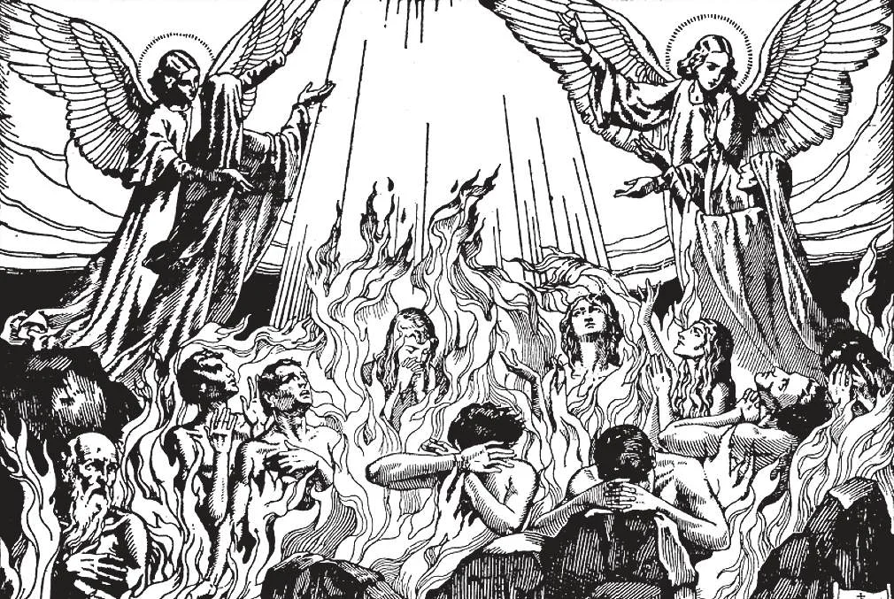

# 78. Existência do Purgatório

*Tanto a razão quanto a fé dizem-nos que há um meio-termo de expiação, onde a alma é purificada de toda mancha de pecado antes que possa entrar na glória do céu. "Não entrará nela coisa alguma contaminada" (Apoc. 21: 27). Cristo disse: "Em verdade te digo: não sairás de lá até que pagues o último centavo" (Mat. 5: 26). Mesmo pessoas que negam a existência do purgatório instintivamente rezam por seus entes queridos que morreram. Isto seria grande inconsistência se sua razão não lhes dissesse que suas orações fariam bem aos mortos. Orações são inúteis para aqueles no céu ou inferno.*

**O que é purgatório?**

— Purgatório é um lugar de punição temporária para aqueles que morreram em estado de graça, mas não satisfizeram plenamente a justiça de Deus por toda punição devida a seus pecados.

1. Purgatório é um estado intermediário onde almas destinadas ao céu são detidas e purificadas. Almas no purgatório não podem ajudar-se, pois seu tempo de merecer passou. Mas podem ser ajudadas pelos fiéis na terra, por orações e outras boas obras.

> Em alguns lugares, às oito horas da noite, os sinos das igrejas tocam, para admonestar os fiéis a rezar pelas almas no purgatório. Esta hora é em comemoração da oração de Cristo no jardim. Devemos então ajoelhar-nos e rezar um Pai-Nosso, uma Ave-Maria e o Requiem Aeternam "Dai-lhes, ó Senhor, o descanso eterno, e brilhe sobre eles a luz perpétua," etc.

2. Crença na utilidade de rezar pelos mortos automaticamente inclui crença na existência do purgatório. Se não houvesse purgatório, seria inútil rezar pelos mortos, porque santos no céu não precisam de ajuda, e aqueles no inferno estão além de auxílio.

> E podemos ter certeza de que não haverá mais purgatório após o Juízo Geral; porque a razão de sua existência terá passado.

3. Purgatório é um lugar de punição temporária para aqueles que morreram em pecado venial, ou que não satisfizeram plenamente a justiça de Deus por pecados mortais já perdoados. (a) Um menino rouba uma maçã de uma banca no mercado; isto é um pecado venial punível no purgatório. Alguns argumentam que Deus é um Deus bom, e não punirá tais pecados leves com as dores do purgatório. Devemos lembrar, contudo, que os julgamentos de Deus são diferentes daqueles dos homens, como Sua santidade está muito acima da santidade humana.

> "Meus pensamentos não são vossos pensamentos, nem vossos caminhos Meus caminhos, diz o Senhor. Pois como os céus são exaltados acima da terra, assim Meus caminhos são exaltados acima de vossos caminhos, e Meus pensamentos acima de vossos pensamentos." Reverenciemos a santidade e justiça de Deus, como temos amorosa confiança em Sua misericórdia.

(b) Um homem comete um assassinato cruel. Isto é um pecado mortal que, não arrependido e não confessado, o enviará ao inferno.

> O homem arrepende-se, confessa, e obtém absolvição por seu pecado; a culpa portanto é removida. Mas justiça requer que ele compense o mal que fez; esta expiação tem lugar no purgatório, a menos que faça plena satisfação antes da morte.

4. A doutrina do purgatório é eminentemente consoladora ao coração humano. Consola-nos quando nossos entes queridos morrem. Purgatório é um vínculo de união fazendo-nos perceber que a morte não é uma separação eterna para os justos, mas apenas uma perda de sua presença corporal.

> Purgatório dá-nos uma certeza de que ainda estamos em contato com nossos queridos falecidos. Somos consolados pelo conhecimento de que ainda podemos ajudá-los com oração, como na vida assim os ajudamos.

**A doutrina da existência do purgatório é razoável?**

— A doutrina da existência do purgatório não é apenas razoável, mas sua negação é eminentemente contrária à razão; é ensinada na Sagrada Escritura, e tem sido ensinada pela Igreja desde o próprio princípio.

1. A doutrina de um estado intermediário de purgação é ensinada no Antigo Testamento, e foi firmemente crida pelos Hebreus.

> Após uma batalha, Judas Macabeu ordenou orações e sacrifícios oferecidos por seus camaradas mortos. "E fazendo uma coleta, enviou doze mil dracmas de prata a Jerusalém para sacrifício a ser oferecido pelos pecados dos mortos, pensando bem e religiosamente acerca da ressurreição. Pois, se não esperasse que os que haviam caído ressuscitariam, teria parecido supérfluo e vão rezar pelos mortos. E porque considerou que aqueles que haviam adormecido com piedade tinham grande graça posta para eles. É portanto um pensamento santo e salutar rezar pelos mortos, para que possam ser absolvidos dos pecados" (2 Mac. 12: 43-46).

2. Quando Nosso Senhor veio à terra, purificou a Igreja Judaica de todas aquelas mudanças humanas que com os anos tinham entrado em seus usos e crenças. Mas nunca repreendeu alguém por crença num estado intermediário de purgação, ou orações pelos mortos.

> Ao contrário, Cristo mais do que uma vez implicou a existência do purgatório. Disse "E quem disser uma palavra contra o Filho do Homem, ser-lhe-á perdoado; mas quem falar contra o Espírito Santo, não lhe será perdoado, nem neste mundo nem no mundo vindouro" (Mat. 12: 32). Quando Nosso Senhor disse que um pecado não será perdoado na próxima vida, deixou-nos concluir que alguns pecados serão assim perdoados. Mas na próxima vida, pecados não podem ser perdoados no céu: "Não entrará nela coisa alguma contaminada" (Apoc. 21: 27). Nem podem pecados ser perdoados no inferno, pois do inferno não há redenção. Devem portanto ser perdoados num estado intermediário, Purgatório.

3. Crença na existência do Purgatório é um ensino contínuo e solene da Igreja. De São Paulo, os primeiros Padres, os Doutores da Igreja, através das idades, a Igreja tem ensinado a existência do Purgatório, e a doutrina correlata da utilidade de rezar pelos mortos.

> Desde o princípio, Cristãos rezaram pelos mortos no Santo Sacrifício da Missa. Os mais antigos livros usados na Missa contêm orações pelos mortos.

A doutrina do Purgatório foi dada definição solene pelo Concílio de Trento como segue: "Há um purgatório, e as almas lá detidas são assistidas pelos sufrágios dos fiéis, mas especialmente pelo sacrifício mais aceitável do altar."

> Esta definição dogmática contém três pontos de fé que todos os Católicos são compelidos a crer: (a) que há um purgatório; (b) que após a morte almas sofrem lá por seus pecados; (c) que os vivos podem estender assistência a tais almas.

4. Razão demanda crença na existência do purgatório. Se um homem morre com alguma leve mancha em sua alma, um pecado de impaciência, ou uma palavra ociosa, está ele apto a entrar no céu? A santidade de Deus proíbe isto: "Não entrará nela coisa alguma contaminada" (Apoc. 21: 27). Mas deve tal alma ser consignada ao inferno? A misericórdia e justiça de Deus proíbem isto.

> Portanto razão conclui a existência de um estado intermediário e temporário de expiação, onde a alma é purificada de toda mancha de pecado antes que possa ser admitida na perfeita santidade e bem-aventurança do céu. "Em verdade te digo: não sairás de lá até que pagues o último centavo" (Mat. 5: 26).

5. Entre quase todos os povos tem persistido uma crença que almas devem sofrer algum tipo de purificação após a morte. Isto apontaria à doutrina do purgatório.

> A história Grega de Prometeu implica um lugar de purgação. Os Egípcios e outros criam na transmigração de almas. Lendas e mitos de todas as nações, bem como costumes de sepultamento, indicam crença na possibilidade de ajudar os mortos.
