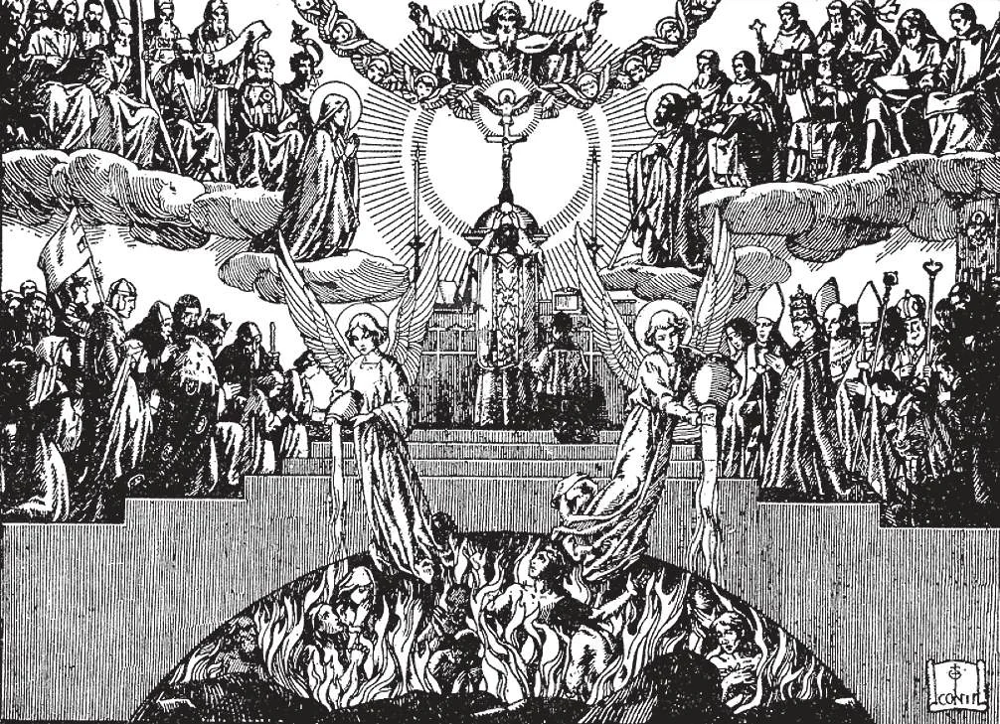

# 79. Almas no Purgatório

*Devemos ser generosos em ajudar as almas pobres no purgatório, que anseiam por Deus. A melhor coisa que podemos fazer por elas é ter Missas oferecidas por elas. A Igreja não põe limite ao tempo durante o qual podemos rezar ou oferecer Missas pela alma padecente no purgatório. Se não podemos ter uma Missa rezada, devemos ao menos ouvir Missas por nossos queridos falecidos. Se Deus assim quisesse, uma única Missa poderia libertar todas as almas no purgatório. Devemos oferecer Missas especialmente no Dia de Todas as Almas e nos aniversários de morte de nossos parentes e amigos.*

**Que dores sofrem as almas no purgatório?**

— As almas no purgatório sofrem de um grande anseio de unir-se a Deus, e de outras grandes dores.

1. Sua dor principal é a privação da Visão Beatífica, a visão de Deus na glória do céu. Esta privação temporária é uma punição mais severa, porque as almas pobres já têm pleno conhecimento do que estão perdendo.

> "Como o cervo brama pelas correntes das águas, assim minha alma brama por Ti, ó Deus! Minha alma teve sede do Deus forte vivo; quando virei e aparecerei diante da face de Deus?" (Sl. 41: 2-3).

2. A tradição geral da Igreja é que também sofrem agudamente de outras maneiras.

> Santo Agostinho crê que os sofrimentos das almas pobres são maiores que os sofrimentos de todos os mártires. São Tomás crê que a menor dor lá é maior que a maior na terra.

3. A grandeza e a duração dos sofrimentos de uma alma no purgatório variam segundo a gravidade dos pecados cometidos. Aquele que viveu uma longa vida de pecado, mas é salvo do inferno apenas por um arrependimento no leito de morte, permanecerá nos fogos purgadores do purgatório por mais tempo, e sofrerá lá mais intensamente do que uma criança, que cometeu apenas os pecados veniais de uma criança ordinária.

> Que algumas almas permanecem muito tempo no purgatório é implicado pelo fato de que a Igreja não põe limite à oferta de Missas pelos mortos; algumas fundações têm durado por séculos, oferecidas pelo repouso de certas almas. Santo Agostinho crê que aqueles permanecem mais tempo no purgatório que amaram mais os bens da terra. Alguns santos têm sustentado que certas almas santas no purgatório não sofrem dor alguma exceto sua exclusão da visão de Deus. Praticamente todos concordam que no purgatório as almas sofrem mais naquelas coisas em que mais pecaram; como a "Imitação de Cristo" diz: "Nas coisas em que um homem mais pecou, naquelas coisas será mais gravemente atormentado."

4. As almas pobres, contudo, têm muito para consolá-las. Têm certeza da salvação e do amor de Deus. Estão livres da tentação: não podem cometer o mais leve pecado, mesmo de impaciência.

> Não têm preocupação, ansiedade ou angústia de mente, pois têm certeza da libertação. São consoladas pelas orações dos anjos e santos, e das pessoas na terra.

**Todas as almas no purgatório irão ao céu?**

— Todas as almas no purgatório irão ao céu algum dia; permanecerão no purgatório apenas enquanto não tiverem expiado por todos seus pecados.

1. As almas pobres não podem ajudar-se, pois seu tempo de merecer terminou em sua morte. Não podem portanto merecer nada para satisfazer por seus pecados.

> É por isto que nós que ainda podemos merecer por nossas boas obras devemos dar algumas delas como sufrágio pelas almas pobres, de modo que logo sejam libertas de sua prisão. Temos a obrigação especial de ajudar com nossas orações e sacrifícios as almas de nossos parentes falecidos, amigos e benfeitores.

2. Embora não possam merecer nada para si mesmas, as almas pobres intercedem por nós com suas orações a Deus.

> Assim se as ajudarmos nos recompensam por sua intercessão. Ninguém que tem uma devoção às almas santas no purgatório jamais pediu por sua intercessão em vão.

**De que modos podemos ajudar as almas pobres no purgatório?**

— Podemos ajudar as almas pobres no purgatório por Missas, por orações, e por outras boas obras.

1. Missas. O Santo Sacrifício é a maior ajuda que podemos oferecer, porque seu efeito depende de si mesmo, e não da piedade do sacerdote que o oferece. Sempre que possível, Missas Gregorianas devem ser oferecidas; estas consistem de trinta Missas celebradas em dias consecutivos por alguma pessoa falecida.

> Se não podemos ter uma Missa rezada, devemos ao menos ouvir Missa por nossos queridos falecidos. Uma Missa tem mérito infinito, pois é o sacrifício de Nosso Senhor Mesmo. Certamente aproveitará a nossos mortos oferecer por eles o Próprio Filho de Deus na Santa Missa.

2. Orações. Devemos rezar com devoção pelas almas pobres. Deus não considera tanto o comprimento da oração ou as palavras quanto o amor no coração daquele que reza.

> Há orações especiais enriquecidas com indulgências, aplicáveis às almas no purgatório. Devemos também receber os Sacramentos da Penitência e Santa Eucaristia pelas almas pobres. "Sabei que o Senhor ouvirá vossas orações se perseverardes" (Judite 4: 11).

3. Esmolas. Nenhum funeral pomposo ou profusão de flores é de algum proveito para as almas pobres no purgatório. Como São João Crisóstomo diz: "Não por chorar, mas por oração e esmolas os mortos são aliviados."

> É melhor dar à caridade o dinheiro gasto em exibição ociosa e mundana, que não pode ajudar as almas pobres. Ao invés de enviar coroas caras à família de um amigo falecido, é um excelente costume ao invés disto ter Missas oferecidas por sua alma.

4. O Ato Heróico. Por este Ato uma pessoa rende, em nome das almas no purgatório, toda a satisfação feita a Deus por suas boas obras, incluindo qualquer satisfação que possa ser oferecida por ele por outros durante sua vida e após.

> O Ato Heróico é enriquecido com favores preciosos. Aquele que faz o Ato pode aplicar cada indulgência ganha às almas pobres no purgatório. Pode ganhar uma indulgência plenária aplicável apenas às almas pobres: (1) cada vez que recebe a Santa Comunhão: (2) toda segunda-feira ouvindo Missa em nome das almas pobres. Para ganhar estas indulgências, deve rezar na igreja pelas intenções do Papa.

É um erro supor que alguém que desiste de seus méritos, ou oferece orações e boas obras pelas almas pobres, assim perde algo para si mesmo.

> A oração confere uma bênção não apenas naqueles por quem se reza, mas também naquele que reza. "Bem-aventurados os misericordiosos, porque alcançarão misericórdia."

5. Não devemos, contudo, confiar demasiado nas orações e sacrifícios que nossos parentes possam oferecer por nós após nossa morte. Mesmo concedendo que se lembrarão de nós frequentemente e fervorosamente em orações, é contudo verdade que obras oferecidas em sufrágio por almas aproveitam-lhes apenas num limite.

> Deus dá mais valor a uma pequena penitência voluntária feita aqui na terra do que a disciplinas oferecidas por aquela alma após a morte. Como um Santo apropriadamente disse: "Uma Missa devotamente ouvida durante a vida vale mais que uma grande soma deixada para a celebração de cem Missas após a morte."
