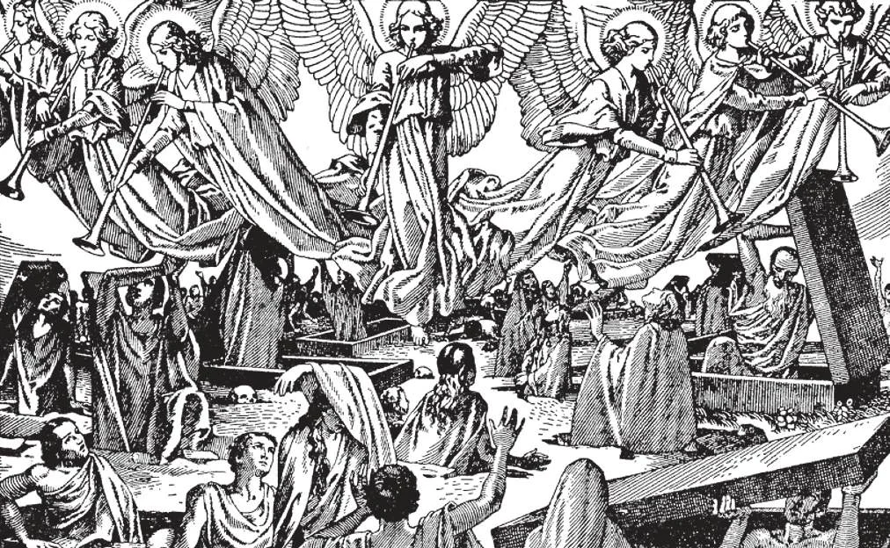

# 80. Ressurreição do Corpo

*Crença na ressurreição é muito consoladora. Foi esta crença que deu aos primeiros Cristãos e mártires tal fortaleza sob perseguições. Firmes nesta crença, não devemos chorar excessivamente por nossos queridos falecidos: "Não queremos, irmãos, que ignoreis acerca dos que dormem, para que não vos entristeçais como os outros que não têm esperança" (1 Tess. 4:13). Vê-los-emos novamente na ressurreição. Devemos lembrar as palavras de Nosso Senhor, Que nos levantará dos mortos: "Eu sou a ressurreição e a vida; quem crê em Mim, mesmo que morra, viverá; e todo aquele que vive e crê em Mim, nunca morrerá" (João 11:25-26).*

**O que se entende por "a ressurreição do corpo"?**

— Por "a ressurreição do corpo" entende-se que no fim do mundo os corpos de todos os homens ressuscitarão da terra e serão unidos novamente às suas almas, para nunca mais separar-se.

> "Num momento, num abrir e fechar de olhos, à última trombeta. Pois a trombeta soará, e os mortos ressuscitarão" (1 Cor. 15:52).

1. Nosso Senhor frequentemente predisse a ressurreição do corpo.

> "Pois vem a hora em que todos os que estão nos túmulos ouvirão a voz do Filho de Deus. E os que fizeram o bem sairão para ressurreição da vida; mas os que fizeram o mal para ressurreição do juízo" (João 5:28-29).

2. Nosso Senhor disse que o Santíssimo Sacramento dá imortalidade também ao corpo.

> "Quem come Minha carne e bebe Meu sangue tem vida eterna e Eu o ressuscitarei" (João 6:55).

3. Cristo redimiu o homem inteiro, e não a alma apenas.

> Logo, o corpo deve, no caso dos justos, ressuscitar para a vida eterna. O corpo do homem foi originalmente destinado para a imortalidade, e a perdeu apenas com o pecado de Adão. "Como em Adão todos morrem, assim em Cristo todos serão vivificados" (1 Cor. 15:22). "Aquele que ressuscitou Jesus nos ressuscitará também com Jesus" (2 Cor. 4:14). "Nosso Senhor Jesus Cristo refará o corpo de nossa baixeza" (Fil. 3:21).

4. A ressurreição do corpo não é uma ideia extraordinária. Se olharmos ao nosso redor na natureza, podemos ver tipos da ressurreição do corpo.

> Na primavera, flores e árvores despertam para nova vida após a morte do inverno. A semente, enterrada como um cadáver no chão, brota numa árvore ou arbusto vivo. O corpo levanta-se a novo vigor após o sono, que é um tipo da morte.

**Nossos corpos ressuscitados serão os mesmos que tínhamos na terra?**

— Sim, nossos corpos ressuscitados serão os mesmos que tínhamos na terra.

Se nossos corpos ressuscitados não fossem aqueles que tínhamos na terra não seriam nossos corpos, e não seríamos as mesmas pessoas.

> Não poderia ser dito então que houve ressurreição, nem que nossos corpos haviam ressuscitado. As palavras de Jó são muito consoladoras na verdade que contêm: "Pois sei que meu Redentor vive, e no último dia ressuscitarei da terra" (Jó 19:25).

2. Durante a vida o corpo está constantemente mudando, vestindo novo crescimento e lançando fora resíduos em osso, músculo, e pele. Contudo é sempre o mesmo corpo.

> Assim, será na ressurreição. Quaisquer mudanças que haja não afetarão a mesmice do corpo que temos na terra. Na morte o corpo apenas dorme, aguardando o último dia. Nosso Senhor Mesmo disse que Lázaro e a filha de Jairo estavam dormindo, embora soubesse que estavam mortos.

3. Nossos corpos ressuscitarão novamente mesmo que tenham sido reduzidos a pó. Tudo é possível a Deus. Aquele Que criou anjos e homens e todo o universo do nada certamente não encontrará qualquer dificuldade em reunir juntos os elementos do corpo mesmo que fossem espalhados através do mundo, nem em dar-lhes vida uma vez mais. Deus tem poder todo-poderoso.

> Cristo Mesmo ressuscitou três pessoas dos mortos, segundo a Sagrada Escritura. Em Sua ressurreição, os corpos de muitos ressuscitaram dos túmulos. Homens e mulheres santos têm em nome de Cristo trazido de volta centenas à vida.

**Por que os corpos dos justos ressuscitarão?**

— Os corpos dos justos ressuscitarão para compartilhar para sempre na glória de suas almas.

> "Pois este corpo corruptível deve vestir-se de incorrupção, e este corpo mortal deve vestir-se de imortalidade" (1 Cor. 15:53).

1. O corpo ressuscitado será radiante e belo, se é de uma pessoa justa. Terá as qualidades do Corpo ressuscitado de Nosso Senhor, caracterizado por: (a) Impassibilidade.

> Por esta qualidade o corpo ressuscitado não mais estará sujeito a dor, doença, morte, fome, sede, fadiga, sono, calor ou frio. "E Deus enxugará toda lágrima de seus olhos. E a morte não será mais, nem haverá luto, nem clamor" (Apoc. 21:4).

(b) Brilho.

> Por esta qualidade, o corpo ressuscitado brilhará com grande radiância e glória. "Então os justos brilharão como o sol, no reino de seu Pai" (Mat. 13:43).

(c) Agilidade.

> Esta qualidade capacitará o corpo ressuscitado a passar com a rapidez do pensamento a todas as partes do universo.

(d) Subtileza, ou espiritualidade.

> Esta qualidade capacitará o corpo ressuscitado a penetrar substâncias materiais, mesmo como Nosso Senhor, Que ressuscitou do túmulo e entrou no Cenáculo enquanto portas e janelas estavam trancadas. "O que é semeado corpo natural, ressuscita corpo espiritual" (1 Cor. 15:44).

2. O corpo ressuscitado, unido à alma, permanecerá no céu para sempre, para gloriar-se na presença e em união com Deus.

> Quando estivermos desanimados pelas misérias desta vida, infortúnio, doença, dores, e muitos outros males, incluindo a dificuldade de afastar o pecado. Consolemo-nos no pensamento de que nosso corpo, agora tão fraco e imperfeito, será, se perseverarmos no amor e serviço de Deus, algum dia ressuscitar em glória e estar continuamente em Sua presença. "Se a casa terrestre em que habitamos for destruída, temos um edifício de Deus, uma casa não feita por mãos humanas, eterna nos céus" (2 Cor. 5:1).

**O corpo de alguma pessoa humana alguma vez foi ressuscitado dos mortos e levado ao céu?**

— Pelo privilégio especial de sua Assunção, o corpo da Santíssima Virgem Maria, preservado da corrupção, foi ressuscitado dos mortos e levado ao céu.

> "Assunção" neste sentido significa a elevação do corpo da Santíssima Virgem ao céu. Sua Assunção difere da Ascensão de Cristo, em que Ele subiu ao céu, corpo e alma, por Seu próprio poder não auxiliado, enquanto Nossa Senhora foi levada pelo poder de Deus, não o seu próprio. O dogma da Assunção foi proclamado em 1º de novembro de 1950.

**Por que os corpos dos condenados também ressuscitarão?**

— Os corpos dos condenados também ressuscitarão, para compartilhar na punição eterna de suas almas.

1. O corpo ressuscitado dos ímpios será hediondo e repulsivo, um horror de contemplar.

> Isto deve dar pausa àqueles cujo principal pensamento na terra é mimar e decorar seus corpos. Esta vida durará apenas algumas décadas; mas na ressurreição haverá uma eternidade. Devemos preferir ser pintados e "belos" por estas poucas décadas, e tornar-nos um objeto de aversão por toda eternidade; ou dar menos atenção a nosso corpo aqui na terra, de modo a atingir glória para sempre?

2. Os corpos ressuscitados dos ímpios, unidos às suas almas, permanecerão condenados no inferno para sempre, seus companheiros outras almas ímpias, e demônios, seguidores de Satanás.

> E no inferno, o corpo, bem como a alma, sofrerá tormentos tais que nós aqui na terra não podemos mesmo imaginar. Que aproveitará àquelas almas perdidas então, que aqui tiveram luxúrias e prazeres?
