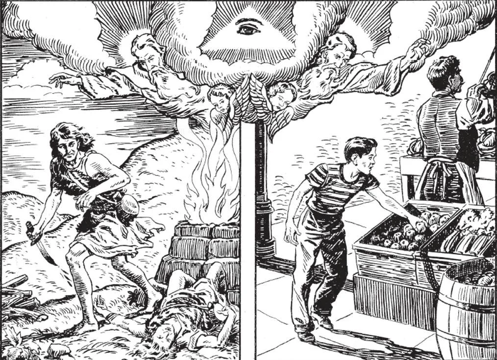

# 84. A Lei de Deus; Consciência

*1. A consciência é frequentemente chamada a voz de Deus dentro de nós. Ordena-nos fazer o que é certo e evitar o que é errado. Caim, que viveu muito antes dos Dez Mandamentos serem dados a Moisés, sabia por sua consciência que era mau matar seu irmão. 2. Quando alguém é tentado a roubar, parece ouvir uma voz de advertência dizendo, "Não roubes. O roubo é uma ofensa contra Deus." Aquilo é a consciência.*

**Além de crer no que Deus revelou, que mais devemos fazer para sermos salvos?**

— Além de crer no que Deus revelou, devemos guardar Sua lei.

> "Mas se queres entrar na vida, guarda os mandamentos" (Mat. 19:17).

1. A lei de Deus está contida tanto na lei natural quanto na revelada. A lei natural está impressa por Deus nos corações e mentes de todos os homens. Ensina as regras mais importantes da moralidade: homenagem devida a Deus, tratamento dos outros como esperamos que os outros nos tratem, o mal da lesão voluntária a si mesmo, a virtude da verdade e honestidade. Assim, a lei natural é uma expressão definida da vontade de Deus, exigindo obediência.

> Por exemplo, uma criança, ou um pagão, que nunca ouviu falar dos Dez Mandamentos, sente-se culpado quando fez algo errado. Tem um conhecimento instintivo da lei da natureza escrita por Deus em seu coração, dizendo-lhe o que é certo e o que errado.

2. Além da lei natural, há a lei revelada, composta principalmente dos Dez Mandamentos e dos dois preceitos da caridade. A lei revelada é apenas uma repetição e amplificação da lei natural.

> Os Dez Mandamentos, que foram dados aos Judeus através de Moisés, não foram revogados por Jesus Cristo; ao contrário, foram ampliados e cumpridos. "Se me amais, guardai os meus mandamentos" (João 14:15). "E por isto podemos ter certeza de que O conhecemos, se guardarmos os Seus mandamentos. Aquele que diz que O conhece, e não guarda os Seus mandamentos, é mentiroso e a verdade não está nele" (1 João 2:3-4).

3. A lei de Deus — aquela divina razão e vontade de Deus — é percebida pelos homens pela luz do intelecto, pela voz de sua consciência.

**O que é consciência?**

— Consciência é a manifestação da vontade de Deus que é feita aos homens pela voz da razão, pelos ditames de seu intelecto.

1. Consciência é frequentemente chamada a "voz da razão" ou *"voz de Deus"*, porque nos ordena fazer o certo e evitar o errado. Caim, que viveu muito tempo antes de Moisés, sabia que havia cometido mal ao matar Abel. Ainda hoje, em países pagãos que nunca ouviram dos mandamentos, os homens conhecem o certo do errado por sua consciência. Por ela, conhecem Deus; ordena-lhes obedecer.

> Como São Paulo, falando dos não-Judeus que não conheciam a lei judaica, disse: "Os Gentios, que não têm lei, fazem por natureza o que a Lei prescreve. Mostram a obra da lei escrita em seus corações. Sua consciência dá testemunho deles" (Rom. 2:14-15).

2. Se sempre obedecermos aos ditames de nossa consciência, nunca ofenderemos a Deus. É um guia que Ele espera que sigamos. Surge do conhecimento da lei, seja natural ou revelada. Antes de qualquer ação, a consciência fala seja a favor ou contra. Após a ação, conforme a seguimos ou desconsideramos, a consciência nos enche de paz ou inquietação.

> Se uma pessoa é tentada a roubar, parece ouvir uma voz interior dizendo: "Não roubes. Sabes que é errado roubar." Esta voz interior é a consciência. A consciência nos diz que Deus é nosso Legislador — nosso Juiz, Recompensador e Vingador.

**Quando a consciência é errônea?**

— Consciência é errônea quando pensamos que algo certo é errado, ou que algo errado é certo.

1. Uma consciência errônea surge da ignorância ou conhecimento defeituoso da lei. Enquanto uma pessoa que tem uma consciência errônea não souber melhor, não é responsável pelo mal que possa fazer seguindo-a. Uma consciência errônea é falsa.

> Por exemplo, uma criança conta uma mentira para salvar seu irmão mais novo de punição. Pensa que seu dever de proteger seu irmãozinho é superior à dizer a verdade. Tem uma consciência errônea, e neste caso não comete pecado. Contudo, todos são obrigados a esforçar-se por um conhecimento correto da lei estudando sua religião. Dessa forma, formará uma consciência correta ou reta.

2. Se uma pessoa com uma consciência errônea crê que algo certo é errado, e contudo o faz, é culpada de pecado, porque violou sua consciência, e portanto quis fazer o mal.

> Um homem pode crer que Deus proíbe jogar em loteria. Se não obstante participa, peca, porque violou sua consciência.

3. Tem-se uma consciência duvidosa quando não se sabe se algo é certo ou errado. Não devemos agir se temos uma consciência duvidosa sobre algo, mas esperar até que possamos esclarecer o assunto.

> Se alguém tem uma consciência duvidosa, mas não obstante deve fazer algo e não pode esperar, deve dizer a si mesmo que se soubesse que era errado, então não o faria. Então mesmo que tome sua decisão e o faça, e seja realmente errado, não é culpado de pecado.

**O que é uma consciência escrupulosa?**

— Uma consciência escrupulosa é uma consciência doente que vê pecado onde não há nenhum.

1. Uma pessoa escrupulosa considera tentações como pecados. Não devemos encorajar uma consciência escrupulosa. É marca de falta de confiança na bondade de Deus.

> Quando uma pessoa escrupulosa é tentada, preocupa-se até adoecer, crendo que cometeu pecado, mesmo quando não cedeu à tentação nem um pouco, mesmo quando na verdade a abominou.

2. O oposto de uma consciência escrupulosa é uma consciência sem escrúpulos ou laxa. Alguém com tal consciência laxa convence-se de que o homem é fraco demais para resistir ao pecado, e assim todo pecado é negligenciável. "Errar é humano" é seu lema constante.

> Uma consciência laxa é descuidada; faz pouco de pecados ordinários, e considera pecados graves como negligenciáveis. Após algum tempo uma consciência laxa aumenta em laxidão até que a pessoa perde praticamente todo senso do mal. Assim, se torna um pecador habitual. Dizemos então que não tem consciência.

**O que é uma consciência delicada ou terna?**

— Uma consciência delicada ou terna é aquela que nos impele a evitar qualquer coisa no mais leve grau má.

> Devemos ter o maior cuidado em manter nossa consciência delicada. É uma coisa terrível para alguém viver como se não tivesse consciência. É uma consciência terna que escapa coisas como auto-recriminação, vergonha, remorso, consternação, e medo, porque está sempre diante de Deus, Que lhe dá paz e esperança.

Uma consciência terna é a consciência dos santos. É a consciência que bons cristãos devem cultivar. Então não farão nada no mínimo desagradável a Deus.
