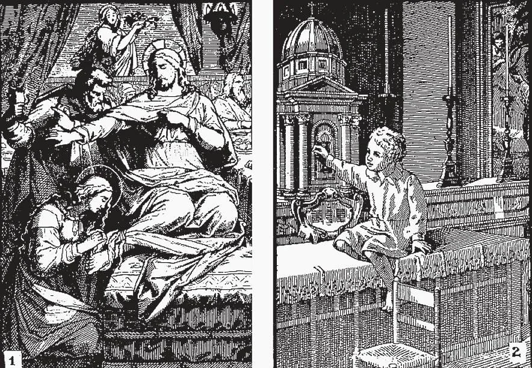

# 85. Os Grandes Mandamentos

*O amor de Deus nos faz odiar o pecado e fazer o bem. Maria Madalena (1) após sua conversão, amou a Deus plenamente. Odiou o pecado tanto que nunca mais cometeu nenhum, embora anteriormente tivesse sido uma grande pecadora. Na imagem (2) é mostrada a criança que, sendo-lhe dito que Jesus está no tabernáculo, bate para implorar-Lhe que faça seu pai, um incrédulo, crer em Deus. Vamos nós, em imitação desta criança, bater ao coração de Jesus. Ele responderá nossa oração.*

**Quais são os dois grandes mandamentos que contêm toda a lei de Deus?**

— Os dois grandes mandamentos que contêm toda a lei de Deus são: Primeiro, Amarás o Senhor teu Deus de todo o teu coração, e de toda a tua alma, e de toda a tua mente, e de todas as tuas forças; Segundo, Amarás o teu próximo como a ti mesmo.

**Quem nos revelou os dois grandes mandamentos?**

— Nosso Senhor Jesus Cristo nos revelou os dois grandes mandamentos.

> Uma vez um doutor da lei perguntou a Jesus: "Mestre, qual é o grande mandamento na Lei?" Jesus disse-lhe: "Amarás o Senhor teu Deus de todo o teu coração, e de toda a tua alma, e de toda a tua mente. Este é o maior e o primeiro mandamento. E o segundo é semelhante a este: Amarás o teu próximo como a ti mesmo" (Mat. 22:36-39).

1. O amor de Deus é o maior mandamento, porque inclui todos os outros mandamentos.

> Se verdadeiramente amamos a Deus, nada faremos para ofendê-Lo. Não cometeríamos pecado, porque o pecado Lhe é desagradável. Obedeceríamos a todos os mandamentos. Não apenas isso; se verdadeiramente O amamos, faremos coisas que Ele não requer, mas que sabemos que O agradarão.

2. Os dois grandes mandamentos são inseparavelmente unidos, de modo que um não pode ser observado sem o outro. Como diz a Sagrada Escritura, "Se alguém diz: Eu amo a Deus, e odeia a seu irmão, é mentiroso" (1 João 4:20).

> Quanto maior nosso amor a Deus, mais amaremos nossos semelhantes. E quanto mais zelosamente ajudarmos nossos semelhantes por amor de Deus, mais perfeitamente serviremos a Deus. Nosso amor a Deus pode ser melhor medido pelo nosso amor ao próximo.

3. Mais especificamente, o primeiro grande mandamento abrange os primeiros três dos Dez Mandamentos; o segundo grande mandamento abrange os últimos sete.

> Os dois grandes mandamentos afetam e controlam todos os poderes do homem: sua vontade, seu entendimento, suas emoções e suas ações. Não teríamos um mundo perfeito, não precisando de outras leis, se todos os homens obedecessem estritamente a estes dois mandamentos? Por esta razão, Nosso Senhor disse: "Destes dois mandamentos depende toda a Lei" (Mat. 22:40).

**Por que devemos amar a Deus?**

— Devemos amar a Deus porque:

1. Ele é infinitamente bom e perfeito e digno de amor. "Um só há que é bom, isto é, Deus" (Mat. 19:17).

> Podemos ver a bondade e perfeição de Deus ao nosso redor. Se meditarmos sobre Sua bondade, nunca nos cansaremos de amá-Lo. Amamos nossos pais e amigos porque são bons. Sua bondade não é nada comparada à bondade de Deus.

2. Ele nos ama, e está sempre fazendo o bem para nós. Basta pensarmos em nós mesmos e nossas vidas para encontrar um número inumerável de favores que nos concedeu.

> "Porque Deus amou tanto o mundo que deu seu Filho unigênito, para que aqueles que crêem n'Ele não pereçam, mas tenham a vida eterna" (João 3:16). "Sim, Eu te amei com amor eterno: por isso te atraí, tendo compaixão de ti" (Jer. 31:3). "Toda dádiva boa e todo dom perfeito vem do alto, descendo do Pai das Luzes" (Tia. 1:17).

3. Ele quer e nos ordena amá-Lo. Somos criaturas de Deus. Seus menores desejos são lei para nós. Quanto mais devemos obedecer a Seus solenes mandamentos!

> Nosso Senhor disse muito claramente: "Amarás o Senhor teu Deus de todo o teu coração, e de toda a tua alma, e de toda a tua mente, e de todas as tuas forças" (Mar. 12:30).

**Quando nosso amor a Deus é perfeito?**

— Nosso amor a Deus é perfeito quando O amamos sobre todas as coisas, por Si mesmo.

1. Amamos a Deus sobre todas as coisas quando preferiríamos perder a vida, bens, amigos, e todas as outras coisas, antes que ofendê-Lo; quando estamos prontos a fazer qualquer coisa para nos assemelharmos a Ele, para Lhe dar prazer.

> "Quem ama o pai ou a mãe mais do que a Mim, não é digno de Mim" (Mat. 10:37). Deus nos permite amar as criaturas, exorta-nos a amar nossos semelhantes; mas tal amor deve ser apenas por amor de Deus, sujeito ao amor de Deus. Deus deseja que O amemos em Suas criaturas, não as criaturas por si mesmas. Não aceitará o segundo lugar em nossas afeições. "Eu sou o Senhor teu Deus, forte, zeloso" (Êx. 20:5). Não nos permitirá amar qualquer coisa que diminua um mínimo que seja nosso amor completo por Ele.

2. Amamos a Deus por Si mesmo quando O amamos por Sua infinita perfeição.

> Amamos a Deus por Si mesmo quando O amamos porque Ele é o bem supremo e mais digno de amor.

3. Nosso amor a Deus não é perfeito quando O amamos apenas porque Ele nos dá dons, ou nos ameaça com punição, ou nos promete o céu.

> Não obstante, o amor imperfeito de Deus é frequentemente o começo do amor perfeito. Pouco a pouco o amor perfeito se desenvolve dele.

**Como provamos nosso amor a Deus?**

— Provamos nosso amor a Deus pela obediência aos Seus mandamentos.

> "Se me amais, guardai os meus mandamentos" (João 14:15).

1. Mostramos nosso amor mais por obras do que por palavras. São João diz: "Meus queridos filhos, não amemos em palavra, nem com a língua, mas em obra" (1 João 3:18).

> O amor de Deus não é um mero deleite em pensar n'Ele; consiste antes num ato da vontade, de viver uma vida piedosa por causa daquele amor. Contudo, o amor de Deus também nos faz falar e pensar n'Ele frequentemente, já que é traço humano fazer assim com respeito ao objeto de afeição. Aquele que ama a Deus está unido com Ele a cada momento em cada fibra de seu ser: em pensamento, palavra e obra. "Onde está teu tesouro, aí estará também teu coração" (Mat. 6:21).

2. Mostramos maior amor, quando não apenas evitamos o que Deus proíbe, mas fazemos o que Lhe dará prazer.

> Assim Deus não nos ordena ir à Missa todos os dias, mas se o fizermos, Ele se agrada por esta marca de nosso amor.

3. Aumentamos nosso amor a Deus amando-O. "A prática faz a perfeição." Quanto mais O amamos, mais podemos amá-Lo.

Cada boa obra que fazemos nos faz crescer no amor de Deus.

> Mostramos nosso amor a Deus aceitando tudo que vem de Sua mão. Aquele que habitualmente murmura de todos os inconvenientes, enfermidade, infortúnio, etc., não possui o amor cristão de Deus, Que nunca nos prometeu livramento de todos os males terrenos.
