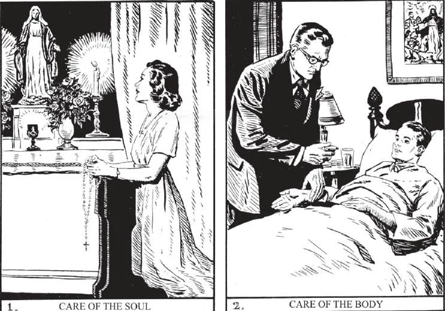

# 86. Amor de Nós Mesmos

*Deus nos ordena amar a nós mesmos. Devemos assim cuidar tanto de nosso corpo quanto de nossa alma. Sendo a alma muito mais preciosa que o corpo, devemos dar-lhe mais cuidadosa atenção. Cada dia devemos orar por graça para viver segundo a vontade de Deus. Cuidar do corpo inclui tomar tratamento e medicina adequados quando estamos doentes (2). Qualquer coisa contra a saúde viola o dever de amar a nós mesmos.*

**Por que devemos amar a nós mesmos?**

— Devemos amar a nós mesmos porque:

1. Deus deseja e requer isto. Nosso Senhor disse: "Amarás o teu próximo como a ti mesmo" (Mat. 22:39).

> Assim fez o amor próprio a medida do amor aos outros. Santo Agostinho diz: "Aprende primeiro a amar a Deus, depois a amar a ti mesmo, depois o teu próximo como a ti mesmo." Cada homem é seu próprio próximo mais próximo.

2. Somos feitos à imagem de Deus. Devemos portanto reverenciar a imagem de Deus em nós mesmos, assim como somos obrigados a respeitá-la em nosso próximo, mesmo nosso pior inimigo.

3. Somos remidos pelo sangue de Cristo. Somos comprados por grande preço. Devemos ser muito preciosos aos olhos de Deus.

> São Pedro diz: "Fostes remidos da vã maneira de viver transmitida por vossos pais, não com coisas perecíveis, com prata ou ouro, mas com o precioso sangue de Cristo" (1 Ped. 1:18).

4. Pelos méritos de Jesus Cristo somos feitos filhos de Deus e templos do Espírito Santo. Não deveríamos amar a nós mesmos como tais, se apenas para mostrar reverência a Deus?

> "Vede que maneira de amor o Pai nos concedeu, que fôssemos chamados filhos de Deus" (1 João 3:1). "Não sabeis que vossos membros são templo do Espírito Santo, que está em vós?" (1 Cor. 6:19).

5. Somos destinados a viver eternamente com Deus e os anjos no céu. Esta dignidade deve impelir-nos a amar a nós mesmos corretamente.

> O fim do homem é a glória de Deus e a salvação de sua própria alma. Devemos ter cuidado, amor, de nós mesmos, a fim de nos salvarmos para Deus. Por esta razão, devemos até amar a nós mesmos mais que aos outros: temos um dever maior para conosco mesmos do que para com os outros. Isto não deve ser interpretado, contudo, como significando que não devemos sacrificar-nos pelo bem dos outros; pois, como veremos, o auto-sacrifício não é apenas possível, mas muito desejável.

**Em que consiste o verdadeiro amor próprio?**

— O verdadeiro amor próprio consiste em evitar o pecado e praticar a virtude.

> "Entrai pela porta estreita. Porque larga é a porta e espaçoso o caminho que leva à perdição, e muitos são os que entram por ela. Quão estreita é a porta e quão íngreme o caminho que leva à vida! E poucos são os que o encontram" (Mat. 7:13-14).

1. Devemos primeiro assegurar nossa salvação eterna, antes de atender às coisas terrenas que são apenas meios para nosso fim último.

> "Buscai primeiro o reino de Deus e sua justiça, e todas estas coisas vos serão dadas além disto" (Mat. 6:33).

2. Devemos cuidar mais de nossa alma do que do conforto de nosso corpo. Se perdermos nossa alma, perdemos tudo.

> Devemos prover às nossas necessidades corporais, como alimento, vestuário, etc., mas sem solicitude excessiva. São apenas meios pelos quais podemos ascender a Deus. "Marta, Marta, estás ansiosa e atribulada com muitas coisas; e contudo uma só é necessária" (Luc. 10:41-42).

3. É contra o verdadeiro amor próprio esforçar-se apenas por posses terrenas e honrarias e negligenciar a salvação eterna. "Tende cuidado de não praticar vossas boas obras diante dos homens, para serdes vistos por eles; de outro modo não tereis recompensa junto a vosso Pai que está nos céus" (Mat. 6:1). "Pois que aproveita ao homem ganhar o mundo inteiro e sofrer a perda de sua própria alma?" (Mat. 16:26).

> Riquezas e honrarias terrenas não são boas em si mesmas, mas são boas apenas como meio para atingir a felicidade eterna. Não devem ser usadas para gratificar nossos sentidos, nosso orgulho, arrogância, presunção ou vaidade, mas apenas para ajudar-nos a ir mais perto de Deus.

**O amor de si mesmo inclui o amor do corpo?**

— O amor de si mesmo inclui o amor do corpo, pois nosso corpo é um dom de Deus, que devemos tratar como tal.

1. Nosso corpo está unido à nossa alma, e é instrumento da alma para o bem, para a obtenção de nosso fim, a felicidade eterna.

> Deus não nos criou como almas desencarnadas; é Sua vontade que trabalhemos nossa salvação neste mundo, habitando nossas almas nosso corpo. Como instrumento da alma, o corpo não deve ser mal usado: "Portanto não reine o pecado em vosso corpo mortal. . . . E não entregueis vossos membros ao pecado como armas de iniqüidade, mas apresentai vossos membros como armas de justiça para Deus" (Rom. 6:12-13).

2. Devemos ter o maior respeito e reverência por nosso corpo. Nunca devemos contaminá-lo com pecado, pois é destinado a viver para sempre no céu.

> Devemos guardar cuidadosamente nossos olhos, ouvidos, língua e mãos, porque o pecado entra na alma pelos cinco sentidos. Nosso corpo é o templo do Espírito Santo. É como um ostensório segurando Deus. São Pedro falou de seu corpo como um "tabernáculo." Algumas pessoas são muito particulares em manter seu corpo limpo. Saboam e lavam suas mãos frequentemente, e as desinfetam após tocar coisas sujas. Mas não são tão cuidadosas em evitar pecados que tornam seu corpo tão sujo que nenhum desinfetante pode purificá-lo.

3. Não amamos nosso corpo quando o mimamos em vaidade, ou conforto excessivo, ou gratificando cada uma de suas paixões. Por tal indulgência antes odiamos nosso corpo, porque trazemos sobre ele punição eterna.

> Os santos mortificavam seus corpos. Assim entenderam as palavras de Nosso Senhor: "Pois quem quiser salvar sua vida, perdê-la-á; mas quem perder sua vida por amor de Mim e do Evangelho, salvá-la-á" (Mar. 8:35).

**O verdadeiro amor próprio inclui também cuidado pela própria reputação e bens temporais?**

— O verdadeiro amor próprio também ordinariamente inclui cuidado pela própria reputação e bens temporais.

1. Uma boa reputação é uma posse preciosa, útil tanto para o tempo quanto para a eternidade. Por uma boa reputação pode-se fazer muito bem; sendo bem considerado, pode ter influência sobre os outros, assim como mais encorajado por si mesmo a levar uma vida reta.

> Nosso Senhor Mesmo disse: "Assim brilhe vossa luz diante dos homens, para que vejam vossas boas obras, e dêem glória a vosso Pai que está nos céus" (Mat. 5:16). E o Apóstolo reitera o mesmo conselho quando disse, "Seja vossa moderação conhecida de todos os homens" (Fil. 4:5).

2. Bens temporais são úteis como meio para obter riquezas espirituais. Por eles podemos ajudar os necessitados, promover a religião, ganhar ascendência para o bem comum.

> Como com nosso corpo e nossa reputação, devemos usar as riquezas apenas para a glória de Deus e o bem-estar de nós mesmos e de nossos semelhantes. Quando postas ao uso correto, todas estas nos tornam verdadeiramente ricos aos olhos de Deus. Então não teremos temor na morte, quando Deus nos disser, "Prestai contas de vossa mordomia (de todos estes dons)" (Luc. 16:2).
