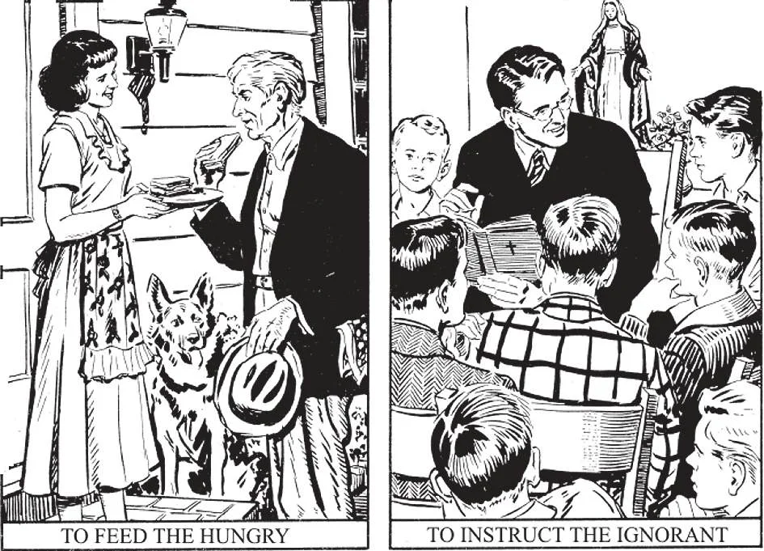

# 89. Obras de Misericórdia

*1. Dar esmola a um mendigo é uma obra de misericórdia corporal. Deus considera a caridade dada aos pobres como um ato de caridade para consigo Mesmo. Jesus Cristo Mesmo disse isto (Mat. 25:40). 2. Quando ensinamos catecismo estamos realizando uma obra de misericórdia espiritual. Muitos podem fazer esta obra hoje, se apenas quisessem. Numerosas pessoas, mesmo de idade avançada, não conhecem o essencial de sua religião, por falta de alguém que lhes ensine.*

**Que devemos fazer para amar a Deus, ao próximo, e a nós mesmos?**

— Para amar a Deus, ao próximo, e a nós mesmos, devemos guardar os mandamentos de Deus e da Igreja, e praticar as obras de misericórdia espirituais e corporais.

> Obras de misericórdia espirituais são aquelas que aliviam necessidades espirituais de nosso próximo. Obras de misericórdia corporais são aquelas que aliviam necessidades corporais ou materiais de nosso próximo. "Portanto, todas as coisas que quereis que os homens vos façam, assim também fazei vós a eles" (Mat. 7:12).

**Quais são as principais obras de misericórdia corporais?**

— As principais obras de misericórdia corporais são sete:

1. Dar de comer aos famintos. — Nunca devemos desprezar qualquer um que está com fome. Aqueles em autoridade devem prevenir o desemprego. Dar trabalho é o melhor meio para remover a necessidade de alimentar os desempregados.

> São Luís da França provia alimento diário aos pobres, e frequentemente os servia ele mesmo. Muitas pessoas caridosas hoje, especialmente as instituições religiosas, alimentam os famintos. Leigos podem ajudar melhor dando trabalho a todos que podem ajudar; trabalho é melhor para os aptos do que esmolas diretas.

2. Dar de beber aos sedentos.

> Nosso Senhor diz que um copo de água fria dado em Seu nome não ficará sem recompensa (Mar. 9:40). Dar medicina pertence a esta obra de misericórdia. Aqueles que constroem reservatórios, ou que purificam água potável pública, estão dando de beber aos sedentos.

3. Vestir os nus. — Muitos têm por prática dar roupas aos pobres; outros dons pertencem a este tipo de esmola.

> A história de São Martinho, dando metade de seu manto a um mendigo, exemplifica esta obra de misericórdia.

4. Visitar os encarcerados. — Aqueles que visitam os prisioneiros nas cadeias e lhes dão instrução e ajuda material estão fazendo uma obra de misericórdia.

> Na Idade Média a Ordem da Redenção foi fundada para o resgate de cristãos mantidos cativos pelos Turcos. Diz-se que mais de um milhão de cristãos foram assim resgatados, seja com dinheiro, ou por outros tomando seu lugar. No século 19 o Cardeal Lavigerie estabeleceu a Ordem dos Padres Brancos, visando libertar escravos na África.

5. Acolher os peregrinos. — Aqueles que fazem esta obra de misericórdia são como o Bom Samaritano. Aqueles que provêem lares limpos e confortáveis para os pobres a baixos aluguéis praticam esta obra de misericórdia.

> São Paulo disse, "Da hospitalidade não vos esqueçais; pois por ela alguns, sem o saberem, hospedaram anjos" (Heb. 13:2). Em tempos antigos viajantes paravam para a noite ou para alimento nos mosteiros.

> Nos Alpes, os monges de São Bernardo realizam esta obra de misericórdia quando resgatam, com a ajuda de sua famosa raça de cães, viajantes que sofreram acidentes.

6. Visitar os enfermos. — Quando visitamos os enfermos para dar-lhes alívio temporal ou espiritual, fazemos um ato de misericórdia.

> Construir, sustentar ou ajudar um hospital ou um patronato para os enfermos é um ato de caridade muito meritório. Médicos e enfermeiras que cumprem seus deveres para agradar a Deus serão recompensados no céu. Várias ordens religiosas foram fundadas com o propósito expresso de cuidar dos enfermos, como as ordens fundadas por São João de Deus e São Vicente de Paulo.

7. Enterrar os mortos. — Assistir a um funeral, visitar uma casa de luto, ou ajudar a família enlutada, são obras de mérito.

> Outras obras de misericórdia corporais são: ajudar durante um incêndio ou acidente, resgatar alguém em perigo de morte, etc. Cada palavra ou ato feito em nome de ou por amor de Cristo é uma obra de misericórdia, e será recompensado.

**Quais são as principais obras de misericórdia espirituais?**

— As principais obras de misericórdia espirituais são sete:

1. Admoestar o pecador. — Sempre que pensamos que nossas palavras podem ter bom efeito, não devemos hesitar em admoestar o errante prudentemente. Aqueles em autoridade, como pais e professores, são obrigados a admoestar aqueles sob sua autoridade de suas faltas, mesmo que fazendo isto tragam problemas sobre si mesmos. Bom exemplo é outra maneira de admoestação.

> Ao admoestar pecadores, devemos fazê-lo com mansidão e caridade. Do contrário poderíamos apenas produzir resultados opostos ao que desejamos. Seria errado, se com um pouco de trabalho pudéssemos salvar um pecador do pecado, não falássemos para salvá-lo; seria, além disso, uma perda de grande graça para nós mesmos. "Aquele que faz um pecador converter-se de seu caminho errado, salvará sua alma da morte, e cobrirá uma multidão de pecados" (Tia. 5:20).

2. Ensinar o ignorante.

> Missionários, catequistas, confessores, escritores cristãos e professores — todos que ensinam religião ou outro conhecimento útil — estão fazendo uma importante obra de misericórdia, e receberão recompensa. "Os que instruem muitos para a justiça brilharão como estrelas por toda a eternidade" (Dan. 12:3). Aqueles que coletam dinheiro para missões estrangeiras fazem esta obra de misericórdia.

3. Aconselhar o duvidoso. — Devemos ser muito zelosos em ajudar aqueles que uma palavra pode salvar ou ajudar. Quão felizes deveríamos ser se a palavra que dizemos ajuda um duvidoso a tornar-se firme em sua fé!

> Como ao admoestar pecadores, aconselhar o duvidoso deve ser feito prudentemente e suavemente, para efetuar bons resultados. Raramente é eficaz precipitar-se em discussão acalorada. Rezemos primeiro, antes de dar conselho.

4. Consolar o aflito. — Podemos consolar os aflitos mostrando-lhes sincera simpatia, sugerindo consolações, e ajudando-os em sua necessidade.

> Consolar o aflito é uma obra de misericórdia similar a curar o doente, já que a dor é uma enfermidade mental e emocional. Para dar conforto, podemos falar da providência de Deus, de Seu amor por cada uma de Suas criaturas, da felicidade que Ele nos reserva no céu, quando todas as dores e problemas terrenos terão terminado.

5. Suportar as injúrias com paciência.

> Sendo pacientes com a injustiça, beneficiamos tanto a nós mesmos quanto a nosso próximo. Nossa paciência ajuda-o a perceber seu erro. É, contudo, errado permitir que outros nos imputem falsamente um crime grave. Mas sejamos pacientes, por amor de Deus.

6. Perdoar todas as injúrias.

> Não devemos buscar vingança. "A Mim pertence a vingança, Eu retribuirei, diz o Senhor" (Rom. 12:19). Devemos perdoar aos outros, como esperamos que Deus nos perdoe. Em vez de buscar vingança, aqueles que desejam imitar os santos saem de seu caminho para fazer favores àqueles que os injuriam. Como Cristo, amam todos os homens.

7. Rogar pelos vivos e pelos mortos.

> Podemos não ver os efeitos de nossas orações, mas Deus vê. Nem uma única oração elevada a Deus de um coração sincero é desperdiçada. "Mais coisas são realizadas pela oração do que este mundo sonha." Orações fazem bem não apenas àqueles por quem rezamos, mas a nós mesmos.
