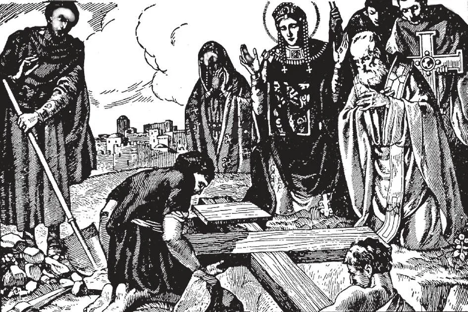

# 94. Relíquias e Imagens

*A verdadeira cruz foi encontrada por Santa Helena, mãe do imperador Constantino o Grande no ano 326. Seus operários, escavando no Monte Calvário em busca da verdadeira cruz de Cristo, encontraram três cruzes. Duas das cruzes foram aplicadas sem resultado a uma mulher muito doente. Assim que a terceira cruz a tocou, foi instantaneamente curada. A festa do encontro da verdadeira cruz é celebrada em 3 de maio. A adoração da Cruz na Sexta-Feira Santa faz parte das devoções da Semana Santa. A Festa da Exaltação da Cruz é celebrada em 14 de setembro.*

**Por que honramos relíquias?**

— Honramos relíquias porque são os corpos dos santos, ou objetos conectados com os santos ou com Nosso Senhor.

> De maneira similar preservamos com reverência certos objetos conectados com nossos grandes homens — uma espada, um casaco, ou livros.

1. Restos dos corpos dos santos, a Cruz na qual Nosso Senhor morreu, os pregos que O crucificaram, são todos relíquias. As roupas e mobiliário usados pelos santos são também tidos como relíquias.

> Apenas aquelas relíquias às quais o nome do santo e o selo episcopal estão anexados são autênticas. Relíquias não podem ser vendidas. Deus frequentemente mostrou Sua aprovação do uso de relíquias operando milagres por meio delas. "Quando tocou os ossos de Eliseu, o homem voltou à vida" (4 Reis 13: 21).

2. Relíquias merecem ser veneradas. Os corpos dos santos foram templos do Espírito Santo, e instrumentos pelos quais Deus trabalhou.

> Um dia ressurgirão gloriosos da sepultura, e serão unidos com a alma no céu. Deus mostra Sua aprovação da veneração de relíquias operando frequentes milagres em sua aplicação. Em certos casos, os corpos dos santos permaneceram incorruptos, como os de Santa Teresa, São Francisco Xavier e Santa Catarina de Bolonha. O sangue de São Januário, guardado numa ampola em Nápoles, liquefaz-se várias vezes ao ano por certos períodos. "Deus operava mais do que os milagres usuais pela mão de Paulo; de modo que até lenços e aventais eram levados de seu corpo aos enfermos, e as doenças os deixavam e os espíritos malignos saíam" (Atos 19: 12).

3. Honramos relíquias quando as preservamos com reverência, visitamos os lugares onde estão depositadas, rezamos diante delas, etc.

> Honra foi prestada a relíquias desde os primeiros dias do Cristianismo. Quando Santo Inácio, Bispo de Antioquia, foi lançado aos leões, dois de seus companheiros vieram à noite e recolheram seus ossos. Quando São Policarpo foi queimado vivo, os cristãos recolheram suas cinzas para veneração. E assim por diante.

4. Mais prezadas de todas as relíquias são relíquias da Paixão, particularmente da Cruz na qual Cristo morreu.

> Alguns zombam das relíquias da cruz, dizendo que há demasiadas para serem genuínas. Mas se todas as peças conhecidas são juntas, fariam um bloco de apenas cerca de 1/6 de um pé cúbico. Hoje as doze porções mais famosas da verdadeira Cruz variam de 6,33 polegadas cúbicas a 33 polegadas cúbicas. As maiores são encontradas em Jerusalém, Bruxelas, Ghent e Roma: Partículas veneradas são muito pequenas.

**É correto mostrar respeito às estátuas e imagens de Cristo e dos santos?**

— É correto mostrar respeito às estátuas e imagens de Cristo e dos santos, assim como é correto mostrar respeito às imagens daqueles que amamos na terra.

> Estimamos fotografias de nossa família e amigos. Estimamos e honramos nossa Bandeira Nacional, não por causa do pano do qual é feita, mas por causa do que representa. De maneira similar respeitamos estátuas e imagens sagradas.

1. A honra que prestamos a imagens e quadros sagrados não é idolatria, porque não os adoramos.

> Honramos imagens sagradas para mostrar nossa veneração pelas pessoas que representam, não para adorá-las como deuses. Fazemos e usamos estátuas e imagens para lembrar-nos de Jesus Cristo, Nossa Senhora e os santos. Deus Mesmo, após dar o Primeiro mandamento, ordenou a feitura de estátuas para serem colocadas no Templo; e Deus não pode contradizer-Se a Si Mesmo.

2. Alguns dos benefícios que derivamos da veneração de imagens sagradas são:

> (a) Através delas graças eficazes, e às vezes sobrenaturais, são obtidas. Houve casos de imagens e estátuas milagrosas, assim como crucifixos. (b) Ajudam-nos a evitar distrações ao rezar, fixando nossa atenção. (c) Servem como uma admoestação silenciosa para encorajar-nos à imitação. (d) São meios maravilhosos para instruir os fiéis na religião. Os maiores artistas do mundo foram artistas católicos. Suas maiores obras-primas tratam de assuntos religiosos. Mesmo os mais iletrados podem entender um quadro.

**Honramos Cristo e os santos quando rezamos diante do crucifixo, relíquias e imagens sagradas?**

— Honramos Cristo e os santos quando rezamos diante do crucifixo, relíquias e imagens sagradas, porque honramos as pessoas que representam; adoramos Cristo e veneramos os santos.

> Nossas ações devem sempre conformar-se à fé implícita pelas imagens que exibimos. Temos aquelas imagens santas para propósitos santos, para venerar os santos por amor de Deus, e para imitar suas vidas santas.

1. Mostramos veneração por imagens e estátuas sagradas colocando-as em nossos lares, nas igrejas, e nas escolas. Jesus fez uma promessa especial de abençoar a casa na qual uma imagem de Seu Sagrado Coração é exposta.

> Rezamos diante delas, adornamo-las com flores, acendemos luzes diante delas, e beijamo-las com reverência. Fazemos visitas e peregrinações aos túmulos ou santuários dos santos. Similarmente, em feriados civis, mostramos honra a nossos heróis colocando coroas em suas sepulturas; visitamos seus lares, etc.

2. Acima de todas as outras representações sagradas, veneramos mais o crucifixo. É o sinal de nossa redenção. Na cruz, Nosso Senhor morreu para salvar-nos das consequências do pecado.

> Tal é a honra que a Igreja presta ao crucifixo que não permite nenhum sacramento ser administrado, nenhuma Missa ser celebrada, nenhum ato de culto ser realizado, a menos que na presença de um crucifixo. Colocamos o crucifixo nas mãos dos moribundos. Acompanha-nos à sepultura. Todo lar cristão deve ter um crucifixo proeminentemente exibido.

**Rezamos ao crucifixo ou às imagens e relíquias dos santos?**

— Não rezamos ao crucifixo ou às imagens e relíquias, mas às pessoas representadas.

1. A veneração que prestamos a imagens e relíquias sagradas não é prestada à relíquia, quadro ou estátua em si, mas àquele representado, Deus, ou um dos santos ou anjos.

> Do mesmo modo quando beijamos a foto de nossa mãe não damos nossa afeição ao papel, mas à nossa mãe. Desrespeito a uma imagem é desrespeito àquele representado.

2. Na veneração de relíquias, estátuas sagradas e quadros, não cremas que qualquer poder divino resida neles. Não podem, por si mesmos, operar milagres. São meros instrumentos, objetos inanimados que podem ser usados por um Deus Todo-Poderoso.

> Os numerosos milagres operados através do uso de relíquias foram resultado, não do poder das relíquias, mas de Deus, agindo através delas. Os Evangelhos contam a história comovente da mulher curada ao tocar a orla da vestimenta de Nosso Senhor. Contudo mesmo aquela vestimenta sagrada não operou por si mesma o milagre; Cristo usou Seu poder, operando através da vestimenta. E assim hoje relíquias continuam a desempenhar um papel na operação de milagres, na suspensão da lei natural, mas sempre como meros instrumentos do Deus Todo-Poderoso.
