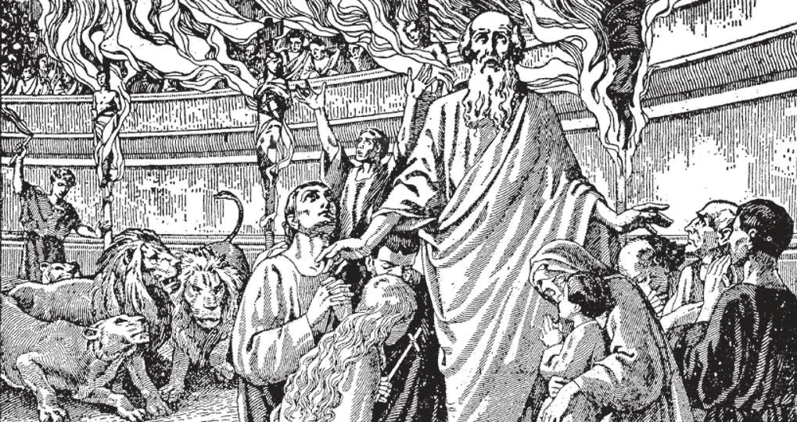

# 95. Pecados Contra a Fé

*Se amamos a Deus, nenhum sacrifício é grande demais para oferecer-Lhe por Seu prazer. Milhões de mártires alegraram-se em dar suas vidas por sua fé. Durante as grandes perseguições sob os imperadores romanos pagãos, milhares foram levados à arena para serem dilacerados por feras. Milhares de outros foram cobertos de pez e acesos como tochas. Todos os tipos de torturas humanas foram inventados para fazer os cristãos negar sua fé. Mas seu amor puro de Deus fez-lhes permanecer firmes e encontrar a morte alegremente.*

**Como um católico peca contra a fé?**

— Um católico peca contra a fé por infidelidade, apostasia, heresia, indiferentismo, e tomando parte em culto não-católico.

> Podemos perder nossa fé por: (a) não aprender bem as doutrinas da Igreja; (b) duvidar voluntariamente de verdades que foram reveladas à Igreja; (c) ler livros e outra literatura contra nossa religião; (d) assistir assembleias de pessoas que se opõem à nossa religião; e (e) negligenciar a prática de nossa religião. (Veja páginas 142-147)

1. Infidelidade é: (a) rejeição da Fé por aquele que a recebeu; ou (b) negligência em investigar o fundamento das reivindicações da Igreja por aquele que entende a necessidade de tal investigação; ou (c) ignorância da Fé por aquele que não teve chance de aprendê-la, ou que não percebe a importância de aprender.

> Pessoas que não crêem no Cristianismo como uma religião divinamente revelada, quer tenham sido batizadas ou não, são comumente referidas como "infiéis". Infidelidade é recusa em crer em qualquer coisa que não possa ser percebida com os sentidos, ou compreendida com o entendimento.

> Mas não é totalmente razoável ter fé num Deus todo-poderoso, Que sabe muito mais do que podemos alguma vez esperar saber, e Que pode fazer coisas além de nosso entendimento? É necessário que sirvamos a Deus do modo que Ele requer, não do modo que nos agrada fazer. Por esta razão devemos praticar a religião revelada por Deus, e evitar criar nossas próprias religiões segundo nossos caprichos e fantasias inumeráveis. Budistas, Maometanos, Hindus, Judeus, e pagãos, são infiéis. Como explicado, cristãos também podem tornar-se infiéis.

2. Apostasia é completa rejeição das verdades da fé católica por aquele que foi batizado. Uma vida viciosa e pecaminosa frequentemente leva à apostasia. Nenhum homem verdadeiramente bom jamais se afastou da fé católica.

> Um apóstata nega ou abandona sua religião por medo ou vergonha, ou por motivos mundanos ou respeito humano, e nega o Próprio Cristo. Está sob sentença de danação eterna, pois Cristo diz: "Quem Me renegar diante dos homens, também Eu o renegarei diante de Meu Pai que está nos céus" (Mat. 10:33). Pode acontecer que um católico abandone sua religião porque teve uma discussão com o padre. Crucifica Cristo por causa de uma pequena desavença com um mortal. Tal homem deve sempre lembrar que "quem perde seus bens perde muito; quem perde sua vida, perde mais; mas quem perde sua fé perde tudo."

3. Heresia é a recusa de pessoas batizadas em aceitar uma ou mais das verdades reveladas por Deus e ensinadas pela Igreja Católica. Se esta recusa é voluntária e obstinada, há heresia formal; se é involuntária, há heresia material.

> Um herege afirma ser cristão, mas nega uma ou mais verdades reveladas por Deus. Membros de denominações protestantes são hereges. Muito de sua heresia, contudo, é negativa, ou material: isto é, acompanhada de nenhuma obstinação da vontade; por exemplo, a heresia de um protestante que sempre creu que a sua é a religião ordenada por Deus.

4. Indiferentismo ensina que todas as religiões são igualmente boas. É o resultado de falta de interesse na religião. Muitos não querem incomodar-se em estudar sua religião, e gradualmente perdem a fé.

> Uma alma é como uma planta: precisa ser regada continuamente pelas verdades e práticas da religião. A menos que seja assim nutrida, adoecerá e perecerá. Por que Cristo, e depois d'Ele os Apóstolos, e depois deles uma longa linhagem de católicos, teriam sofrido tanto e resistido à perseguição tão firmemente, se não importasse o que um homem crê? É absurdo supor que Deus não se importa se os homens denunciam Seu Filho como um impostor e blasfemador ou O adoram como Deus.

**Por que um católico peca contra a fé tomando parte em culto não-católico?**

— Um católico peca contra a fé tomando parte em culto não-católico, porque fazendo assim professa crença numa religião que sabe ser falsa.

1. É errado estar presente em serviços protestantes ou judeus mesmo quando não participamos deles, porque tais serviços destinam-se a honrar Deus de um modo que Ele não deseja ser honrado. Se Ele instituiu uma Igreja Própria, deve desejar ser honrado nos modos daquela Igreja. Além disso, damos então mau exemplo, e expomo-nos ao perigo de perder nossa fé.

> Quando necessário, para obrigações sociais, um católico pode estar presente num casamento ou funeral não-católico, mas não deve participar dos serviços. Em nenhum caso pode assistir outros serviços de igrejas não-católicas, como a instalação de seus ministros, sermões, etc.

2. É pecado pertencer a qualquer sociedade que se oponha à Igreja. A Franco-Maçonaria, ou Maçonaria, é condenada pela Igreja. Muitas pessoas caridosas, que se juntaram à Maçonaria meramente por razões sociais ou de negócios, não entendem a posição da Igreja. A maioria delas serve apenas ao Terceiro Grau, e não mantém nenhum espírito de antagonismo contra a Igreja; mas estas boas pessoas não percebem os propósitos básicos de sua organização.

> Na realidade, a Maçonaria é uma seita religiosa empenhada na destruição da Igreja Católica. Tem suas próprias doutrinas, sacerdócio e ritual; tem sua moralidade característica. Por exemplo, impõe um juramento que requer obediência cega; não aceita a Revelação Divina. "Pelos seus frutos os conhecereis", e os frutos da Maçonaria são evidentes através da história europeia. Podemos dizer que ninguém precisa ter vergonha dos frutos da Igreja Católica em todos os lugares e todos os tempos?

**Como pode um católico melhor salvaguardar sua fé?**

— Um católico pode melhor salvaguardar sua fé fazendo atos frequentes de fé, rezando por uma fé forte, estudando sua religião muito seriamente, vivendo uma boa vida, por boas leituras, recusando-se a associar com os inimigos da Igreja, e não lendo livros e jornais opostos à Igreja e seu ensino.

1. Atos de fé são orações ditas para dizer a Deus que cremos n'Ele. Agradáveis a Deus também são orações de fé, como as que os Apóstolos fizeram ao Senhor: "Aumenta-nos a fé" (Luc. 17:5). Quanto mais cremos, mais firme nossa fé se torna, pela graça de Deus.

> Devemos estudar bem nossa religião, especialmente a doutrina cristã. Se temos alguma dúvida sobre ela, devemos consultar um bom conselheiro espiritual ou confessor. Muitos perderam sua religião por mal-entender suas doutrinas.

2. Um forte baluarte para a fé é uma boa vida. Nunca um homem justo, vivendo segundo os ensinamentos da Igreja, perde sua fé. Para aumentar na fé, vamos à Confissão e recebamos a Sagrada Comunhão frequentemente, para que nossos espíritos sejam nutridos por alimento divino.

> Aqueles que levam vidas más podem facilmente perder sua fé. Tentam convencer-se de que não há Deus, não há religião, para justificar sua maldade, ou silenciar sua consciência.

3. Devemos ter cuidado que os livros e revistas que lemos não sejam maus nem contra as doutrinas da Igreja. Os olhos são as janelas da alma; através deles pode ser atraída para o bem ou o mal.

> Devemos também abster-nos de ser íntimos de inimigos da Igreja, que falam contra ela e a assaltam em todas as ocasiões. Evitemos armadilhas, para que não caiamos nelas.
