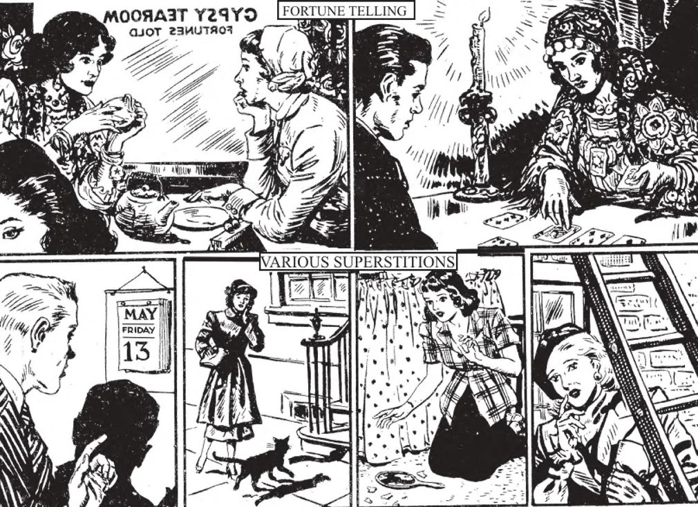

# 96. Religião e Superstição

*Acima, são ilustradas algumas das formas mais comuns de superstição. Pessoas doentes ou seus parentes às vezes recorrem à feitiçaria numa vã esperança de cura (1). Muitas pessoas de outro modo sensatas recorrem a adivinhos para saber sobre o futuro (2). Outros crêem em sinais e presságios (3-5). A superstição, além de ser contra a virtude da religião, algema a mente.*

**Como adoramos a Deus pela virtude da religião?**

— Adoramos a Deus pela virtude da religião adorando-O sozinho como o único e Supremo Ser, sendo a principal expressão de adoração a oração.

1. Adoramos a Deus reconhecendo Sua infinita excelência, nossa completa dependência d'Ele, nossa absoluta sujeição à Sua vontade; rezamos a Deus elevando nossas mentes e corações a Ele.

> Devoção à Bem-Aventurada Virgem Maria, veneração de santos, relíquias e imagens, não se opõem a esta virtude. Não adoramos os santos: apenas os honramos como amigos e servos especiais de Deus. Adoramos somente a Deus. Tampouco adoramos imagens e quadros sagrados ou relíquias. Apenas lhes prestamos honra como pertencendo ou representando Deus ou os santos. De maneira similar comumente estimamos as fotografias de nossos queridos amigos.

2. Os principais pecados contra a virtude da religião são: superstição, sacrilégio, idolatria e simonia.

> Falhamos em nosso dever de adoração quando nos entregamos às criaturas aparte de Deus: quando gastamos todas nossas vidas pelo mundo, por interesses materiais, em orgulho, luxúria ou avareza.

**Quando uma pessoa peca por superstição?**

— Uma pessoa peca por superstição quando atribui a uma criatura um poder que pertence somente a Deus.

1. Exemplos de práticas supersticiosas são: uso de amuletos ou feitiços, crença em sonhos ou adivinhação. Como praticado hoje, todas estas superstições são puro disparate: podem ser tomadas apenas como alguma diversão social, como "bingo." Apenas idiotas realmente crêem nestas práticas, em mascotes, presságios, astrologia.

> Como praticado hoje, manifestações de crenças supersticiosas são fraudulentas. Aqueles "mágicos" meramente realizam truques de destreza manual; as "bruxas", "adivinhos" e "espíritas" apenas usam suas agudas faculdades de observação e sua memória retentiva. E contudo, ainda há pessoas não inteligentes que crêem em dias de sorte e azar, números de sorte e azar; realmente crêem que encontrar uma ferradura é boa sorte, quebrar um espelho significa sete anos de má sorte, trazer um caixão com uma pessoa morta para dentro e para fora pelo mesmo caminho trará muito infortúnio e até morte aos participantes, e assim por diante, continuamente. Ao contrário, tudo é disparate, para ser ridicularizado.

2. Um amuleto é qualquer coisa usada com a crença de que tem poder mágico para proteger. Feitiços são palavras pela recitação das quais os supersticiosos crêem que o mal pode ser evitado, ou boa fortuna obtida.

> É tolice interpretar sonhos, porque são mais frequentemente o resultado de um jantar demasiado pesado. Os "sonhos" na Sagrada Escritura e nas vidas dos santos são, mais propriamente falando, revelação ou inspiração antes que sonhos; Deus usa meios particulares para casos excepcionais.

3. Espiritismo consiste em tentativas de comunicar com os espíritos dos mortos, ou com outros espíritos, usualmente pelo uso de médiuns e sessões. Magia refere-se a manifestações de maravilhas, através da intervenção de espíritos malignos, seja real ou fingida, indo até a invocação de demônios.

> Não há prova positiva de que um espírita ou mágico tenha sido capaz de comunicar com os espíritos dos mortos. Houdini, que foi o maior de todos os mágicos, fez uma aposta pública que poderia reproduzir qualquer manifestação espírita usando meios puramente naturais. Nenhum dos milhares de mágicos e espíritas de seu tempo aceitou.

4. Se houvesse tal coisa como adivinhação, por que aqueles adivinhos não melhoram suas próprias fortunas predizendo a alta do mercado de ações e comprando todas as ações? Então não precisariam trabalhar na adivinhação de fortunas a tanto por fortuna predita.

**Quando uma pessoa peca por sacrilégio?**

— Uma pessoa peca por sacrilégio quando maltrata pessoas, lugares ou coisas sagradas.

> Sacrilégio é um tipo de blasfêmia consistindo na violação ou profanação de uma pessoa, lugar ou coisa consagrada a Deus. Por exemplo, é sacrilégio incorrendo em excomunhão levantar mãos violentas contra um padre, uma freira, ou qualquer outra pessoa consagrada a Deus. É sacrilégio cometer atos de impureza ou de violência, como matar ou lutar, numa igreja ou cemitério consagrado, receber os sacramentos indignamente, roubar vasos sagrados ou outra propriedade da Igreja, causar dano numa igreja, desprezar relíquias e quadros santos, mutilar imagens, etc.

> Baltassar, Rei da Babilônia, foi culpado de sacrilégio quando usou os vasos sagrados do Templo de Jerusalém como copos de beber num banquete. Sua punição, como anunciada pela escrita na parede, é bem conhecida. Para evitar possível desrespeito a imagens sagradas e quadros santos que já estão demasiado velhos para uso, devemos queimá-los.

**Quando uma pessoa peca por idolatria?**

— Uma pessoa peca por idolatria quando presta a uma criatura o culto supremo devido somente a Deus como Criador e Preservador de todas as coisas.

> Honra divina deve ser prestada somente a Deus. Nos primeiros dias do Cristianismo, muitos cristãos foram postos à morte por recusar queimar incenso diante de Ídolos. Os antigos egípcios, e muitos pagãos hoje, adoram o sol, fogo, ou animais como o crocodilo. Deus puniu os Israelitas por sua idolatria.

Aquele que conhece a Igreja Católica como a Verdadeira Igreja, contudo recusa-se a juntar-se e obedecer-lhe, é culpado de resistir à verdade cristã conhecida, uma forma de idolatria, já que por ela obstinadamente nega o culto devido a Deus.

> Os Escribas e Fariseus conheciam bem todas as profecias concernentes ao Messias. Jesus Cristo provou-Se o Messias prometido por maravilhosos milagres, após anunciar-Se como o Filho de Deus. Mas seu orgulho foi uma barreira ao seu humilde reconhecimento de Jesus; caluniaram-No e perseguiram-No ao extremo. Foram culpados de resistir à verdade cristã conhecida. Maçons, especialmente aqueles que nasceram e foram criados católicos, podem ser culpados deste pecado se não permitirem que um padre se aproxime deles em seu leito de morte; "Tapam seus ouvidos, para não ouvir, e fazem seu coração como pedra de diamante" (Zac. 7: 11).

**Quando uma pessoa peca por simonia?**

— Uma pessoa peca por simonia quando compra ou vende coisas ou posições sagradas ou espirituais.

> O termo "simonia" vem de Simão Mago, que ofereceu aos Apóstolos dinheiro para dar-lhe o poder de dar o Espírito Santo (Atos 8: 19-20). É simonia vender um rosário por mais que seu preço ordinário por causa de uma bênção que tenha. Assim vendidos, objetos indulgenciados perdem suas indulgências.

Dar dinheiro a um padre para dizer Missa por nossa intenção não é simonia, porque não compramos e não podemos comprar uma Missa. O dinheiro é apenas uma oferta para os materiais para a Missa, e para ajudar a sustentar o padre.

> Como São Paulo disse, "Os que servem ao altar têm sua parte com o altar. Assim também o Senhor ordenou que os que pregam o Evangelho vivessem do evangelho" (1 Cor. 9: 14). Não seria para a dignidade do sacerdócio nem para o benefício do trabalho religioso se padres tivessem que trabalhar em ocupações seculares para sustentar-se.
