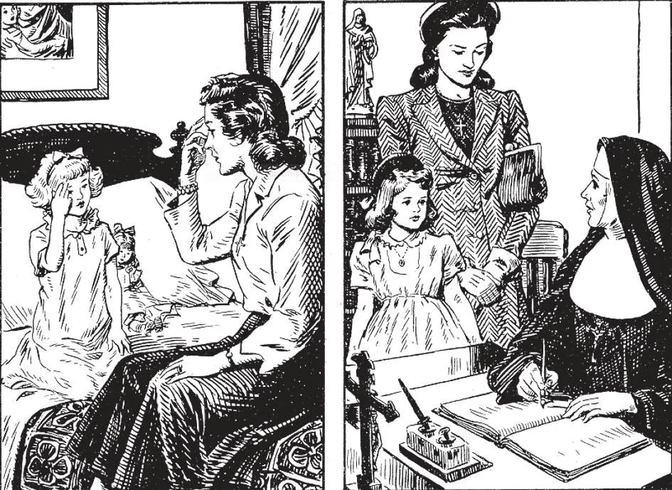

# 103. Deveres dos Pais

*Os pais têm o dever de começar o treinamento religioso de seu filho o mais cedo possível. (1) mostra uma boa mãe ensinando seu filho o sinal da cruz. (2) Os pais têm o dever de enviar seu filho a uma escola católica sempre que uma esteja disponível. Pais descuidados têm muito que responder diante de Deus se enviam seu filho a uma escola não-católica e a criança cresce na ignorância ou ódio da fé católica.*

**Que dever têm os pais para com seus filhos?**

— Os pais devem prover o bem-estar espiritual e corporal de seus filhos.

> O quarto mandamento requer que os pais amem seus filhos, e cuidem deles em corpo e alma. Seus deveres incluem provisão para o treinamento religioso e moral de seus filhos, necessidades corporais, educação, disciplina, maneiras, etc.

1. Os pais devem prover a um menor com alimento e vestuário, guardá-lo de enfermidade e acidentes, e dar-lhe brincadeira e exercício adequados. É dever dos pais exercer supervisão pessoal, e não deixar tudo com ajuda doméstica. Deus deu filhos aos pais, não às babás.

> Da mesma forma, aquelas instituições (chamadas berçários) onde mesmo bebês podem ser deixados o dia inteiro, por melhores que sejam, e mesmo que estejam sob supervisão de Irmãs, devem ser recorridas apenas por graves razões.

2. É dever dos pais católicos enviar seu filho a uma escola católica. Escolas seculares ou não-católicas onde a religião católica não é ensinada podem ser toleradas apenas quando o bispo diocesano dá permissão por causa de circunstâncias prevalecentes.

> Em casa, os pais devem supervisionar os estudos da criança. Devem apoiar a autoridade do professor, para ensinar à criança o devido respeito pela autoridade. Não é edificante para os pais criticar ou ridicularizar o professor na presença da criança. Os efeitos maus de tal conduta sobre a criança dificilmente podem ser superestimados.

3. Os pais devem prover para o futuro de uma criança dando-lhe uma educação que desenvolverá sua mente e caráter. Devem também habilitá-lo a adquirir algum treinamento, ofício ou profissão pelo qual possa mais tarde sustentar-se.

> Pais que dão a uma criança toda a comida, doces, brinquedos e roupas que pede apenas o mimam, e mostram amor falso. Meninas devem ser feitas vestir-se com modéstia. Os pais não têm obrigação de sustentar seus filhos adultos. É uma má prática continuar sustentando filhos mais velhos, pois dessa forma tornam-se preguiçosos e dependentes de seus pais.

**Como devem os pais prover treinamento moral e religioso?**

— Os pais devem começar cedo a dar a seu filho treinamento religioso.

1. Assim que a criança possa falar, deve ser ensinada as orações ordinárias, e informada sobre Deus e coisas santas. É um costume muito louvável ter orações em família nas quais toda a família participa.

> Uma criança deve ser feita dizer suas orações da manhã e da noite regularmente. Deve ser ensinada seu catecismo e preparada para Confissão e primeira Santa Comunhão; deve ser feita assistir à Missa, e cumprir todos os seus deveres religiosos fielmente.

2. Os pais devem exercer vigilância contínua, para guardar a criança do mal moral.

> À medida que a criança cresce, não deve ser permitida liberdade excessiva, especialmente com relação à companhia que mantém, e a ficar fora à noite. Os pais devem sempre saber onde a criança está, quem são seus companheiros, o que lê, que espetáculos vê.

3. Os pais devem corrigir as faltas da criança, tomando cuidado em não ser nem severos nem excessivamente indulgentes. Devem agir com justiça assim como com misericórdia. Devem tratar todos os seus filhos igualmente, e não mostrar favoritismo.

> Pais que voam em fúria sobre uma falta num dia e riem da mesma falta no outro dia dificilmente podem esperar que sua criança os respeite. Pais que são demasiado "bons" para corrigir, repreender ou punir uma criança que cometeu faltas graves são ou estúpidos ou preguiçosos. São maus pais, falhando em seus deveres para com Deus.

4. Os pais devem dar bom exemplo à criança. Obras são mais poderosas que palavras. Se os pais negligenciam os sacramentos, Missa, e outros deveres religiosos, não podem bem esperar que seu filho seja fiel.

> Alguns pais pensam que apenas porque enviam seu filho a uma boa escola católica, não têm mais responsabilidade sobre seu treinamento. Por melhor que seja uma escola, Deus não deu uma criança aos seus cuidados independentes, mas aos dos pais. Os pais devem treinar seus filhos não apenas por preceito, mas principalmente por exemplo. Pelo fruto a árvore é conhecida.

**Qual deve ser a atitude dos pais quando seu filho é adulto?**

— Quando seu filho é adulto, os pais devem lembrar que seu filho é um indivíduo que Deus criou para Seus próprios propósitos, e que tem seus próprios direitos e privilégios.

> Os pais devem ajudar seu filho a realizar os propósitos de Deus tanto quanto podem. Nunca devem ser um obstáculo para a criança, por egoísmo ou amor falso. Os pais devem ter o maior cuidado com sua atitude quando a criança escolhe uma ocupação, e especialmente quando escolhe um estado de vida.

1. Na escolha de uma ocupação ou profissão por seu filho, os pais devem agir com sabedoria e entendimento; devem aconselhar, mas nunca forçar. Acontece às vezes que uma criança mostra forte inclinação para certo estudo. Isto deve ser encorajado, pois é sinal de talento. Se a criança não mostra inclinação especial, um acordo e entendimento mútuos devem prevalecer.

> Se a criança é fortemente atraída ao estudo de agricultura ou arquitetura, não deve ser forçada a tornar-se advogado, porque seu pai é advogado ou porque seus pais desejam vangloriar-se de um filho político. Quantos são fracassos em suas ocupações hoje porque seus pais os forçaram a uma vocação desagradável para eles!

2. Muitos pais por puro capricho interferem com o exercício da profissão ou ocupação de seu filho, impedindo sua aceitação de posições, desejando que ele fique em casa com eles, etc.

> Tais pais não precisam surpreender-se se se encontram sobrecarregados com o sustento de seus filhos adultos e suas famílias. Se cortais as asas de um pássaro, não pode voar.

3. Na escolha de um estado de vida, que pode fazer ou arruinar a vida de seu filho, os pais devem aconselhar, mas não interferir. Se deseja casar-se, e têm alguma objeção ao parceiro que escolheu, podem expor suas objeções. Se a objeção é muito séria, podem tentar impedir o casamento, mas nunca de outro modo.

> Os pais não devem ser egoístas. Muitos são tão egoístas que, desejando manter seu filho para si mesmos, não podem encontrar ninguém no mundo inteiro satisfatório como parceiro para ele. Os pais devem lembrar que a criança tem direito à sua própria vida. Quando morrem, ele deve ser capaz de existir sem eles.

4. Os pais pecam quando forçam seu filho a casar-se com alguém por quem não se importa.

> Os pais não devem meter-se nos assuntos de seus filhos casados. Esta interferência é uma fonte frequente de desacordo entre casais. Os pais devem ter muito cuidado com sua atitude se seu filho escolhe uma vocação religiosa.
