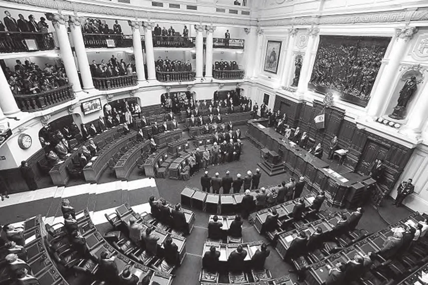

# 104. Deveres de Outros Superiores

*Ao ser escolhido para um cargo público, oficiais adquirem não apenas direitos, mas deveres também. Juízes, legisladores e outros oficiais públicos devem tratar todos com igual justiça, e devem dar o melhor serviço que podem ao povo. São responsáveis diante de Deus por tudo que fazem, por todas as decisões que tomam.*

**Quais são os principais deveres daqueles que exercem cargo público?**

— Os principais deveres daqueles que exercem cargo público são: ser justos com todos no exercício de sua autoridade, e promover o bem-estar geral.

1. Oficiais públicos têm uma grave responsabilidade diante de Deus. Quanto mais alto o posto, maior a responsabilidade. Legisladores, membros do gabinete, juízes, todos os detentores de cargo — todos do mais baixo ao mais alto terão que dar uma prestação de contas rígida a Deus de tudo que pensaram, disseram, fizeram, ou omitiram, cada lei aprovada, cada voto dado.

> "Um juízo muito severo será para aqueles que exercem o governo" (Sab. 6:6). Aqueles em alto ofício devem considerá-lo como meramente confiado aos seus cuidados por um curto tempo.

2. Ninguém deve esforçar-se por uma posição de autoridade que não é competente para preencher.

> Aquele que aspira a uma dignidade, para realizar deveres dos quais é incapaz, é como um padeiro que tenta pilotar um avião. Se, contudo, uma pessoa sente-se competente, e está disposta a aceitar os deveres de um posto, é bom para ele esforçar-se para obtê-lo se assim pode contribuir para o bem-estar de outros.

3. Aquele sobre quem honras e posições são conferidas deve ter como seu pensamento principal o cumprimento dos deveres conectados com sua posição. Não deve pensar muito de si mesmo por causa da honra; isto não o torna melhor aos olhos de Deus.

> Somente a virtude dá a um homem verdadeiro valor e distinção. Herodes era rei; Maria e José eram pobres trabalhadores. Mas Maria e José agora estão muito perto de Deus, e seguramente Herodes não está tão perto de Deus. "Aquele que quiser tornar-se grande entre vós será vosso servo; e aquele que quiser ser o primeiro entre vós será vosso escravo; assim como o Filho do Homem não veio para ser servido mas para servir" (Mat. 20:27-28).

4. Oficiais públicos devem dar bom exemplo porque ocupam uma posição proeminente, e porque exemplo é melhor que preceito. Oficiais fazem mais por seu exemplo do que por suas ordens e regulamentos.

> Como uma cidade assentada sobre um monte, oficiais públicos não podem ser escondidos. Outros rapidamente os imitam. Que responsabilidade diante de Deus é para um oficial levar uma vida imoral e assim corromper numerosas pessoas jovens por seu mau exemplo! Que escândalo é para um oficial ser o primeiro a quebrar a lei!

**Como devem os oficiais públicos promover o bem-estar geral?**

— Oficiais públicos devem promover o bem-estar geral salvaguardando os direitos de todos, aprovando leis boas e justas e fazendo cumprir estas leis imparcialmente, interessando-se pela difusão de bons costumes morais e religião, e punindo malfeitores.

1. Sendo os representantes de Deus, oficiais públicos devem imitar Sua justiça. O bem comum, não o benefício de uma única pessoa ou grupo, deve ser o objeto.

> Oficiais civis devem estar prontos a sacrificar-se pelos cidadãos. Cristo o Bom Pastor deu Sua vida por Suas ovelhas.

2. Oficiais devem ser imparciais. Devem mostrar favor a nenhum, mas tratar todos igualmente, ricos ou pobres, proeminentes ou desconhecidos. "Com Deus, não há acepção de pessoas" (Rom. 2:11).

> Juízes devem guardar-se de agir injustamente, ou de permitir-se ser corrompidos por subornos. Não devem deixar que os ricos e poderosos os induzam a dar julgamento injusto. Aceitação de subornos por oficiais públicos é um pecado contra o sétimo mandamento. "Deus fez o pequeno e o grande, e tem igual cuidado de todos" (Sab. 6:8).

3. Oficiais públicos devem particularmente prover para o bem-estar dos pobres e indefesos: os destituídos, os doentes, órfãos, e o grande corpo das classes trabalhadoras.

> Estes cidadãos menos afortunados frequentemente não têm poder para proteger-se. As leis e governantes devem portanto salvaguardá-los sem, contudo, ferir o bem-estar e direitos de outros.

4. Oficiais têm uma obrigação séria de promover os fundamentos cristãos de nossa Constituição.

> Devem trabalhar para fazer princípios cristãos prevalecer num país cristão; salvaguardando educação, respeito pelo Dia do Senhor, casamento, etc.

**Quais são os deveres dos superiores em geral?**

— Em geral, superiores devem prover para o bem-estar espiritual e material daqueles sobre quem têm controle.

1. Empregadores devem ser considerados para com seus inferiores. Não devem oprimir seus empregados, nem reter seus salários, nem explorá-los de qualquer modo.

> Opressão dos pobres, da viúva, e do órfão, e defraudar trabalhadores de seus salários, são pecados que clamam ao céu por vingança. Alguns empregadores fazem seu povo trabalhar em salas insalubres e superlotadas; dificilmente lhes dão algum tempo para repouso e para suas refeições; requerem deles mais trabalho do que podem fazer.

2. Empregadores devem dar a seus empregados um salário digno; isto é, suficiente para eles e suas famílias viverem decentemente. Devem permitir-lhes amplas facilidades para cumprir deveres religiosos.

> Devem cuidar de sua saúde, vigiar seus costumes, atender à sua instrução religiosa se são católicos. (Para outros deveres de empregadores veja páginas 230-231.)

**Que proíbe o quarto mandamento?**

— O quarto mandamento proíbe desrespeito, rudeza, e desobediência a nossos pais e superiores legítimos.

1. Desrespeito inclui toda irreverência e teimosia contra autoridade legítima. Alguém ofende contra o respeito devido a seus pais quando responde de volta a eles, recusa sua correção, ridiculariza-os ou bate neles.

> Aquele que pensa e age como se fosse "superior" a seus pais é um snob desgraçado. Pois mesmo se um filho ou filha graduou-se com as mais altas honras da melhor universidade do mundo, ainda deve a seus pais o devido respeito como representantes de Deus.

2. Desprezo e rudeza são contrários ao amor que devemos a nossos pais. Alguém ofende contra o amor devido a seus pais se os amaldiçoa, despreza-os, odeia-os, entristece-os ou os faz irar-se.

> Crianças às vezes falam asperamente e insultuosamente a seus pais. Devemos recuar em vergonha antes de fazer isto. Mesmo se apenas pensamos no que nossos pais fizeram por nós, os contínuos e intermináveis sacrifícios que fizeram, deveríamos queimar nossa língua antes de falar com desprezo a eles. "Aquele que amaldiçoa a seu pai ou mãe, morra" (Lev. 20:9).

3. Crianças podem pecar contra a obediência seja recusando ou negligenciando fazer o que é comandado, ou fazendo o que é proibido. Mostrar indisposição é também uma forma de desobediência.

> Uma criança jovem é desobediente se negligencia seus estudos, anda com companheiros proibidos, sai sem permissão, etc. Crianças mais velhas desobedecem assistindo a espetáculos ou bailes proibidos, saindo com companheiros proibidos ou em tempos proibidos, ocultando seus ganhos de seus pais, etc.
