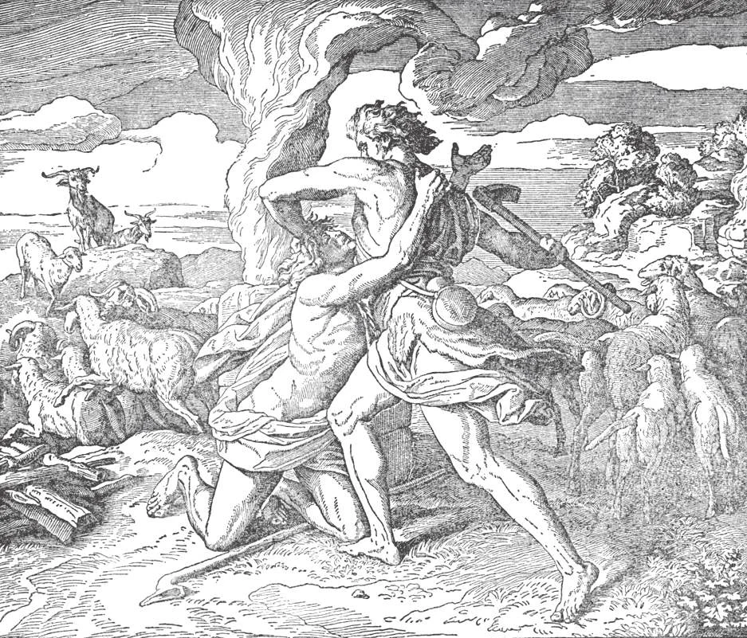

# 106. O Quinto Mandamento

*O primeiro assassinato na terra foi cometido por Caim quando matou Abel. "E disse Caim a Abel seu irmão: Saiamos ao campo. E quando estavam no campo, Caim levantou-se contra Abel seu irmão, e o matou. E o Senhor disse a Caim: Onde está Abel teu irmão? E ele respondeu: Não sei. Sou eu o guardador de meu irmão?" (Gên. 4:8-9). Assassinos não agem como irmãos do assassinado.*

"NÃO MATARÁS."

**Que nos é ordenado pelo Quinto Mandamento?**

— Pelo quinto mandamento, nos é ordenado tomar cuidado adequado de nosso próprio bem-estar espiritual e corporal e o de nosso próximo. Pecados incluídos neste mandamento são muitos, como: assassinato, suicídio, ira, luta, ódio, escândalo e mau exemplo.

**O que é assassinato?**

— Assassinato é o matar voluntário e injusto de um ser humano.

1. Assassinato é um grande pecado. Um assassino viola os direitos de Deus sobre a vida humana, e, além de tirar uma vida, rouba sua vítima da oportunidade de ganhar méritos para o céu, e preparar-se para a morte.

> Deus criou o homem, e tem domínio supremo sobre a vida. "Sabeis que nenhum homicida tem a vida eterna permanecendo nele" (1 João 3:15).

2. A intenção direta de matar uma pessoa inocente é sempre proibida, como contra este mandamento, seja por autoridade pública ou privada. E o corpo humano não pode ser mutilado a menos que fosse o único modo de preservar a saúde ou salvar uma vida. Também, já que violação do corpo é proibida exceto para salvar vida ou saúde, qualquer um que realiza esterilização comete pecado grave.

> Por mais doente que uma pessoa esteja, e mesmo a seu próprio pedido, para aliviá-la de dor, ninguém, nem mesmo o próprio governo, pode tirar sua vida. Alguns propagariam a ideia de eutanásia, o que chamam "morte misericordiosa", uma matança direta e deliberada daqueles em grande dor, dos defeituosos, morônicos, ou de outro modo incapacitados. Tais "assassinos misericordiosos" são assassinos, que usurpam os direitos de Deus sobre a vida.

3. Uma mãe esperando um filho deve ter muito cuidado em proteger e preservar a vida de sua criança. Como a alma é criada no próprio momento da concepção, qualquer coisa voluntariamente feita que resulta na morte mesmo de uma criança por nascer é assassinato.

> Nem mesmo para salvar a vida da mãe uma criança por nascer pode ser morta por aborto direto. Se a morte da criança resulta secundariamente, numa tentativa de salvar a vida da mãe, e após todos os cuidados terem sido tomados para salvaguardar a criança, isto é aborto indireto, e é permitido, por causa grave. Nos Estados Unidos, uma em cada três gravidezes termina em aborto.

4. É lícito matar animais para alimento, porque Deus os deu para uso do homem. O quinto mandamento proíbe o matar apenas de seres humanos. Deus Mesmo comandou o matar de animais para sacrifício, após ter dado este mandamento.

> É nosso dever cuidar dos animais, abster-nos de atormentá-los, e de matar qualquer animal útil sem razão; mas não devemos prodigalizar sobre eles afeição exagerada, como se fossem ídolos.

**Quando é lícito tirar a vida de outrem?**

— É lícito tirar a vida de outrem:

1. Em legítima defesa, ou defesa de outro injustamente atacado. Uma mulher pode matar, para proteger-se contra agressão criminal. Alguém pode defender vida ou propriedade contra inimigos, indo até matar.

> Alguém, contudo, não pode fazer mais do que o necessário para defesa: se ferir um agressor é suficiente, seria errado matá-lo. Alguém não está justificado a matar para proteger propriedade de valor trivial. Armar uma armadilha para matar um ladrão de galinhas é assassinato.

2. Ao executar criminosos condenados por autoridade legítima. A sociedade deve proteger-se do crime, e pode através de autoridade constituída ordenar uma sentença de morte.

> Pessoas privadas e turbas não têm direito de pôr alguém à morte. Linchamento é assassinato.

3. Numa guerra justa. Uma nação tem o direito de existir e proteger-se. É lícito para ela repelir pela força aqueles que procuram destruí-la, e assim defender seus direitos numa matéria grave. Nações podem também assistir outras nações injustamente atacadas, ou cujos direitos são invadidos.

> A guerra, contudo, é um mal que não deve ser empreendido exceto como último recurso. Nações têm uma tendência a considerar seu lado particular como justo, mesmo quando pode não ser.

**O que é ira?**

— Ira é um forte sentimento de desprazer, combinado com desejo de punir o ofensor.

1. Ira é contrária ao espírito de Cristo, Que é manso e humilde de coração. Devemos ter cuidado em não ferir ou magoar os sentimentos de outrem. Se caímos na infelicidade de fazê-lo, devemos pedir desculpas ou fazer emendas de algum outro modo. "Não se ponha o sol sobre vossa ira" (Ef. 4:26).

> Ira frequentemente surge de orgulho ou inveja. Aqueles que pensam muito de si mesmos iram-se a cada suposta ofensa ou injúria. Devem lembrar a caridade cristã, e temer estas palavras: "Todo aquele que se irar contra seu irmão será réu de juízo" (Mat. 5:22).

2. Ira injusta leva a luta, ódio, rixa, maldição, zombaria, vingança, e outros pecados graves, pode até terminar em assassinato.

**O que é ódio?**

— Ódio é forte aversão ou má vontade para com alguém.

1. Ódio é um tipo de ira habitual. Aquele que odeia não vê bem nenhum na pessoa odiada, e gostaria de ver o mal chover sobre aquela pessoa, que então se torna um inimigo.

> Se odiamos certas qualidades de uma pessoa, mas não temos antagonismo para com a própria pessoa, nosso sentimento não é necessariamente pecaminoso. Não é ódio detestar as qualidades más dos outros; devemos odiar o pecado, mas não o pecador. Devemos ter cuidado, contudo, em não cometer juízo temerário, referente a qualidades, pois não podemos conhecer todas as circunstâncias; tenhamos caridade para com todos.

2. Ódio é um pecado porque aquele que odeia a outro viola o mandamento de Deus, "Amarás o teu próximo como a ti mesmo." "Todo aquele que odeia a seu irmão é homicida" (1 João 3:15).

**Qual é o pecado de vingança?**

— O pecado de vingança é o desejo de infligir punição imoderada e injusta a alguém que nos injuriou, por motivo de ira. Quando séria, vingança é vingança, um pecado contra a caridade e justiça, muito pecaminoso e não-cristão. Por mais que sejamos injuriados, não temos direito de tomar a lei em nossas mãos.

> São Paulo disse, "Não vos vingueis a vós mesmos, amados, mas deixai lugar à ira, pois está escrito: A Mim pertence a vingança, Eu retribuirei, diz o Senhor" (Rom. 12:19). "Aquele que procurar vingar-se encontrará vingança da parte do Senhor" (Deut. 32:35).
