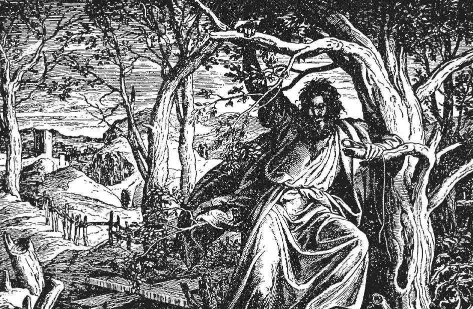

# 107. Cuidando de Nossa Saúde e Vida

*Após trair Nosso Senhor, Judas caiu em desespero. "Então Judas, que O traiu, quando viu que foi condenado, arrependeu-se e trouxe de volta as trinta moedas de prata aos sumos sacerdotes e aos anciãos, dizendo: 'Pequei traindo sangue inocente.' Mas eles disseram 'Que nos importa? Isso é contigo.' E ele lançou as moedas de prata no templo, e retirou-se; e foi e enforcou-se com uma corda" (Mat. 27: 3-5). Se Judas se tivesse arrependido, em vez de desesperar, e tivesse pedido perdão, Nosso Senhor tê-lo-ia perdoado, como perdoou o bom ladrão.*

**Quais são nossos deveres referentes à nossa saúde e vida?**

— Temos a obrigação de preservar nossa saúde e vida.

1. O homem não tem direito de invadir o domínio de Deus sobre a vida. O homem não criou nenhum ser humano, e não pode matar nenhum ser humano, nem mesmo a si mesmo. Nosso corpo não é nosso; pertence a Deus. Somos obrigados a cuidar dele, e fazer com ele não o que queremos, mas o que Deus quer. Deus criou nosso corpo como morada para nossa alma imortal.

Muito frequentemente a condição do corpo afeta a da alma. Se o corpo está doentio, a alma sofre. Há um sábio provérbio romano: "Mente sadia em corpo são." Contudo, não somos obrigados a empregar meios incomuns envolvendo grande despesa, ou sofrimento extraordinário.

2. Devemos exercer prudência em preservar nossa saúde e a daqueles sob nosso cuidado. Prudência implicaria limpeza, temperança, regularidade, indústria, e uso de remédios durante enfermidade.

> Dirigir um carro em velocidade excessiva, atravessar os trilhos quando um trem está se aproximando, brincar com armas de fogo carregadas, pular para dentro ou para fora de um carro quando está em movimento, pendurar-se no estribo de um carro, etc., são ações imprudentes.

3. Temos a obrigação de não fazer nada que tenda a ferir ou destruir saúde ou vida. Fere a saúde indulgar em excesso em beber, fumar, dançar a todas as horas, comer comida não saudável, e vaidade no vestir.

> Algumas mulheres e meninas são gravemente responsáveis por não comer comida adequada por desejo de manter-se magras e assim ser mais agradáveis aos olhos dos outros, para dano de sua saúde. Alguns homens e meninos formam o vício da embriaguez, tomando tanto de intoxicantes a ponto de perder a razão.

**Por que a embriaguez é um pecado?**

— Embriaguez é um pecado porque fere a saúde, e frequentemente leva a outros pecados.

> "Caminhemos decorosamente como de dia, não em orgias e bebedeiras, não em libertinagem e dissolução, não em rixa e ciúme. Mas revesti-vos do Senhor Jesus Cristo, e quanto à carne, não tenhais cuidado de suas concupiscências" (Rom. 13: 13).

1. Pela embriaguez, alguém deliberadamente entorpece sem justa causa sua razão, dom precioso de Deus ao homem.

> São Paulo disse: "As obras da carne são manifestas, que são inimizades. . . . bebedeiras, orgias e coisas semelhantes. E a respeito destas vos advirto, como já vos advi, que os que fazem tais coisas não alcançarão o reino de Deus" (Gál. 5: 19-21).

2. Quando cometida publicamente, a embriaguez ocasiona mau exemplo e escândalo, e frequentemente promoveu lutas e até assassinato. Por beber habitual, uma pessoa não apenas fere sua saúde, mas negligencia o sustento de sua família, e não improvavelmente também falha em suas obrigações para com o Estado e para com Deus.

> Embriaguez é uma forma de suicídio lento; bêbados não vivem muito. Encurtam a vida que Deus lhes deu para ceder a seus apetites indignos. Se um homem apenas se sentasse e raciocinasse o assunto nunca se submeteria ao vício da embriaguez, que não o torna nem louvado nem amado por Deus ou seus semelhantes.

**O que é suicídio?**

— Suicídio é o tirar deliberado da própria vida.

1. Suicídio é um grande pecado: é auto-assassinato. A Igreja nega sepultura cristã àqueles que sabiamente tiram sua própria vida. Por isto, a Igreja não quer dizer que aquelas almas estão seguramente condenadas ao inferno. Seu juízo está nas mãos de Deus. A Igreja meramente deseja mostrar condenação pública de tais pecados.

> Aquele que comete suicídio peca contra Deus, Que é o árbitro exclusivo da vida ou morte; peca contra si mesmo, lançando sua alma misericordiosamente no inferno; e peca contra sua família, que deixa para suportar sua vergonha, e talvez viver em necessidade por falta de seu sustento.

2. Suicídio é o resultado de falta de religião. A experiência ensina que à medida que a religião enfraquece numa terra, o número de suicídios aumenta. Suicídio é usualmente cometido por alguém que se meteu em problemas ou cometeu algum grande pecado.

> Se nos metemos em problemas, devemos ter paciência e confiança em Deus. Alguns cometem suicídio porque perdem suas fortunas; outros por falências de negócios; e ainda outros porque não podem suportar desapontamentos.

3. Suicídio é o pecado daqueles em desespero, que não crêem ou esperam na misericórdia de Deus e capacidade de sustentá-los em todas as adversidades. Suicídio é um pecado de Judas.

> O suicida não mais sustenta que Deus fortifica qualquer coisa e tudo quando um pecador se arrepende. Não mais sustenta que Deus é infinitamente misericordioso e infinitamente poderoso, que pode tirar bem dos males mais horríveis.

4. Se alguém cometeu grandes pecados, o remédio não é cometer suicídio, mas arrepender-se. A coisa a fazer não é ferir ou atirar ou envenenar a si mesmo, mas apegar-se a Deus em sincera tristeza.

> Mesmo se alguém tem que sofrer desprezo e desgraça nesta vida por seus pecados, estará apenas reparando sua alma para o céu. Mas se comete suicídio, estará apenas preparando-a para os tormentos do inferno.

5. Um duelo é um combate realizado por acordo entre duas pessoas, lutado com armas mortais, usualmente diante de testemunhas chamadas padrinhos. Duelar não é senão suicídio e assassinato combinados. Um católico é obrigado a recusar lutar um duelo. Sepultura cristã é negada àqueles que são mortos num duelo.

> O duelista é culpado de um duplo assassinato: intenta matar seu antagonista, e arrisca sua própria vida. A Igreja excomunga aqueles que desafiam ou aceitam um desafio para um duelo, os padrinhos, e todos que sancionam um duelo por sua presença.

6. Não é errado, mas altamente meritório, expor nossa saúde e vida para ganhar a vida eterna, ou resgatar nossos semelhantes da morte física ou espiritual. Cristo Mesmo sabiamente deu Sua vida para salvar almas.

> Mártires, padres e missionários que expõem suas vidas, médicos e enfermeiras que atendem casos contagiosos, merecem uma recompensa eterna. Aqueles que perdem suas vidas resgatando outros de afogamento ou incêndio, merecem renome. "E não tenhais medo dos que matam o corpo mas não podem matar a alma. Mas antes temei aquele que pode destruir alma e corpo no inferno" (Mat. 10: 28). "Aquele que acha sua vida perdê-la-á e aquele que perde sua vida por amor de Mim, achá-la-á" (Mat. 10: 39).
