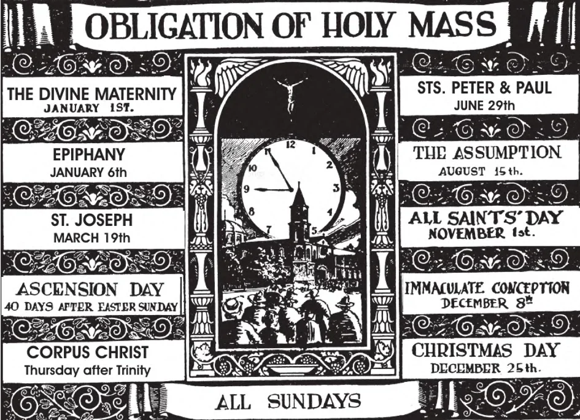

# 118. Primeiro Mandamento da Igreja

*Nos dias santos de obrigação, assim como nos Domingos, devemos ouvir Missa e abster-nos de trabalho servil desnecessário. Se sem qualquer razão grave, alguém falha em santificar os dias santos de obrigação, comete um pecado mortal. Aqueles obrigados a trabalhar nos dias santos de obrigação devem ao menos ouvir Missa antes de ir a seu trabalho. Empregadores católicos têm uma obrigação séria de tornar fácil para aqueles sob sua autoridade santificar os dias santos de obrigação. Todos são filhos do mesmo Pai Eterno.*

"ASSISTIR À MISSA EM TODOS OS DOMINGOS E DIAS SANTOS DE OBRIGAÇÃO."

**Que pecado comete um católico que por sua própria culpa perde a Missa num Domingo ou dia santo de obrigação?**

— Um católico que por sua própria culpa perde a Missa num Domingo ou dia santo de obrigação comete um pecado mortal.

> O preceito não é obrigatório para aquele que deve cuidar dos doentes, ou mora bastante longe de uma igreja, ou que tem trabalho urgente, ou está doente.

1. O primeiro preceito da Igreja requer-nos santificar Domingos e dias santos de obrigação. Então prestamos a Deus e aos santos alguma da honra que lhes é devida.

> Os primeiros cristãos celebravam muitas festas para que pudessem manter viva a memória de certos eventos ou benefícios de Deus. O objetivo de instituir dias santos é ter os fiéis lembrando para todo tempo os importantes eventos comemorados, e ter-lhes dando louvor e ação de graças a Deus por eles. Isto é por que devemos sempre tentar celebrar dias santos de maneira conveniente. Algumas pessoas infelizmente tratam dias santos como apenas dias para comer e beber e ser alegres, sem consideração pela ocasião comemorada.

2. A lei civil não reconhece como dias santos alguns dos dias santos de obrigação da Igreja; fábricas, escritórios, e escolas ficam abertos naqueles dias. Mas mesmo se católicos devem ir trabalhar em tais dias santos, devem ao menos tentar ouvir Missa. Numerosas igrejas celebram Missa numa hora cedo da manhã, como também à noite.

> Pessoas não obrigadas a trabalhar nos dias santos de obrigação devem evitar fazê-lo. Mas aqueles que devem trabalhar precisam lembrar apenas as palavras de Nosso Senhor: "O Sábado foi feito para o homem, e não o homem para o Sábado. Portanto o Filho do Homem é Senhor mesmo do Sábado" (Mar. 2:27-28).

**Quais são os dias santos de obrigação na Igreja Universal?**

— Todos os Domingos e os seguintes dez:

1. Natal

> (25 de Dezembro) Neste dia comemoramos o nascimento de Jesus Cristo no estábulo em Belém. "E aconteceu que enquanto estavam lá, completaram-se os dias de ela dar à luz. E deu à luz seu Filho primogênito, e envolveu-O em panos, e deitou-O numa manjedoura, porque não havia lugar para eles na estalagem" (Luc. 2:6-7).

2. A Epifania

> (6 de Janeiro) A Epifania celebra a adoração do Menino recém-nascido pelos Magos, os Sábios do Oriente, — Melchor, Gaspar, e Baltasar. A festa é chamada a Epifania (ou "manifestação") porque celebra a manifestação de Cristo aos Gentios.

3. Quinta-feira da Ascensão

> (40 dias após a Páscoa) Quarenta dias após Sua Ressurreição dos mortos, Nosso Senhor ascendeu ao céu do Monte das Oliveiras. "E levou-os para fora até Betânia, e levantou as mãos e os abençoou. E aconteceu que enquanto os abençoava, separou-Se deles e foi levado ao céu" (Luc. 24:50-51). E quando disse isto, foi elevado diante de seus olhos, e uma nuvem O tomou fora de sua vista. E enquanto estavam fitando o céu enquanto Ele ia, eis que dois homens pararam junto deles em vestes brancas, e disseram-lhes, "Homens da Galileia, este Jesus que foi tomado de vós para o céu, virá da mesma maneira como O vistes indo para o céu" (Atos 1:9-11).

4. Corpus Christi

> (Quinta-feira após o Domingo da Trindade)

5. A Divina Maternidade da Bem-Aventurada Virgem Maria

> (1 de Janeiro) Também chamada a Circuncisão de Nosso Senhor.

6. A Assunção

> (15 de Agosto). Após sua morte, a alma da Bem-Aventurada Virgem Maria foi reunida a seu corpo incorrupto, e foi levada ao céu pelo ministério de anjos. Ninguém jamais reivindicou possuir qualquer relíquia do corpo de Maria; se ela não tivesse sido assumida ao céu, não teriam os Apóstolos, que a reverenciavam altamente, guardado suas relíquias?

7. Dia de Todos os Santos

> (1 de Novembro). No Dia de Todos os Santos honramos a memória de todos os Santos no céu e imploramos sua intercessão.

8. A Imaculada Conceição

> (8 de Dezembro). Deus Mesmo proclamou a pureza imaculada de Maria no Paraíso (Gên. 3:15): o arcanjo Gabriel anunciou-a, chamando-a "cheia de graça." Cristãos através dos séculos chamaram Maria imaculada; o dogma foi declarado pelo Papa em 1854. É um artigo de fé crer que Maria foi concebida inteiramente livre do pecado original.

9. São José

> (19 de Março)

O Papa Pio IX declarou São José como o patrono da Igreja universal.

10. Santos Pedro e Paulo.

> (29 de Junho)

**Que mais nos obriga a Igreja a fazer nos dias santos de obrigação?**

— A Igreja nos obriga a abster-nos de trabalho servil nos dias santos de obrigação, assim como nos Domingos, tanto quanto somos capazes. (Veja páginas 204-205, Trabalho Servil Desnecessário.)

> Nestes dias, católicos devem manter-se afastados de trabalho doméstico como lavar e limpeza da casa.

**Por que foram dias santos instituídos pela Igreja?**

— Dias santos foram instituídos pela Igreja para lembrar-nos dos mistérios de nossa religião, e dos importantes eventos nas vidas de Cristo e de Sua Bem-Aventurada Mãe, e recordar-nos as virtudes e as recompensas dos santos.

1. A Igreja designa festas em honra de Nosso Senhor, para que possamos recordar os principais mistérios de nossa Redenção, agradecer a Deus pelas graças recebidas através destes mistérios, e fazê-los dar fruto em nossas vidas.

> As festas de Nosso Senhor que não caem necessariamente num Domingo são: Natal, a Circuncisão, e a Ascensão. Páscoa e Pentecostes sempre caem num Domingo.

2. Mesmo se algumas festas não são dias santos de obrigação em vosso país, deveis ainda celebrá-las com muita honra, especialmente assistindo à santa Missa.

3. As festas em honra de Nossa Senhora e dos Santos são prescritas, para que possamos reverenciá-los como amigos de Deus, e lucrar por sua intercessão e exemplo.
