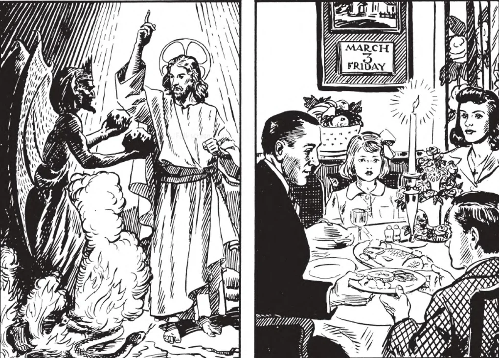

# 120. Segundo Mandamento da Igreja

*Nosso Senhor Mesmo frequentemente jejuou. Jejuou quarenta dias e quarenta noites antes de começar Sua vida pública. Por lei da Igreja, todas as pessoas batizadas entre as idades de 18 anos completos e até o início de seu sexagésimo ano, são obrigadas a jejuar; e todas as pessoas batizadas que completaram o décimo quarto ano de idade e acima, são obrigadas a observar os dias de abstinência, a menos que excusadas ou dispensadas.*

"JEJUAR E ABSTER-SE NOS DIAS DESIGNADOS."

**O que é um dia de jejum?**

— Um dia de jejum é um dia no qual apenas uma refeição completa é permitida: mas de manhã e à noite algum alimento pode ser tomado, a quantidade e qualidade dos quais são determinadas pelo costume local aprovado. As refeições menores não devem ser iguais à quantidade da refeição principal.

1. A refeição completa pode ser tomada tanto ao meio-dia quanto à noite. Apenas nesta refeição pode ser tomada carne; mas tanto peixe quanto carne podem ser tomados na mesma refeição.

> Jejum era uma prática na primitiva Igreja. E o Espírito Santo disse, "Separai para Mim Saulo e Barnabé para a obra a que os tenho chamado." Então, tendo jejuado e orado e imposto sobre eles as mãos, deixaram-nos ir (Atos 13: 2-3).

2. Comer entre refeições é proibido; bebida que não nutre é permitida.

> Líquidos são permitidos incluindo leite e sucos de fruta, vinho, refrigerante, chá, limonada, cerveja, café preto.

**Quem é obrigado a observar os dias de jejum da Igreja?**

— Todas as pessoas batizadas começando no dia após seu 18º aniversário e terminando à meia-noite que completa seu 59º aniversário, são obrigadas a observar os dias de jejum da Igreja, a menos que sejam excusadas ou dispensadas.

> Pastores têm o poder de dispensar em casos particulares, do jejum ou abstinência, ou ambos, indivíduos assim como famílias. Pessoas excusadas do jejum devem, contudo, observar abstinência a menos que também tenham sido excusadas dela.

Aqueles de saúde fraca, os doentes, os convalescentes, mulheres amamentando, os muito pobres, e aqueles ocupados em trabalho duro são excusados do jejum. Aquele em dúvida quanto a seus deveres deve consultar pastor ou confessor.

> Jovens abaixo de dezoito anos não terminaram de crescer, e precisam de mais que uma refeição completa diariamente. Aqueles que passaram seu quinquagésimo nono ano estão frequentemente fracos, e têm necessidade de mais que uma refeição completa. Os muito pobres têm que trabalhar duro, e precisam de mais que uma refeição completa para poder fazer seus deveres. Entre aqueles que são dispensados por causa de trabalho duro estão: professores, enfermeiras, socorristas, administradores, etc.

**O que é um dia de abstinência?**

— Um dia de abstinência é um dia no qual não nos é permitido o uso de carne. Em tais dias nos é proibida toda carne, mas isto não se aplica a produtos lácteos, ovos, ou condimentos e gorduras feitos de gorduras animais. Carne é a carne de animais terrestres de sangue quente, incluindo aves e galináceos.

> Peixe, caracóis, rãs, ostras, camarões e caranguejos podem ser tomados nos dias de abstinência, assim como leite, manteiga, queijo, ovos e alimentos similares. Banha e gordura de quaisquer animais podem ser usadas em cozinhar e temperar. Num dia de abstinência, a menos que seja também um dia de jejum, apenas a qualidade, não a quantidade, de alimento é regulada.

**Quem é obrigado a observar os dias de abstinência da Igreja?**

— Todas as pessoas batizadas, começando no dia após seu 14º aniversário, são obrigadas, a menos que sejam excusadas ou dispensadas.

1. Os doentes e convalescentes, aqueles que fazem trabalho extremamente duro, e aqueles demasiado pobres para obter outros alimentos são excusados.

> Aquele que pensa ter razão suficiente para ser excusado deve consultar seu pastor ou confessor.

2. Quando há um grande concurso de pessoas, ou se a saúde pública está em questão, o bispo pode dispensar uma localidade particular, ou mesmo toda sua diocese, da lei de jejum ou de abstinência, ou ambas.

> Bispos geralmente têm faculdades da Santa Sé para dispensar da lei de abstinência às Sextas-feiras.

**Por que a Igreja nos manda jejuar e abster-nos?**

— A Igreja nos manda jejuar e abster-nos para que possamos controlar os desejos da carne, elevar nossas mentes mais livremente a Deus, e fazer satisfação pelos pecados.

> "Castigo meu corpo e reduzo-o à sujeição, para que talvez depois de pregar a outros Eu mesmo seja rejeitado" (1 Cor. 9: 27).

1. A Igreja não comanda abstinência e jejum porque considera carne e outros alimentos maus em si mesmos. Apenas nos negamos para a glória de Deus e o bem de nossas almas.

> Um bom cristão terá cuidado em observar as leis de jejum e abstinência. Aquele que não pode jejuar deve fazer alguma outra penitência.

2. O jejum de quarenta dias observado na Quaresma é em imitação de Nosso Senhor, Que jejuou quarenta dias no deserto. É uma preparação para a Páscoa. Sexta-feira como dia de abstinência comemora a Paixão e morte de Nosso Senhor.

> Pelo jejum e meditação sobre os sofrimentos de Cristo, podemos melhor induzir em nós mesmos uma contrição adequada por nossos pecados. Jejum e abstinência são agradáveis a Deus apenas quando também nos abstemos do pecado e nos ocupamos em boas obras. Devemos honrar a paixão de Nosso Senhor durante a Quaresma abstendo-nos de prazeres e diversões mundanas. Devemos aceitar provações pacientemente, unindo-as às de Nosso Senhor.

3. Mesmo por motivos meramente naturais, jejum e abstinência, longe de arruinar a saúde como algumas pessoas afirmam, ao contrário são uma preservação da saúde.

4. Jejum e abstinência não devem ser levados ao excesso para dano de nossa saúde. Nosso dever de conservar nossa saúde é uma lei de Deus e da natureza, e está acima da lei da Igreja de jejuar e abster-se. Quando as duas conflitam, a primeira prevalece.

> Obediência é melhor que sacrifício. Devemos sempre ser temperantes antes que comer demasiado ordinariamente, então jejuar em excesso em ocasiões especiais.

**Como podemos saber os dias designados para jejum ou abstinência?**

— Pelas instruções de nossos bispos e padres.

> Em 1966 o Papa Paulo VI promulgou um novo conjunto de leis concernentes a jejum e abstinência. Também apareceu no novo Código de Direito Canônico de 1983 (1249-1253).

Desde então, os dias de jejum e abstinência que todos os católicos são obrigados a observar são: 1) Abstinência de carne ou de algum outro alimento como determinado pela Conferência Episcopal: Todas as Sextas-feiras do ano a menos que uma solenidade caia na Sexta-feira. 2) Jejum e Abstinência: Quarta-Feira de Cinzas e Sexta-Feira Santa.

> Contudo, por conta da tradição apostólica e do uso venerável das idades passadas de fé, é fortemente recomendado que os fiéis também observem os seguintes dias de jejum e abstinência:

Dias de jejum altamente aconselhados são: (a) Os dias das Têmperas. Estes são doze em número, sendo três por estação, a saber, as Quartas-feiras, Sextas-feiras e Sábados após: o primeiro Domingo da Quaresma, Pentecostes, terceira semana de Setembro, e após o terceiro Domingo do Advento em Dezembro. (b) Todas as Sextas-feiras da Quaresma. (c) As Vigílias de Pentecostes, Todos os Santos, Imaculada Conceição e Natal. 2) Dias de abstinência altamente aconselhados são: Os dias das Têmperas e Vigílias de Pentecostes, Todos os Santos, Imaculada Conceição e Natal.
