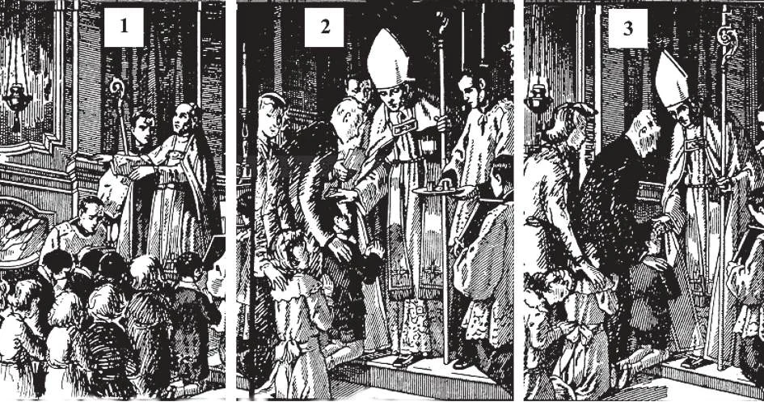

# 127. O Sacramento do Crisma

*As cerimônias do Crisma começam com o Bispo estendendo suas mãos sobre aqueles a serem crismados (1), invocando o Espírito Santo. Ele assina com o sinal da cruz a testa de cada um separadamente com crisma (2), pronunciando as palavras do crisma. Ele dá à pessoa um leve tapa na face (3) para lembrá-la de estar pronta a sofrer todas as coisas, mesmo a morte, por sua fé.*

**O que é Crisma?**

— Crisma é o sacramento através do qual o Espírito Santo vem a nós de um modo especial e nos habilita a professar nossa fé como cristãos fortes e perfeitos e soldados de Jesus Cristo.

> É de crença comum que o Crisma foi instituído por Cristo na Última Ceia.

1. Crisma de um modo muito especial traz-nos o Espírito Santo com Seus sete dons. "Então impuseram-lhes as mãos, e receberam o Espírito Santo" (Atos 8: 17).

> Crisma para os cristãos pode ser comparado ao dia de Pentecostes para os Apóstolos, quando receberam o Espírito Santo sob sinais sensíveis: línguas como de fogo, e um vento impetuoso. Os Próprios Apóstolos administraram o sacramento do Crisma, como em Samaria e Éfeso. "E quando Paulo lhes impôs as mãos, o Espírito Santo veio sobre eles" (Atos 19: 6).

2. Qualquer cristão batizado pode ser crismado. Embora o sacramento não seja necessário para salvação, é pecaminoso negligenciá-lo, pois confere muitas graças.

> "A caridade de Deus é derramada em nossos corações pelo Espírito Santo que nos foi dado" (Rom. 5: 5). Pelo Crisma, tornamo-nos soldados de Cristo, pois fortalece-nos na profissão de nossa fé. "Tudo posso n'Aquele que me fortalece" (Fil. 4: 13).

3. Devemos receber o sacramento do Crisma na idade em que passamos da infância à juventude. Naquele período, todos os tipos de tentações nos cercam, e precisamos de força especial de Deus para resisti-las.

> Nos primeiros dias da Igreja, era costume crismar crianças muito pequenas. O sacramento do Crisma é hoje adiado para que o recipiente possa primeiro ter um conhecimento básico dos fundamentos da fé. Mesmo quando o Crisma é administrado a crianças e crianças muito pequenas, verdadeiramente recebem o sacramento. A idade é uma matéria de disciplina em dioceses particulares.

**Que é necessário para receber o Crisma propriamente?**

— Para receber o Crisma propriamente, é necessário estar no estado de graça, e conhecer bem as principais verdades e deveres de nossa religião.

1. Para o Crisma, é requerido um conhecimento das principais verdades e deveres de nossa religião. Isto é por que, se uma pessoa a ser crismada atingiu a idade da razão, é examinada quanto a estas verdades quando vai à confissão antes do Crisma.

> Os Mandamentos, orações comuns e o Credo dos Apóstolos são a base de qualquer exame em religião; qualquer católico que possa explicar claramente os fundamentos dos doze artigos do Credo dos Apóstolos conhece sua fé suficientemente, para o Crisma.

2. Crisma é um sacramento dos vivos. Portanto, quando alguém que atingiu a idade da razão deve ser crismado, deve primeiro ir à confissão se carregado com pecado mortal, para estar no estado de graça.

> A pessoa a ser crismada deve obter a permissão para o Crisma. Deve ir à igreja propriamente vestida. Deve ir cedo. As portas da igreja são fechadas quando a cerimônia começa para prevenir distúrbios por retardatários.

3. Quando o bispo se aproxima, a pessoa a ser crismada deve ajoelhar-se. Crianças podem ficar de pé. O padrinho fica atrás, com a mão direita no ombro da pessoa a ser crismada. Há apenas um padrinho, do mesmo sexo que o crismado.

> A pessoa crismada não deve deixar a igreja antes que toda a cerimônia termine. Deve assistir com respeito e devoção.

**Em que consiste o sacramento do Crisma?**

— O sacramento do Crisma consiste na unção com crisma na testa, e ao mesmo tempo a pronunciação das palavras: "Eu te assino com o sinal da cruz, e te confirmo com o crisma da salvação, em nome do Pai, e do Filho, e do Espírito Santo."

> Estas são a matéria e forma do sacramento.

1. Santo crisma é uma mistura de azeite de oliva e bálsamo, abençoado pelo bispo na Quinta-Feira Santa. Ungindo a testa com crisma na forma de uma cruz significa que o católico que é crismado deve sempre estar pronto a professar sua fé abertamente e praticá-la sem medo.

> A cruz marcada em nossas testas no Crisma lembra-nos nunca ter vergonha de professar-nos discípulos de um Salvador crucificado. Devemos professar nossa religião abertamente sempre que não possamos manter silêncio sem quebrar alguma lei de Deus ou da Igreja; por exemplo, quando somos desafiados a fazer profissão de nossa fé, quando a Igreja está sendo atacada.

2. O bispo é o ministro usual do Crisma.

> Às vezes, contudo, a Santa Sé dá a padres missionários o poder de administrar este sacramento; mas o óleo usado deve ter sido consagrado por um bispo. Pastores e administradores de paróquias são concedidos a faculdade de administrar o Crisma, como ministros extraordinários, àqueles entre seu rebanho e outros em seu território que estão em perigo de morte.

3. Após a unção com crisma, o bispo dá à pessoa crismada um leve tapa na face, dizendo, "A paz esteja contigo!" Isto é feito para lembrá-la que deve estar pronta a sofrer tudo, mesmo a morte, por amor de Cristo.

> Finalmente o bispo dá a todos sua bênção. Então aqueles que foram crismados ou seus padrinhos dizem o *Credo*, "Pai-Nosso" e "Ave-Maria."

4. Aqueles encarregados devem cuidar que o registro próprio no registro sacramental da igreja tenha lugar após o Crisma.

> Quando uma pessoa é crismada fora de sua própria paróquia, notificação deve ser enviada à paróquia onde foi batizada.

5. Após nosso Crisma, devemos continuar a estudar nossa religião ainda mais seriamente do que antes, para que possamos ser capazes de explicar e defender nossa fé.

> Nestes dias de propagação do paganismo e naturalismo, Deus precisa de soldados para defender Sua fé. E não podemos ser de muita utilidade na defesa da fé se nós mesmos não a conhecemos.

**Quais são os efeitos do Crisma?**

— Crisma aumenta a graça santificante, dá sua graça sacramental especial, e imprime um caráter duradouro na alma.

1. Crisma cria dentro de nós um espírito de mansidão. Aumenta nosso amor de Deus e de nosso próximo. Ilumina nosso entendimento, fortalece nossa vontade, preserva nossa alma do pecado, e inclina nosso coração à virtude. A graça sacramental do Crisma ajuda-nos a viver nossa fé lealmente e professá-la corajosamente.

> Como Batismo nos faz templos do Espírito Santo, Crisma nos dá a plenitude de Suas graças.

2. O caráter do Crisma é um sinal espiritual e indelével que marca o cristão como um soldado no exército de Cristo.

> Porque Crisma imprime um caráter indelével na alma, pode ser recebido apenas uma vez. Como soldado de Cristo, uma pessoa crismada é dada um senso da inutilidade dos bens e prazeres da terra; seus pensamentos são dirigidos ao sobrenatural; em outras palavras, é-lhe dada a capacidade de tornar-se um cristão perfeito.
