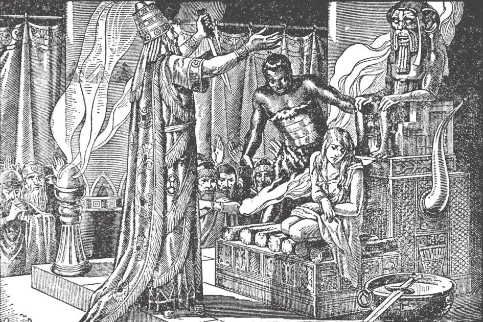
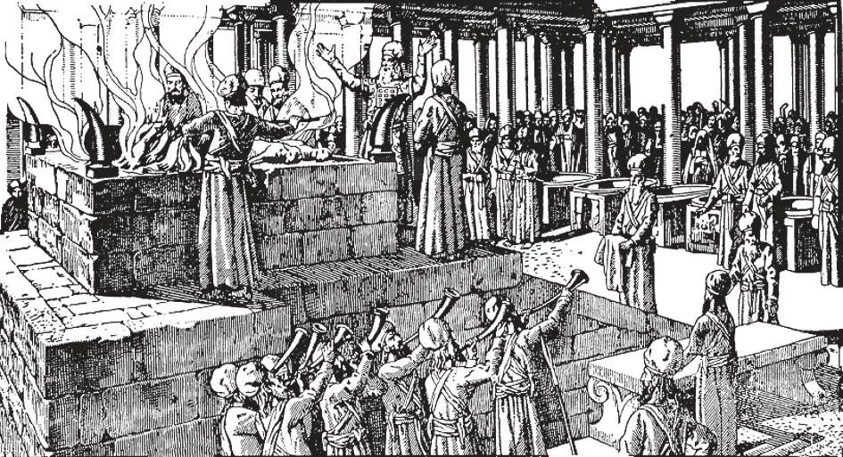
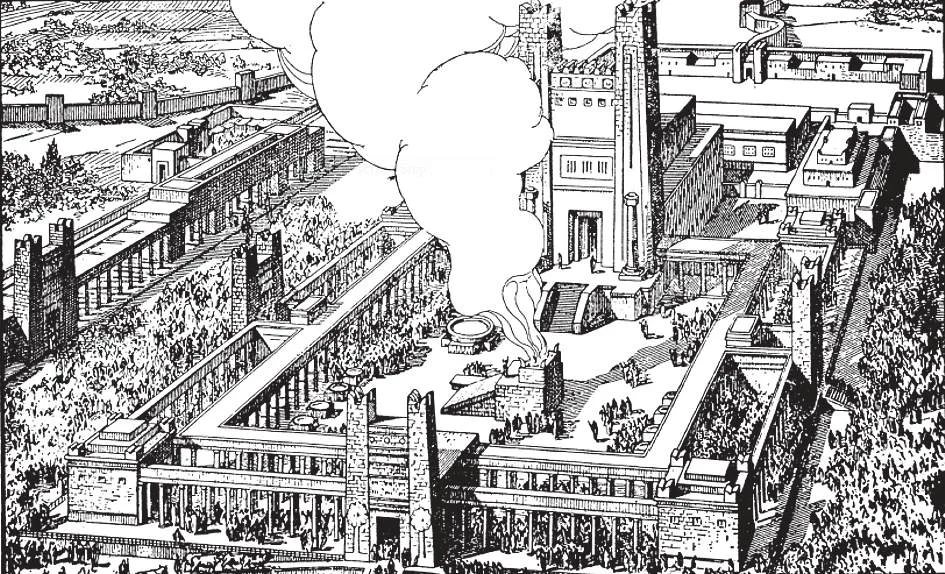
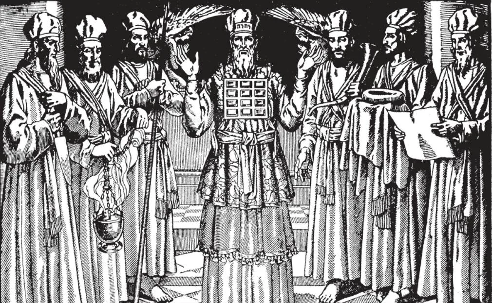
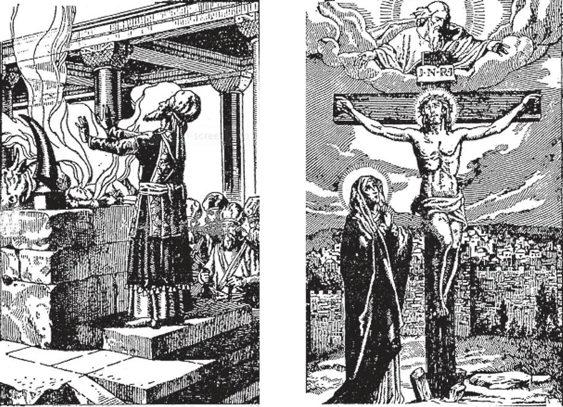

# 130. Natureza e História do Sacrifício

*Desde o princípio da existência do homem, sacrifícios têm sido oferecidos a Deus. Os filhos de Adão e Eva, Abel e Caim, ofereceram sacrifício a Deus. Abel ofereceu ovelhas; Caim, frutos da terra.*

**O que é um sacrifício?**

— Um sacrifício é a oferta de uma vítima por um padre somente a Deus, e a destruição dela de algum modo, para reconhecer que Ele é o Criador e Senhor de todas as coisas.

1. O homem oferece sacrifício a Deus, em reconhecimento de Seu supremo poder, e em gratidão por Seus dons, especialmente pelo dom da vida. A necessidade de oferecer sacrifício é inata na natureza humana, tão natural quanto respirar. Já que o homem foi feito para Deus, sua alma voa a Ele se não impedida, como um balão sobe ao ar a menos que amarrado.

> Deus nos deu vida; Ele soprou em nós uma alma que é imortal, como Deus Mesmo. Sem vida e alma, seríamos inexistentes, nada; não seríamos capazes de fazer qualquer coisa, nem mesmo reconhecer Deus. Nossa vida e alma portanto é nossa posse mais preciosa, e por ela devemos agradecer a Deus.

2. Devemos repagar a Deus por Seus dons, especialmente pelo inestimável dom da vida.

> Mas porque nossa vida é tão preciosa, não podemos dar a Deus o suficiente por ela, para repagá-Lo. Se alguém nos desse um anel de diamante valendo cinco mil dólares, e déssemos a ele dois centavos em pagamento, isto não seria uma diferença tão grande entre o valor do que recebemos e a quantia que pagamos quanto há quando Deus nos dá vida e O repagamos com coisas materiais. Mas porque não temos nada com que possamos repagar a Deus adequadamente, fazemos nosso melhor, oferecendo-Lhe o que podemos. Isto é o que os homens fazem quando oferecem sacrifício.

3. Desde o próprio princípio do mundo, os homens reconheceram a existência e poder de Deus oferecendo sacrifício. Foi primeiro oferecido, então destruído ou mudado, como por consumir ou pelo fogo. A oblação de um objeto visível é um símbolo da adoração e oferta interior, pela qual a alma se dá completamente a seu Criador.

> Na linguagem comum falamos de "sacrificar" por amor de outrem: por exemplo, uma mãe sacrifica-se por seus filhos, um soldado sacrifica-se por seu país. O significado é que alguma coisa valiosa é renunciada — tempo, luxos, saúde, vida — por amor de outrem. Assim ao oferecer um sacrifício a Deus, nós o renunciamos, por amor d'Ele.

4. A oferta de sacrifício é uma honra reservada a Deus somente, já que o ato formal de oferecer e destruir uma oblação é um ato de culto ou adoração. Para fazer um ato religioso solene de sacrifício a Deus, os homens desde os primeiros dias pediram a padres, aqueles consagrados ao serviço de Deus, para oferecer seus sacrifícios, para ser o intermediário entre homem e Deus.

> Na vida ordinária, oferecemos coisas valiosas àqueles que amamos ou respeitamos, como sinal de gratidão ou afeição. Desta forma damos presentes de Natal e aniversário, dons de comemoração, etc. Mas estas ofertas são um "sacrifício" apenas no sentido comum do termo, e não estão incluídas no sacrifício formal que pode ser oferecido a Deus somente. Este último é a oferta e destruição ou mudança de algo, em reconhecimento da infinita majestade de Deus.

*Porque não tinham um conhecimento do verdadeiro Deus, os antigos Gregos e Egípcios ofereciam sacrifícios humanos. Os Cananeus costumavam oferecer vítimas humanas a seu ídolo Moloch, aquecendo a estátua de bronze do deus até ficar vermelha, e lançando as vítimas em seus braços. Mesmo hoje, alguns povos pagãos oferecem sacrifícios humanos. Assim vemos como a perversão entra quando o verdadeiro Deus não é conhecido.*

**Quais são os propósitos do sacrifício?**

— Os propósitos do sacrifício são: dar honra ou adoração a Deus, oferecer-Lhe graças, implorar um favor, ou fazer propiciação.

> Em outras palavras, os propósitos do sacrifício são: adoração, ação de graças, petição, e expiação. É natural para o homem dar expressão exterior aos sentimentos que movem seu ser interior. Por esta razão, ele irrompe em louvor quando pensa na grandeza e santidade de Deus; deve renunciar algo como sinal de gratidão: deve oferecer um dom quando sente sua insignificância implorando um favor; e tenta todos os tipos de obras penitenciais quando percebe suas iniquidades.

**De que formas o sacrifício é oferecido?**

— O sacrifício é oferecido seja na forma sangrenta ou não-sangrenta.

1. Um sacrifício de animais vivos, como um boi, um cordeiro, ou uma pomba, é um sacrifício sangrento. Um sacrifício de algum alimento, como fruta, vinho, ou trigo, é um sacrifício não-sangrento.

> Entre os Judeus, os animais costumavam ser abatidos, seu sangue derramado sobre o altar, e sua carne consumida pelo fogo ou comida pelos padres e aqueles por quem o sacrifício era oferecido. A oblação não-sangrenta era queimada ou comida pelos padres após ser oferecida; o vinho era derramado sobre o altar.

2. Os pagãos, com ideias pervertidas, ofereciam sacrifícios humanos a seus ídolos.

> O Rei de Moab (4 Reis 3:27) ofereceu seu próprio filho como sacrifício, para obter ajuda contra os Israelitas. Como São Paulo diz, "O que os Gentios sacrificam, sacrificam aos demônios e não a Deus" (1 Cor. 10:20).

*Deus deu a Moisés instruções detalhadas sobre ofertas sacrificiais (Lev. 1-7; 16; 22). Entre os Judeus, o sumo-sacerdote, em nome do povo, oferecia de manhã e à tarde um sacrifício não-sangrento de incenso, farinha, óleo, e olíbano. Então oferecia um sacrifício sangrento de um cordeiro, juntamente com comida e bebida. No Sábado, dois cordeiros, com pão e vinho, eram oferecidos além disto como sacrifício.*

*Em certas festas solenes, os Judeus sacrificavam centenas de vítimas em meio a cerimônias impressionantes. Suas festas principais eram: (a) a Páscoa ou Passagem, que comemorava sua libertação do Egito; (b) o Pentecostes, em lembrança da Lei recebida no Monte Sinai; (c) os Tabernáculos, para comemorar suas peregrinações no deserto; e (d) a Expiação ou Propiciação, na qual o padre sacrificava por seus próprios pecados e os do povo. Estes sacrifícios tipificavam o sacrifício de Cristo.*

*Entre os Judeus havia diferentes categorias ou ordens de padres, como o sumo-sacerdote, os padres, e os Levitas. Estas categorias eram uma figura ou tipo das diferentes categorias que estariam na Igreja fundada por Jesus Cristo. O povo fielmente obedecia a seus padres, e os sustentava com esmolas.*

*Os sacrifícios judaicos eram meramente tipos do Sacrifício de Cristo no Calvário, e cessaram com o passar da Lei Antiga. Na Nova Lei, temos o Verdadeiro Sacrifício, o mesmo que Cristo ofereceu no Calvário por Sua morte. O Sumo-Sacerdote é o Próprio Cristo, e Cristo, também, é a Vítima. São Paulo disse, "É impossível que os pecados sejam tirados com sangue de touros e de bodes" (Heb. 10:4).*

