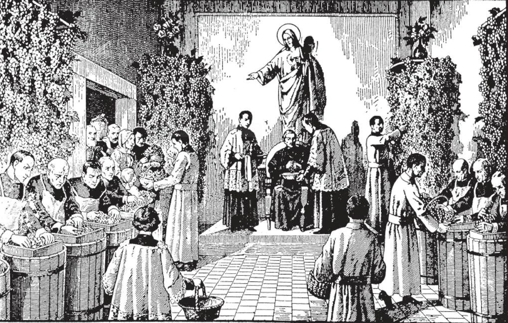

# 132. A Missa e o Calvário

*A Missa é o ato principal e central do culto católico, o maior ato de culto que pode ser oferecido a Deus, um oceano infinito de graças para os vivos e os mortos.*

**Por que a Missa é o mesmo sacrifício que o sacrifício da cruz?**

— A Missa é o mesmo sacrifício que o sacrifício da cruz, porque na Missa a vítima é a mesma, e o Sacerdote principal é o mesmo, Jesus Cristo.

1. A Missa é o próprio sacrifício que foi oferecido na Última Ceia, e consumado no Calvário; é a renovação viva do sacrifício na Cruz.

> Como Cristo ofereceu-Se no Calvário, assim como Vítima Ele é oferecido na Missa. Como na cruz, Seu corpo foi dilacerado e rasgado, assim na Consagração Ele Se coloca como Vítima no altar, com Seu corpo e sangue sob as formas separadas de pão e vinho. Na Comunhão, quando as espécies de pão e vinho são consumidas, o sacrifício é realizado, como foi na cruz, quando no momento da morte Nosso Senhor exclamou, "Está consumado!"

2. A Missa não é uma mera lembrança ou memorial do Calvário; ela realmente renova, na consagração separada do pão e vinho, a morte do Senhor, a separação de Seu Corpo e Sangue.

> Na Última Ceia, após Cristo ter mudado o pão e vinho em Seu Corpo e Sangue, Ele disse: "Fazei isto em memória de Mim" (Luc. 22:19). E São Paulo acrescenta: "Pois todas as vezes que comerdes este pão e beberdes o cálice, anunciareis a morte do Senhor, até que Ele venha" (1 Cor. 11:26). Na Última Ceia, Cristo instituiu um sacrifício visível, a Missa, para renovar o sacrifício sangrento que Ele consumou na cruz.

3. O sacerdote principal em cada Missa é Jesus Cristo, que oferece a Seu Pai celestial, através do ministério de Seu padre ordenado, Seu corpo e sangue que foram sacrificados na cruz.

> Em ambos o Sacrifício da Cruz e a Missa, o mesmo Sumo-Sacerdote oficiante oferece a mesma Vítima Sacrificial: Jesus Cristo Nosso Senhor. O padre dizendo a Missa é apenas ministro e representante de Cristo. Ele profere as palavras da consagração em nome e pessoa de Cristo, dizendo, "Isto é o Meu Corpo. Isto é o Meu Sangue" e não, "Este é o Corpo de Cristo, etc."

*A ilustração mostra religiosos preparando vinho de uvas para consagração. Em certos lugares, cerimônias especiais atendidas pelo bispo são realizadas quando as uvas devem ser prensadas.*

**Há alguma diferença entre o sacrifício da cruz e o Sacrifício da Missa?**

— O modo no qual o sacrifício é oferecido é diferente: Na cruz, Cristo fisicamente derramou Seu sangue e foi fisicamente imolado, enquanto na Missa não há derramamento físico de sangue nem morte física, porque Cristo não pode mais morrer. Na cruz, Cristo ganhou mérito e satisfez por nós, enquanto na Missa, Ele aplica-nos os méritos e satisfação de Sua morte na cruz.

1. Cristo foi imolado no Calvário, uma vez por todas; Ele está agora na glória, e não pode mais morrer. Como então podemos dizer Ele é sacrificado em nossos altares na Missa, e não apenas sacrificado uma vez, mas continuamente? A Missa é a realização, de um modo não-sangrento, do próprio sacrifício oferecido no Calvário de modo sangrento.

> No Calvário, Cristo fisicamente derramou Seu sangue; na Missa, embora a consagração separada recrie a morte de Cristo, não há derramamento físico de sangue.

2. Cristo continua a oferecer-Se como sacrifício na Missa, para: unir-nos com Ele Mesmo, dar-nos um dom digno de ser oferecido a Deus, e fazer-nos compartilhar nos méritos de Seu sacrifício na cruz. Através da Missa, os méritos do sacrifício na cruz são aplicados a nossas almas.

> A Missa, segundo a vontade do Próprio Cristo, é aplicar através de todo tempo os frutos da Redenção, tornada possível pelo sacrifício no Calvário, que pagou o preço pleno de nossa redenção. A Missa, então, é no mais verdadeiro sentido a continuação dos sacrifícios redentores de Cristo. É a Missa que nos dá a mais plena eficácia do Calvário; ela traz o Calvário ao alcance de todas as almas em todo tempo e toda idade. Por causa da Missa, aqui e agora podemos oferecer repetidamente a Deus como nossa Vítima a Deus, participar d'Ele para nós mesmos como um Dom da Santíssima Trindade, e viver em união constante e íntima com Ele.

3. O sacrifício no Calvário foi oferecido pelo Próprio Cristo ao Pai Eterno; o sacrifício da Missa é oferecido por Ele unido conosco, como pelo nosso Batismo nos tornamos membros de Seu Corpo Místico.

> Cristo deu-nos a Missa como um sacrifício visível para continuar Seu sacrifício na cruz até o fim dos tempos. ***A Missa não é uma mera lembrança do Calvário; ela realmente renova a morte de Cristo, continua Seu sacrifício, e é em Si o Próprio Sacrifício d'Ele.***
