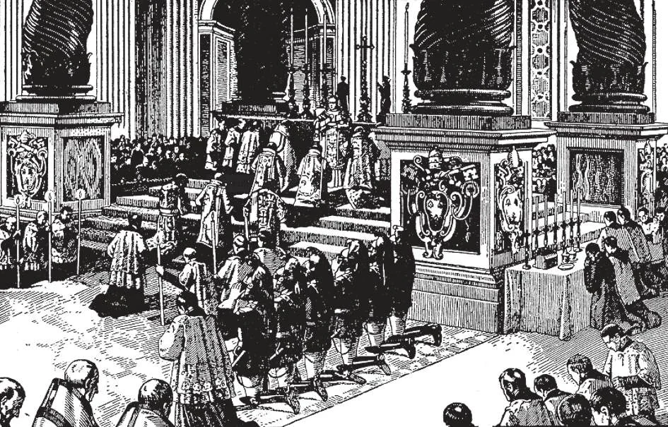
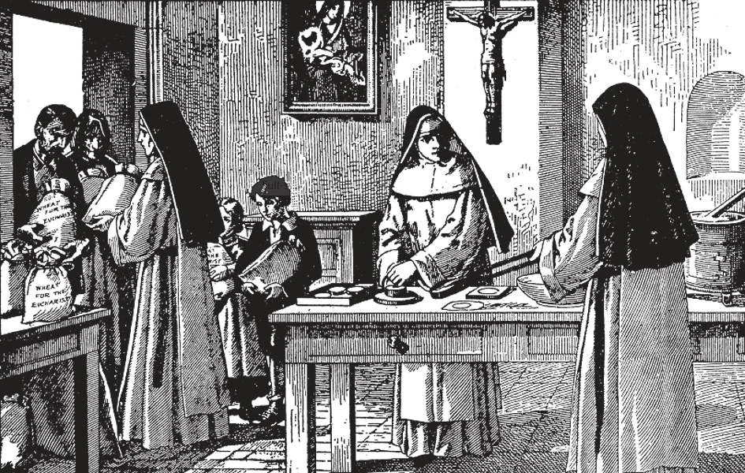

# 134. Valor da Missa

*A mais impressionante de todas as Missas solenes é a Missa Alta do Papa. O Papa é o único que pode dizer Missa nos altares-mores das quatro basílicas em Roma: São Pedro, São Paulo, São João (a Igreja de Latrão), e Santa Maria Maior.*

**Qual é o valor de uma Missa?**

— Uma Missa tem valor infinito, porque é a renovação do sacrifício da cruz.

> O valor de um dom é proporcional à dignidade do doador e ao custo do dom. A Missa, o único dom digno para Deus, é oferecida por Cristo, o Filho de Deus porque custou-Lhe Sua própria vida.

1. Portanto, ouvir ou dizer Missa é uma boa obra de maior excelência do que qualquer outra.

> Por outras boas obras, oferecemos a Deus dons que são humanos. Na Missa, oferecemos-Lhe o dom que é divino: Seu Próprio Filho unigênito. Não há ato mais santo e divino que possa ser realizado na terra do que o sacrifício da Missa.

2. A eficácia do santo sacrifício não depende da dignidade ou indignidade do padre; ele é apenas o ministro de Cristo, Que é tanto Sacerdote quanto Vítima.

> A virtude da Missa é por si mesma, inteiramente aparte da dignidade do padre. Por esta razão, não perdemos os méritos da Missa se é oferecida por nós por um padre que não é digno, já que a Missa tem seu valor intrínseco: de modo similar, um diamante é um diamante, mesmo que o joalheiro vendendo-o seja um homem mau.

3. Contudo, como uma boa obra, as graças e favores são limitados, parcialmente pela vontade de Deus, e parcialmente pelas disposições daqueles a quem os frutos são aplicados. Portanto, quanto mais devoção temos na Missa, maior será o proveito que derivamos.

> Dois jovens foram visitar Roma. Seu itinerário limitou sua estadia lá a um dia. O primeiro jovem, ao chegar, imediatamente visitou todas as famosas porções da cidade, finalmente terminando com uma visita ao Santo Padre e ao Vaticano. O segundo jovem, estando fatigado pela viagem, deitou-se para descansar. Adormeceu e acordou apenas quando estava demasiado escuro para ir a qualquer lugar. Ambos foram à mesma cidade, mas um não lucrou de sua viagem.

**Por que uma oferta é feita ao padre que diz a Missa?**

— Uma oferta é feita ao padre que diz a Missa, para prover as coisas necessárias para o Sacrifício, e assistir no sustento do padre.

1. Nos primeiros anos da Igreja os fiéis, desejando participar mais plenamente na oblação, faziam ofertas de pão e vinho para a consagração.

> Hoje, é mais conveniente fazer uma oferta em dinheiro. O dinheiro certamente não é o preço da Missa, como o pão e vinho não eram.

2. Muitos católicos têm o louvável costume de deixar uma certa quantia de propriedade ou dinheiro em seus testamentos, para ter Missas oferecidas por eles após sua morte.

> Uma Missa de réquiem é dita em paramentos pretos, e com orações especiais pelos mortos. Missas ditas pelos mortos por trinta dias consecutivos são chamadas Missas Gregorianas.

*As hóstias consagradas na Missa, tomadas pelo padre e povo, são feitas de pura farinha de trigo sem fermento misturada com água e assada. São preparadas por pessoas escolhidas, usualmente religiosos.*

**Que materiais são usados para consagração na Missa?**

— Pão e vinho são usados para consagração na Missa; algumas gotas de água são misturadas com o vinho.

1. O pão para consagração é feito de pura farinha de trigo misturada com água e assada.

> Nenhuma outra farinha, como arroz, milho, etc., pode ser usada, do contrário não há consagração. Grande cuidado portanto deve ser tomado para que a farinha seja do tipo próprio.

2. O vinho para consagração deve ser o puro suco de uvas fermentado.

> Nenhum outro vinho é válido, e se usado, nenhuma transubstanciação terá lugar. Um pouco de água é misturada com o vinho quando usado para consagração, porque isto foi feito por Cristo. A água e vinho também comemoram a água e sangue que fluíram da ferida no lado de Nosso Senhor.

**Quando a Missa é oferecida?**

— A Missa é oferecida cada dia do ano exceto Sexta-Feira Santa. Nos primeiros séculos, bispos e padres celebravam Missa juntos, de modo que uma Missa era dita por vários. Nossas Missas presentes, quando padres são ordenados, e bispos são consagrados, são similares àquelas primeiras Missas.

1. Ordinariamente, a um padre é permitido dizer Missa apenas uma vez por dia. No Natal e no Dia de Todas as Almas, contudo, pode dizer três Missas.

> Aos Domingos e dias santos de obrigação, um padre com a permissão própria pode dizer duas Missas quando as necessidades do povo assim o requerem. Em terras de missão onde há poucos padres, é-lhes até permitido dizer três Missas.

2. Missa é dita de manhã e, com a aprovação do bispo, também à tarde. Missas da manhã são ditas até 1 da tarde; à tarde podem começar às quatro horas.

> Nos primeiros dias do Cristianismo, Missa era dita à noite, segundo o exemplo da Última Ceia, quando a Missa foi instituída. Mais tarde pensou-se melhor tê-la dita de manhã, para um maior respeito à Santa Eucaristia. Nestes nossos dias, Missa é dita em praticamente todas as horas do dia, para facilitar a assistência e a recepção da Santa Comunhão.
