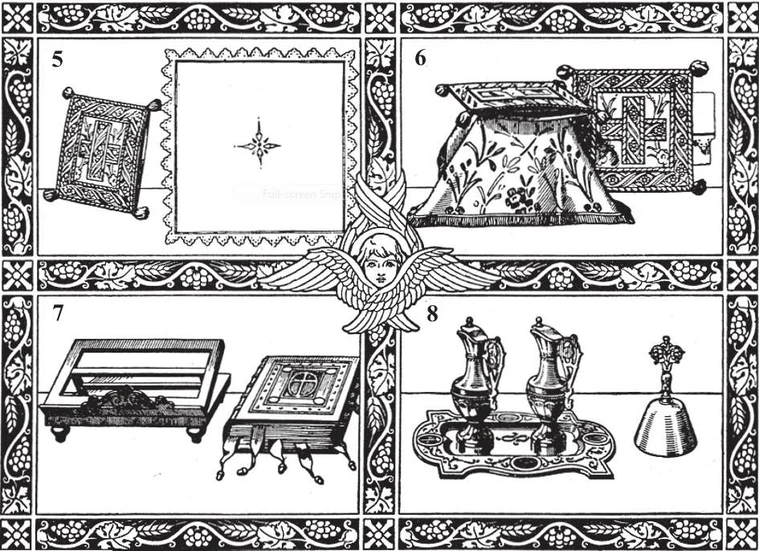

# 136. Vasos Sagrados e Roupas de Altar

*1. Cálice e Purificatório. 2. Patena e Cálice. 3. Pala, com Cálice. 4. Cálice Velado.*

**Quais são os vasos sagrados usados para o altar?**

— Os principais vasos sagrados usados para o altar são o cálice, patena, cibório, e ostensório ou custódia.

> Uma vez consagrados, vasos sagrados não podem ser tocados por pessoas que não estão em ordens sagradas, exceto em casos de necessidade. Àqueles encarregados do cuidado dos vasos deve-se usar um pequeno pano de linho ao manuseá-los, de modo que não os toquem realmente. Devem ser manuseados com reverência.

1. O cálice é o mais sagrado de todos os vasos. É o cálice que contém o vinho para consagração; após a consagração, contém o precioso sangue de Cristo.

> O cálice deve ser de ouro ou prata. Se isto não é possível, pelo menos o interior deve ser sempre dourado. O cálice representa o cálice no qual Nosso Senhor na Última Ceia primeiro ofereceu Seu sangue; também simboliza o cálice da Paixão; e finalmente, representa o Coração de Jesus, do qual fluiu Seu sangue para nossa redenção.

2. A patena é a pequena chapa sobre a qual a hóstia é posta. É feita para ajustar ao cálice.

> É dos mesmos materiais que o cálice, pelo menos dourada. Tanto cálice quanto patena devem ser consagrados por um bispo. Na Santa Comunhão, nossos corações tornam-se cálices vivos, nossas línguas outras patenas sobre as quais o padre põe Nosso Senhor. Possa Ele sempre encontrá-los acolhendo-O!

3. O cibório assemelha-se ao cálice, exceto que tem uma tampa. (Veja página 282.)

> É usado para segurar as hóstias pequenas distribuídas para a comunhão dos fiéis.

4. O ostensório ou custódia é o grande recipiente de metal usado para bênção ou exposição do Santíssimo Sacramento. Em muitas igrejas, é de ouro, e decorado com joias. (Veja página 282.)

> A Hóstia sagrada usada para a Bênção é reservada numa luna ou luneta, que é posta na parte envidraçada do ostensório. (Veja página 282.)

5. Outras coisas, como o Missal, véu, galhetas, e incenso, são usadas no altar.

> O Missal é o livro que contém as orações e cerimônias da Missa. O véu é um pano quadrado do mesmo material e desenho dos paramentos do Padre. É usado para cobrir o cálice, patena e pala antes do Ofertório e após a Abluição. As galhetas são os vasos dos quais o acólito ou sacristão verte água e vinho no cálice segurado pelo celebrante. Incenso é um perfume queimado em certas ocasiões, como na Missa alta e Bênção; é um símbolo de oração.

*5. Bolsa e Corporal 6. Cálice Velado e Bolsa 7. Missal com Suporte 8. Galhetas e Campainha*

**Quais roupas são usadas para o Santo Sacrifício?**

— O corporal, purificatório, pala, e toalha de dedos são usados.

> Estas roupas, exceto a toalha de dedos, são chamadas as "roupas santas". Todas são feitas de linho branco. Nenhum significado especial é posto na toalha de dedos. É de linho, usada pelo padre após lavar seus dedos antes da consagração.

1. O corporal é um quadrado de fino linho, com uma pequena cruz trabalhada no centro. Às vezes tem uma borda de renda. É dobrado em três de ambos os lados, e guardado numa bolsa. O corporal é o mais importante das roupas santas. O padre o espalha sobre o altar. Sobre ele, põe o cálice e a Hóstia após a consagração.

> Com o purificatório, o corporal simboliza o linho no qual Nosso Senhor foi posto no sepulcro. Por causa de seu contato próximo com as espécies sagradas, nem purificatório nem corporal após uso podem ser manuseados por leigos sem permissão especial. O padre primeiro os purifica antes que outros os lavem.

2. O purificatório é uma peça oblonga de linho, dobrada três vezes, posta sobre o cálice.

> É usado pelo padre para limpar o interior do cálice antes de pôr o vinho e após a Abluição; também limpa sua boca com ele após a Abluição.

3. A pala é uma pequena peça quadrada de linho engomado, usada para cobrir o cálice.

> Representa a pedra que os soldados romanos rolaram contra a entrada do sepulcro de Cristo.
