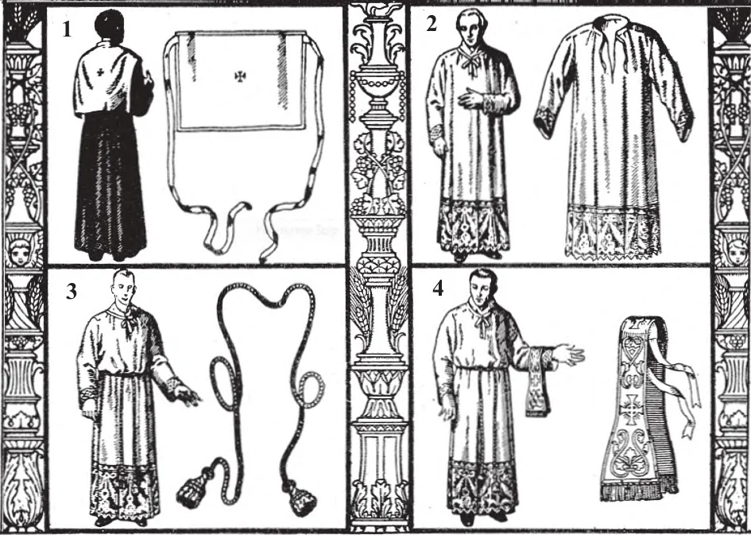
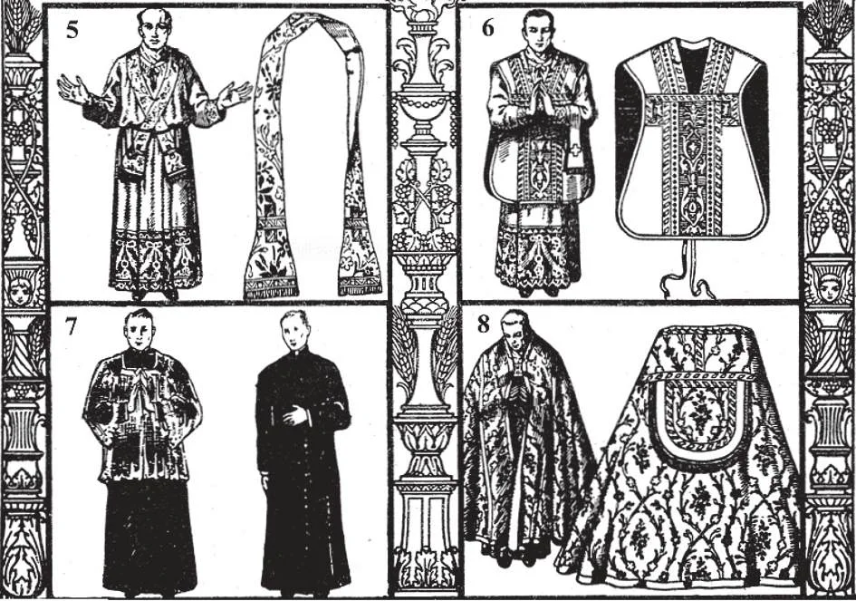

# 137. Paramentos

*1. Amito 2. Alva 3. Cíngulo 4. Manípulo*

*5. Estola 6. Casula 7. Sobrepeliz e batina 8. Capa*

**Que paramentos o padre usa na celebração da Santa Missa?**

— O padre usa o amito, alva, cíngulo, manípulo, estola e casula, na celebração da Missa.

> Quando o padre aparece diante de Deus no altar, ele está vestido com paramentos adequados. Deus Mesmo deu direções sobre os paramentos dos padres no Antigo Testamento (Êxodo 28:4). Os principais paramentos usados pelos padres católicos chegaram até nós desde o tempo dos Apóstolos.

> Significado simbólico tem sido atribuído aos diferentes paramentos. As orações ditas pelo padre ao vestir cada peça de paramento mostram o significado atribuído a elas pela Igreja.

1. O amito é um pedaço de pano de linho branco que cobre os ombros do padre.

> A oração de paramento é, "Põe, ó Senhor, sobre minha cabeça o capacete da salvação, para que eu possa superar os assaltos do diabo." Ao vesti-lo, o padre o coloca por um momento sobre sua cabeça, depois o deixa repousar sobre seus ombros.

2. A alva é uma túnica de linho branco que envolve todo o corpo do padre.

> Ao vesti-la, o padre diz, "Purifica-me, ó Senhor, de toda mácula e limpa meu coração, que lavado no Sangue do Cordeiro, eu possa gozar deleites eternos."

3. O cíngulo ou cordão é o cordão que prende a alva na cintura.

> A oração de paramento é, "Cinge-me, ó Senhor, com o cíngulo da pureza, e apaga em meu coração o fogo da concupiscência, para que a virtude da continência e castidade permaneça em mim."

4. O manípulo é uma estreita faixa curta de pano que pende do braço esquerdo.

> A oração de paramento é, "Mereça eu, ó Senhor, usar o manípulo de lágrimas e tristeza, para que um dia eu possa vir com alegria à recompensa de meus labores."

5. A estola é a longa faixa de seda que se ajusta ao redor do pescoço e é cruzada sobre o peito do padre. É o símbolo de autoridade na Igreja, de todos os paramentos o mais abençoado.

> A oração de paramento é, "Restaura-me, ó Senhor, o estado de imortalidade que foi perdido para mim por meus primeiros pais, e embora indigno de aproximar-Te dos sagrados mistérios, concede-me contudo alegria eterna." Como sinal de seus plenos poderes sacerdotais o bispo não cruza a estola na frente. Somente o Papa tem o direito de usá-la sempre.

6. A casula é o paramento superior usado pelo celebrante na Missa. Pende dos ombros, diante e atrás, quase até os joelhos.

> A oração de paramento na Missa é, "Ó Senhor, Que disseste, Meu jugo é suave e meu fardo leve, concede que eu o carregue de modo a obter Tua graça." A casula, estola, manípulo e véu para o cálice são feitos como um conjunto de paramentos, do mesmo material, cor e desenho.

7. A barreta é o boné quadrado de três cristas usado pelo padre quando entra no santuário. (Veja página 282.)

**Que paramentos são usados pelo padre fora da Missa?**

— Fora da Missa, o padre usa a batina ou soutane, a capa, a sobrepeliz e o véu umeral.

1. A batina ou soutane é o principal paramento usado por eclesiásticos.

> É uma túnica que alcança até os pés, e abotoada na frente. Para padres é preta, para bispos violeta, para cardeais vermelha, e para o Papa branca. Em alguns países católicos eclesiásticos vão em toda parte em suas batinas.

2. A sobrepeliz é uma alva curta, usada pelo padre fora da Missa, quando prega, junta-se a uma procissão, etc.

> Na Missa Alta, o diácono usa um paramento especial chamado dalmática, e o subdiácono uma túnica.

3. A capa é um manto usado para bênção, procissões e outras ocasiões fora da Missa.

> Quando um padre morre, ele é sepultado vestido em sua batina e sobrepeliz, e com a estola roxa, a insígnia de seu sacerdócio. Em completos paramentos roxos, jaz em dignidade.

4. O véu umeral é o longo pano de seda usado pelo padre ao carregar o Santíssimo Sacramento e dar a bênção.

> Alguns dos paramentos, como o amito, alva, sobrepeliz e véu de bênção, são sempre brancos. A estola para ouvir confissões é sempre roxa.

**Por que os católicos gastam grande cuidado e dinheiro em vasos sagrados, paramentos e mobiliário para o altar?**

— Os católicos gastam grande cuidado e dinheiro em vasos sagrados, paramentos e mobiliário para o altar, porque é apenas direito dar o que é mais precioso e belo para o serviço de Deus.

> Nada é demasiado bom para o Senhor do céu e terra. A beleza da casa de Deus também impressiona o observador e ajuda a devoção. Algumas pessoas de mente mundana são propensas a perguntar, "Para que este desperdício?" quando veem quanto cuidado e dinheiro os católicos gastam em vasos sagrados, paramentos e ornamentos de igreja. Lembremo-nos que Judas perguntou isto quando Madalena ungiu Nosso Senhor.
