# 140. O Santo Sacrifício da Missa

:::row

Início da Missa

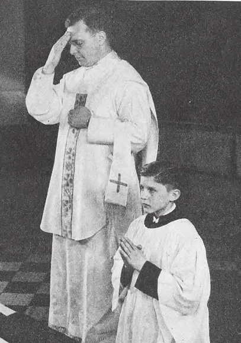
Confiteor
:::

## O Início da Missa

> Quando o padre entra no santuário, o povo fica de pé, por respeito ao representante de Cristo. Então ajoelham-se para o início da Missa.

O padre põe o cálice coberto no centro do altar, tendo primeiro espalhado o corporal. Abre o Missal. Então vai ao pé do altar e começa a Missa fazendo o sinal da cruz,

> O povo deve fazer o sinal da cruz com o padre. Devem dirigir sua intenção para ouvir Missa. Aqueles que vêm após este ponto estão atrasados para a Missa.

O padre diz um salmo introdutório, para expressar sua confiança em Deus e sua consciência de sua própria indignidade. As orações ditas ao pé do altar simbolizam os milhares de anos durante os quais o homem estava longe de Deus e anseando pelo Redentor.

> Nas Missas pelos mortos e do Domingo da Paixão ao Sábado Santo exclusivamente, o salmo é omitido.

## O Confiteor

Após o salmo, o padre inclina-se e diz o Confiteor, uma confissão de pecado, como preparação, uma expressão de humildade diante de Deus. O Confiteor é repetido pelo acólito em nome do povo.

> O padre então sobe ao altar e beija-o no lugar sob o qual relíquias de alguns Santos são cimentadas na pedra do altar. Vai à direita ou lado da epístola e lê a oração de abertura. Nas Missas solenes, o altar é incensado.

## O Introito

Originalmente o Introito era um salmo cantado pelo padre e seus assistentes quando entravam no santuário. Hoje está reduzido a um versículo, o primeiro a ser lido na Missa.

> O Introito varia cada dia, como também outras certas partes da Missa, como as Coletas, Epístola, Gradual, Evangelho, Ofertório, Secretas, Comunhão e Pós-comunhões.

:::row
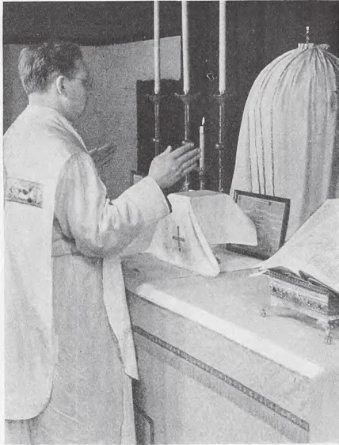
Gloria

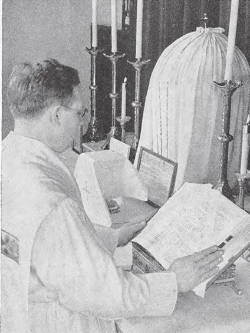
Epístola
:::

## O Kyrie

O padre vai ao centro e recita o Kyrie eleison alternadamente com o acólito, implorando a misericórdia de Deus. A oração é repetida nove vezes: três em honra a Deus Pai, três em honra a Deus Filho e três em honra a Deus Espírito Santo.

## O Gloria

Após o Kyrie, o Gloria é dito quando a Missa o requer. É às vezes omitido, especialmente durante as estações penitenciais e nas Missas pelos mortos. Ao final o padre beija o altar.

> O Gloria repete os cânticos de louvor dos anjos na noite de Natal. Nas Missas altas ouve-se a mais bela música do coro.

## A Coleta

O padre vai ao lado da epístola e lê certas orações, chamadas a Coleta. Pode haver mais de uma Coleta. Estas orações são recitadas em honra ao santo ou mistério do dia ou para a intenção da Missa. Expressam a sujeição do homem a Deus.

> Na Coleta devemos orar pela intenção que temos em ouvir a Missa.

## A Epístola

A Epístola ou Lição segue. É uma leitura da Escritura, usualmente de uma das cartas de São Paulo. Na Missa Alta o subdiácono canta a Epístola.

> Frequentemente a Epístola é tirada dos Atos dos Apóstolos, de Êxodo, Sabedoria, etc. Ao final da Epístola o acólito diz, "Deo Gratias" (Graças a Deus).

## O Gradual

Aqui seguem o Gradual, Aleluia, Trato e Sequência, todos variando de acordo com a estação do ano eclesiástico. Trato e Sequência não são frequentemente ditos.

> O Missal é então levado à esquerda ou lado do evangelho do altar. Este ato simboliza a passagem da fé dos judeus para os gentios.

:::row
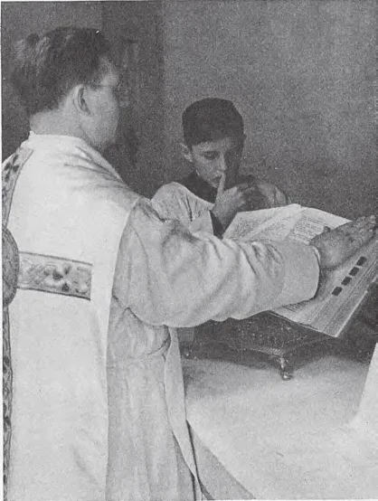
O Evangelho

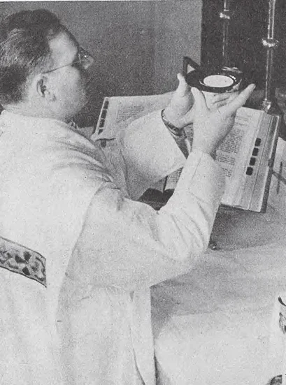
O Ofertório
:::

## O Evangelho

O Evangelho é tirado de um dos quatro Evangelistas. Durante a leitura, o povo fica de pé, por reverência à palavra de Deus. O padre começa a leitura fazendo o sinal da cruz na testa, lábios e peito.

> O povo faz o mesmo, para mostrar que crê no Evangelho, sempre o professará e sempre o amará. Na Missa Alta o Diácono canta o Evangelho.

## O Credo

Após o Evangelho o padre aos Domingos e dias santos de obrigação usualmente prega um sermão. Frequentemente é uma explicação do Evangelho lido. O padre vai ao meio do altar e recita o Credo Niceno ou *Credo*. Isto não é dito em todas as Missas.

> Nas palavras, *incarnatus est* (E se fez homem), o povo genuflete com o padre, em memória da Encarnação de Nosso Senhor. O povo pode sentar-se após o Credo.

## O Ofertório

O Ofertório começa com a oração do Ofertório; então o padre descobre o cálice.

> O Ofertório é a primeira das três partes principais da Missa. Representa a preparação de Nosso Senhor para Sua Paixão e Sua vontade de entregar Sua vida. O povo deve unir-se ao padre em fazer esta oferta. Devem também oferecer-se a si mesmos e tudo que têm a Deus. Aqueles que vêm após este ponto perderam a Missa e devem ficar para ouvir outra.

O Ofertório consiste em duas partes: a oferta do pão e a oferta do vinho. O padre oferece o pão na patena e o vinho no cálice.

> Água é misturada com o vinho porque Cristo assim o fez na Última Ceia.

Ao oferecer o cálice, o padre diz: "Oferecemos-Te, ó Senhor, o cálice da salvação, implorando Tua clemência, para que suba diante de Tua Divina Majestade como suave odor para nossa salvação e para a de todo o mundo. Amém."

:::row
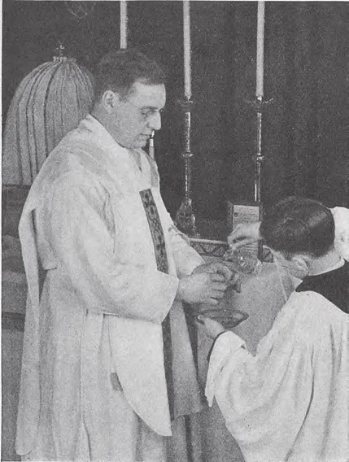
Lavabo

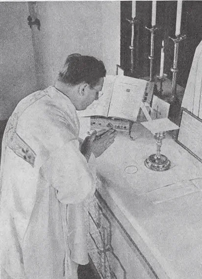
Sanctus
:::

## O Lavabo e Orate Fratres

Após o Ofertório, o padre lava seus dedos, como marca da pureza de corpo e alma que é requerida para o Santo Sacrifício. Isto é o Lavabo.

> O padre volta-se para o povo, estende e junta suas mãos e audivelmente convida-os a orar, dizendo: "Orate fratres" (Orai, irmãos). O acólito faz a resposta pelo povo.

## A Secreta

O padre recita uma ou mais orações formando a Secreta. São orações de petição, similares à Coleta.

> Ao final é dito ou cantado em tons audíveis: "Per omnia saecula saeculorum" (pelos séculos dos séculos).

## O Prefácio e Sanctus

O Prefácio é uma oração de ação de graças, variando com o dia e a estação.

> A oração termina com o Sanctus. Esta parte é indicada pelo tocar da campainha três vezes. O povo ajoelha-se. O padre junta suas mãos e inclina-se ao dizer o Sanctus.

O Sanctus representa a entrada de Cristo em Jerusalém. O povo deve unir-se aos anjos que saúdam com louvores a vinda do Filho de Deus, logo para descer sobre o altar.

## O Cânon da Missa

O Cânon, ou parte mais solene da Missa, segue. Uma lembrança é feita pela Igreja, o Santo Padre, o Bispo do lugar e os fiéis. O Papa e o Bispo são mencionados por seus primeiros nomes. O Memento, ou oração pelos vivos, é dito. Isto representa também a oração de Cristo pela Igreja na Última Ceia. A assistência dos santos é invocada.

> Assim a Igreja militante e triunfante estão unidas para honrar Deus.

O padre cruza a oblação de pão e vinho cinco vezes, em honra às Cinco Chagas.

> O povo deve recolher-se em preparação para a consagração.

:::row
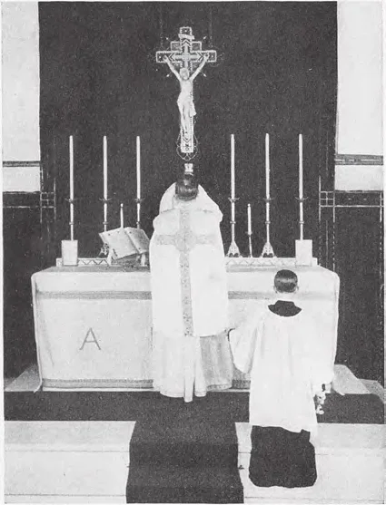
Elevação

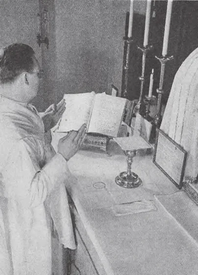
Pater Noster
:::

## A Consagração

A Consagração é a parte principal da Missa. As palavras do Próprio Cristo são faladas sobre o pão e vinho, as mesmas palavras que Ele usou quando instituiu a Santa Eucaristia na Última Ceia.

> Por elas o pão e vinho são mudados no Corpo e Sangue vivos do Filho de Deus. A campainha é tocada.

Após adorar, o padre eleva primeiro a Hóstia, depois o cálice, para o povo adorar. A Elevação comemora o levantamento de Nosso Senhor na Cruz, quando no Calvário Ele entregou Sua vida em sacrifício.

> Na Elevação, o povo deve olhar para a Hóstia e cálice e dizer, "Meu Senhor e meu Deus", então inclinar suas cabeças e adorar. Todos devem estar perfeitamente em silêncio, para acolher e honrar com devoção a vinda do Rei dos Reis.

Imediatamente após a consagração, devemos fazer a Deus Pai um ato de oferta de Seu Divino Filho. Temos um dom digno para oferecer a Deus, Cristo Mesmo.

## A Comemoração dos Mortos

> Pelas almas no Purgatório, o padre então ora, permanecendo em silêncio enquanto pleiteia por certas almas especiais. Então segue uma oração por aqueles presentes, começando com as palavras audivelmente ditas, "Nobis quoque peccatoribus" (Também a nós, pecadores).

## O Pater Noster

O padre recita o Pater Noster (Pai-Nosso), a oração ensinada pelo Próprio Cristo. Nas Missas altas, o povo fica de pé no Pater Noster. Então o Padre, quebrando a Hóstia em duas, põe uma pequena partícula dela no cálice, enquanto diz uma oração.

> Este quebrar simboliza a morte de Cristo.

## O Agnus Dei

O Agnus Dei é então dito, o padre batendo em seu peito três vezes em sinal de humildade e penitência: "Cordeiro de Deus, Que tirais os pecados do mundo, tende piedade de nós."

> Nas Missas altas o Beijo da Paz é dado.

:::row
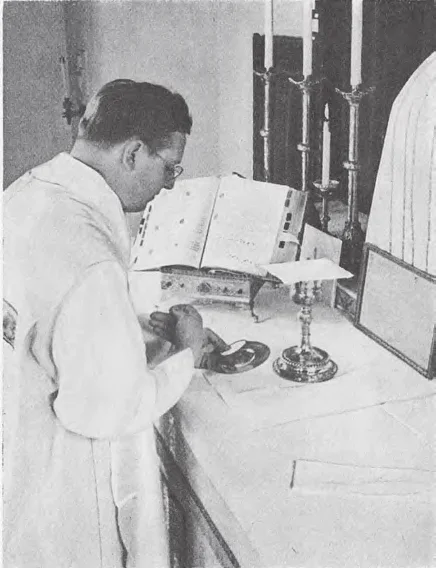
"Domine Non Sum Dignus"

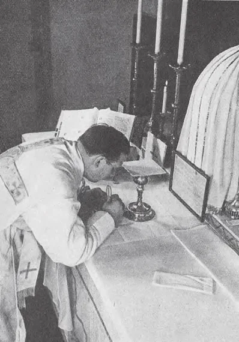
Comunhão do Padre
:::

## A Comunhão

Após várias orações de preparação, a campainha do santuário é tocada e o padre dá Comunhão a si mesmo. Recebe o Corpo de Cristo, dizendo: "O Corpo de nosso Senhor Jesus Cristo guarde minha alma para a vida eterna. Amém." O padre medita, então descobre o cálice, genuflete e diz: "Que darei eu ao Senhor por tudo que Ele me deu? Tomarei o cálice da salvação" etc. Então recebe o Precioso Sangue, dizendo, "O Sangue de Nosso Senhor Jesus Cristo guarde minha alma para a vida eterna. Amém".

> A Comunhão é a terceira parte principal da Missa e termina o sacrifício atual. Representa o sepultamento de Cristo.

Se há alguns para receber Comunhão, o acólito diz o Confiteor em seu nome. Aqueles que não comungam devem fazer uma comunhão espiritual. Se não há comungantes, o povo pode sentar-se após a Comunhão do padre.

## Comunhão do Povo

O padre absolve e abençoa o povo. Toma o cibório e eleva uma pequena Hóstia à vista de todos, dizendo, "Eis o Cordeiro de Deus, eis Aquele que tira os pecados do mundo!" Repete três vezes a oração do centurião a Cristo, "Senhor, não sou digno de que entres sob meu teto; dizei apenas uma palavra e minha alma será curada." Faz o sinal da cruz com a Hóstia sobre cada comungante e diz-lhe: "Que o Corpo de nosso Senhor Jesus Cristo guarde tua alma para a vida eterna. Amém."

> Após administrar a Santa Comunhão ao povo, o padre retorna ao altar.

O padre toma a Abluição; isto é, bebe vinho e água que são vertidos no cálice.

> O padre seca o interior do cálice; dobrando o corporal, põe-no no cálice como no início da Missa.

:::row
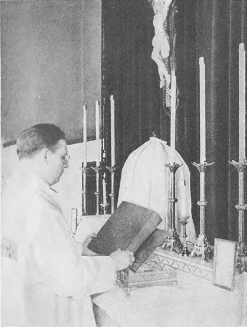
Pós-comunhão

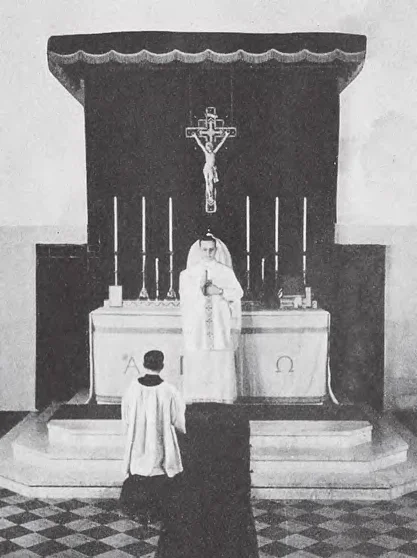
Bênção
:::

## A Pós-comunhão

Indo ao lado da Epístola, o padre lê a oração da Comunhão, denominada assim porque nos primeiros dias era cantada pelo coro enquanto o povo recebia a Santa Comunhão.

> Ao centro novamente, o padre volta-se para o povo e diz, "*Dominus vobiscum*" (O Senhor seja convosco), sendo respondido pelo acólito, "*Et cum spiritu tuo*" (E com teu espírito).

Uma vez mais no lado da Epístola, o padre lê as orações da Pós-comunhão, petições a Deus lidas ou cantadas como as Coletas. No meio, volta-se para o povo e uma vez mais diz: "*Dominus vobiscum*."

> Estas saudações são em comemoração das duas aparições de Cristo aos Apóstolos imediatamente após Sua ressurreição.

## A Bênção

O padre volta-se para o povo e diz: "*Ite, Missa est*" (Ide, a Missa está terminada).

> Estas palavras de despedida representam a Ascensão de Cristo, quando Ele enviou Seus Apóstolos para evangelizar o mundo. Estas palavras são variadas para diferentes ocasiões. Se o Gloria não foi dito, as palavras usadas aqui são: "*Benedicamus Domino*" (Bendigamos ao Senhor). Nas Missas pelos mortos as palavras são: "*Requiescant in pace*" (Descansem em paz). Na semana da Páscoa, as palavras aleluia, aleluia, aleluia, são adicionadas.

Mas mesmo com as palavras formais de despedida do padre, o povo não deve sair; a Missa ainda não terminou. Há uma curta oração à Santíssima Trindade, oferecendo devoção e homenagem.

> Então o padre beija o altar, estende, levanta e junta suas mãos, inclina sua cabeça e dá ao povo a bênção, dizendo, "Que o Deus todo-poderoso Pai, Filho e Espírito Santo vos abençoe."

O povo ajoelha-se e faz o sinal da cruz enquanto o padre o abençoa. Um bispo faz três sinais da cruz quando abençoa na Missa.

> Nas Missas pelos mortos não há bênção, para mostrar que a Igreja não tem a mesma jurisdição sobre os mortos como sobre os vivos.

:::row
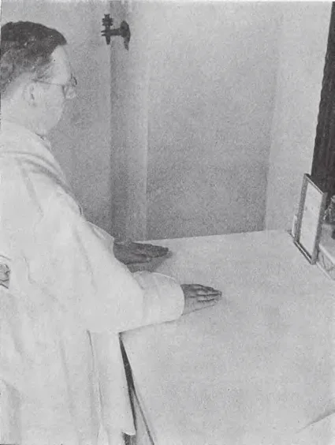
O Último Evangelho

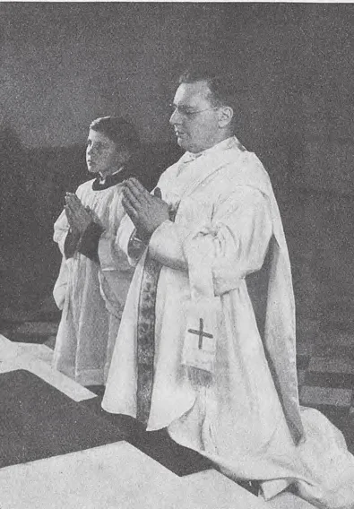
Orações após a Missa
:::

## O Último Evangelho

O padre volta-se para o lado esquerdo para ler o Último Evangelho, que é tirado das palavras de abertura do Evangelho de São João. O povo fica de pé e faz três sinais da cruz com o padre, na testa, lábios e peito. Genuflete com o padre nas palavras: "E o Verbo se fez Carne", em honra à Encarnação de Cristo. Às vezes outro Evangelho é lido em vez disto. O Último Evangelho representa a propagação da palavra de Deus em todo o mundo após a descida do Espírito Santo. Ao final do Último Evangelho, o povo ajoelha-se. A Missa termina com as palavras: "*Deo gratias*" (Graças a Deus).

> Uma Missa votiva é uma dita em honra a algum mistério ou santo particular, num dia não separado pela Igreja para a comemoração daquele mistério ou santo.

## Orações após a Missa

Assim em meia hora, o tempo requerido para uma Missa baixa ordinária, os principais eventos da vida de Nosso Senhor são representados, bem como as principais doutrinas de Sua Igreja.

> No curso da Missa, o celebrante observa não menos que 500 cerimônias, como inclinar-se, bater no peito e fazer o sinal da cruz. Estas cerimônias visam não apenas dar honra a Deus, mas também imprimir nos fiéis a sublimidade do Santo Sacrifício.

Após a maioria das Missas baixas, o padre ajoelha-se ao pé do altar e recita algumas orações prescritas com o povo.

> Todos devem fazer as respostas próprias. Ninguém deve sair antes do padre. Todos devem ficar de pé quando o padre sai do santuário.

> Nenhuma Missa de réquiem é permitida em grandes festas, pois nossas tristezas privadas não devem ter precedência sobre a alegria que deve reinar em toda a Igreja em tais dias.
