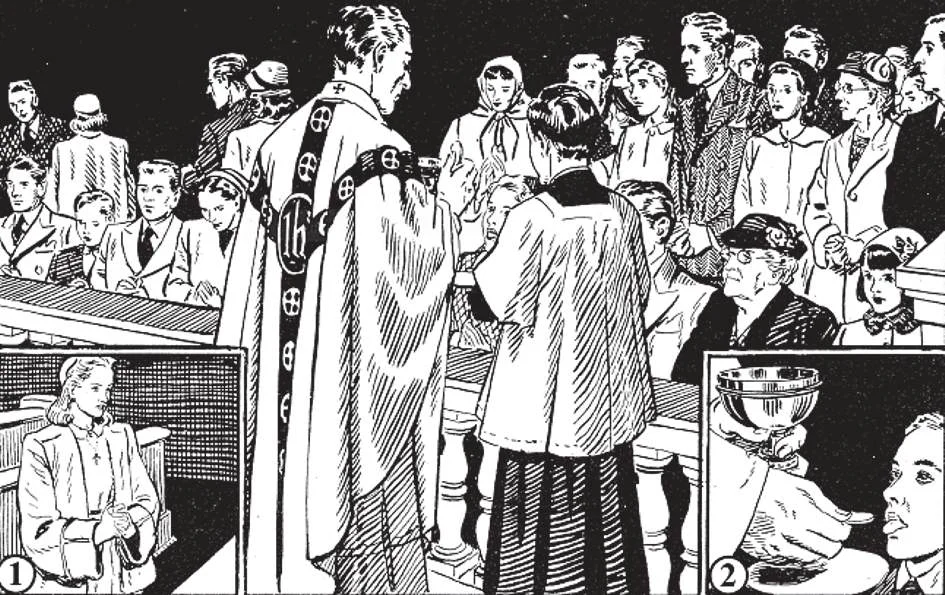

# 142. Disposições para a Santa Comunhão

*Assim devemos ajoelhar-nos no grade da comunhão. Não devemos empurrar ou apertar. (1) mostra como aproximar-se e deixar o grade da comunhão, com mãos juntas e olhos baixos. (2) mostra como receber a Santa Comunhão. Abrimos a boca e estendemos a língua um pouco sobre o lábio inferior. Enquanto isso acolhamos Jesus Cristo num coração alegre.*

**O que é necessário para receber a Santa Comunhão dignamente?**

— Para receber a Santa Comunhão dignamente, é necessário estar livre de pecado mortal e guardar o jejum eucarístico.

> O primeiro requisito é para a alma; o segundo é para o corpo.

**O que devemos fazer para cumprir com a disposição requerida para a alma?**

— Devemos estar em estado de graça.

1. Aquele que sabidamente recebe a Santa Comunhão em pecado mortal verdadeiramente recebe Jesus Cristo, mas comete sacrilégio.

> A primeira comunhão má foi feita por Judas. Ele tinha prometido trair Jesus por trinta moedas de prata. Contudo foi à Última Ceia e recebeu a Santa Comunhão das mãos de Nosso Senhor.

2. Não se requer que alguém vá à confissão antes de cada comunhão, mas apenas quando está consciente de pecado grave.

> Se apenas duvida se cometeu pecado mortal ou não, pode ainda ir à Santa Comunhão após um ato de contrição.

3. Se sem culpa da pessoa esquece na confissão de acusar-se de um pecado mortal, é perdoado com seus outros pecados e pode ir à Santa Comunhão.

> Deve, contudo, mencionar o pecado que esqueceu quando vai novamente à confissão.

4. Aquele que comete um pecado mortal após a confissão e, não percebendo, vai à Santa Comunhão, não faz uma comunhão má.

> Alguém faz uma comunhão má apenas quando está certo e consciente de estar em pecado mortal e ainda deliberadamente recebe a Santa Comunhão.

5. Pecados veniais não impedem e não devem impedir nossa ida à Santa Comunhão.

> Contudo, quanto mais pura nossa consciência, mais graças recebemos do sacramento; assim devemos fazer um ato de contrição antecipadamente.

6. Antes de receber a Santa Comunhão, devemos tentar ter um ardente desejo de estar unido a Cristo e despertar sentimentos de fé, humildade, esperança e amor.

> Tentemos trazer a nosso Senhor Eucarístico algum dom, por menor que seja. Evitemos lugares de diversão na noite anterior quando O recebemos na Santa Comunhão, como um pequeno sacrifício. Oremos devotamente e continuamente, para mostrar-Lhe a alegria em nossos corações à Sua vinda.

**O que devemos fazer para cumprir com a disposição requerida para o corpo?**

— Devemos guardar o jejum eucarístico.

1. As regulações para guardar o jejum eucarístico são: (a) Água natural — isto é, água à qual nada foi adicionado — não quebra o jejum eucarístico.

> Podemos beber água natural a qualquer hora que quisermos, mesmo alguns momentos antes de entrar na igreja para preparar-nos para a Santa Comunhão. Águas minerais artificiais, como soda, ou água à qual um pouco de açúcar foi adicionado, não deve ser considerada água natural para o jejum eucarístico.

(b) Devemos jejuar de todos os sólidos e líquidos, exceto água, por não menos de uma hora antes da Comunhão. É, contudo, uma prática muito louvável quando a Santa Comunhão é recebida de manhã, jejuar desde a meia-noite; ou pelo menos por três horas.

(c) Quando a Santa Comunhão é recebida mais tarde no dia, embora uma hora seja requerida, é novamente uma prática louvável jejuar por três horas. Líquidos podem ser tomados até uma hora antes.

(d) É altamente recomendado que bebidas alcoólicas não sejam tomadas dentro de três horas de receber a Santa Comunhão.

2. Aqueles que desejam receber a Santa Comunhão mas acham difícil jejuar sob algumas circunstâncias particulares podem buscar a permissão de um confessor, seja pessoalmente no confessionário ou pessoalmente fora dele, para tê-lo mitigado. O confessor é quem decide se suas dificuldades os habilitam a isto ou não.

> As circunstâncias particulares são: (a) Trabalho pesado realizado antes da Santa Comunhão. Este trabalho é daqueles que têm que trabalhar durante a noite, como trabalhadores noturnos em fábricas, enfermeiras, vigias noturnos, mulheres grávidas e mães de família que antes de ir à igreja devem gastar muito tempo em deveres domésticos.

> (c) Uma longa jornada para chegar à igreja que também toma em consideração as dificuldades da rota e a condição da pessoa.

3. Após buscar o conselho pessoal de um confessor, os doentes — mesmo aqueles não acamados — podem, sem limite de tempo, também pouco antes da Santa Comunhão, tomar algo em forma de bebida (desde que não seja alcoólica).

> Podem também tomar remédios, seja sólido ou líquido, mas os remédios líquidos não devem ser alcoólicos.

4. Aqueles que recebem o Santo Viático não estão obrigados pela lei do jejum. Em caso de grande perigo de morte, sob sentença de morte ou em guerra, ou para salvar as espécies sagradas da profanação, aqueles não jejuando podem comungar.

**Como devemos nos comportar ao receber a Santa Comunhão?**

— Devota e recolhidos, devemos pensar no Senhor Que estamos recebendo e fazer fervorosos atos de virtude.

1. Ao aproximar-se da grade da comunhão deve-se ter as mãos juntas e não andar demasiado apressadamente, nem correr à frente de outros, nem inserir-se entre duas pessoas já ajoelhadas próximas uma da outra na grade.

> É muito irreverente para mulheres e moças ir à Santa Comunhão com vestidos sem mangas ou curtos, decotes e calças. A tinta de seu batom pode possivelmente tocar a Sagrada Hóstia. Homens também devem estar decentemente vestidos.

2. Quando o padre se aproxima, deve-se levantar a cabeça e abrir a boca, com a língua levemente estendida sobre o lábio inferior.

> Após a Comunhão, deve retirar-se para dar lugar a outros e retornar a seu lugar com mãos juntas e olhos baixos.

3. Deve-se engolir a hóstia assim que puder. Jesus fica conosco apenas enquanto as aparências do pão permanecem.

> Se a hóstia gruda na boca, não devemos de modo algum removê-la com o dedo, mas umedecê-la com saliva e removê-la com a língua, então engoli-la.

Se a hóstia cai no chão, nunca tente apanhá-la. O padre sabe o que fazer. Permaneça onde está até que o padre acene para você sair.

> Se não pode ajoelhar-se, deve ver o padre na sacristia antes da Missa e explicar-lhe sua dificuldade.
