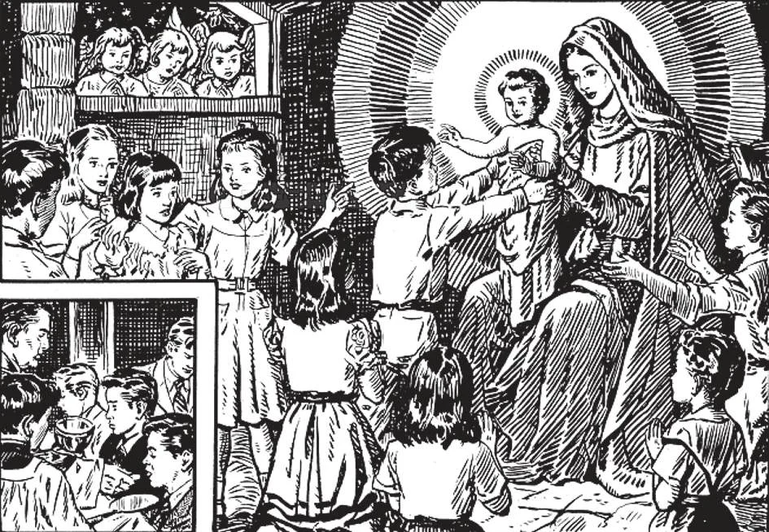

# 143. Graças da Santa Eucaristia

*Devemos receber Nosso Senhor na Eucaristia com a fé e amor de uma criança. Crianças recebendo a Santa Comunhão devem pensar em si mesmas aproximando-se para tomar o Menino Jesus dos braços de Nossa Senhora. Com quanto amor e adoração, com que alegria deveríamos receber Jesus em nossos braços, se a Santíssima Virgem aparecesse diante de nós para dá-Lo a nós! Contudo a Santa Comunhão é realmente melhor que isto: não apenas recebemos Jesus em nossos braços, mas em nossos próprios corações.*

**Quais são os principais efeitos de uma Santa Comunhão digna?**

— Os principais efeitos de uma Santa Comunhão digna são:

1. Uma união mais estreita com Nosso Senhor e um amor mais fervoroso a Deus e ao próximo. O que comida e bebida fazem pelo corpo, a Eucaristia faz pela alma. Une nosso corpo e alma àquele de Cristo.

> Na Santa Comunhão tornamo-nos unidos com Cristo, como Ele Mesmo prometeu, "Quem come a minha carne e bebe o meu sangue permanece em mim e eu nele" (João 6: 57).

2. Um aumento da graça santificante. A Santa Comunhão torna-nos mais agradáveis a Deus por um aumento de graça, fazendo-nos viver n'Ele e ser feitos semelhantes a Ele.

> Como São Tomás diz, "Como um rebento de uma árvore boa, quando enxertado numa selvagem, extrai seu gosto amargo e fá-la dar bom fruto, assim o corpo de Jesus Cristo, quando enxertado em nós, corrige nossas faltas e nos capacita a produzir frutos de justiça semelhantes àqueles que Ele Mesmo realiza."

3. Preservação do pecado mortal e a remissão do pecado venial.

> A Santa Comunhão preserva-nos de recair no pecado ao diminuir a violência de nossas paixões e tentações e ao infundir nova luz em nossas almas, pela qual vemos o poder e a loucura do pecado. Como comida repara o desperdício corporal, assim a Santa Comunhão repara o desperdício na alma, causado por faltas.

4. A diminuição de nossas inclinações ao pecado e a ajuda para praticar boas obras. Para receber mais abundantemente as graças da Santa Comunhão, devemos esforçar-nos por ser mais fervorosos e livrar-nos do pecado venial deliberado.

> A Santa Comunhão dá à nossa alma um vigor extraordinário. Como nossa vida corporal depende da união de nosso corpo com nossa alma, assim nossa vida sobrenatural depende da união de nossa alma com Deus. Quanto mais estreita esta união, mais vigorosa será nossa vida sobrenatural; na Santa Comunhão nossa alma está mais estreitamente unida a Deus do que se derretêssemos duas peças de cera numa só.

**O que devemos fazer após a Santa Comunhão?**

— Após a Santa Comunhão devemos gastar algum tempo adorando Nosso Senhor, agradecendo-Lhe, renovando nossas promessas de amor e obediência a Ele e pedindo-Le bênçãos para nós e outros.

1. Não devemos deixar a igreja imediatamente após receber a Santa Comunhão. Devemos orar pelo menos dez ou quinze minutos, agradecendo a nosso Divino Hóspede. Devemos agradecer a Nosso Senhor fervorosamente por vir a nós, fazer atos de fé, adoração, humildade e amor e suplicar-Lhe favores para nós e aqueles que amamos.

> Nosso Senhor está atual e pessoalmente presente em nós enquanto a aparência do pão permanece, por pelo menos dez minutos após receber a Santa Comunhão. Trataremos a Deus Filho friamente, não fazendo nada quando Ele vem? Para hóspedes terrenos nos esforçamos ao máximo para entretê-los e fazer sua estadia agradável. Diremos então a Cristo, "Estou contente que viestes, Senhor. Agora adeus, porque devo ir para casa." E esquecê-Lo?

2. Se nosso trabalho ou deveres impedem-nos de ficar na igreja para dar as devidas ações de graças, permaneçamos recolhidos e em união com Jesus em nosso caminho para casa; e lembremo-Lo com amor durante todo o dia.

> Uma vez São Filipe Néri notou que um certo paroquiano, sem razão, habitualmente deixava a igreja imediatamente após receber a Santa Comunhão. Para corrigi-lo, disse a dois acólitos num dia que o acompanhassem com velas acesas enquanto caminhava para casa. Os acólitos fizeram como lhes foi dito. O povo nas ruas olhou com surpresa e o homem vendo sua escolta perguntou-lhes a razão de seguirem-no. Eles responderam que o Padre Filipe Néri assim os instruíra. O homem retornou à igreja para descobrir o propósito de São Filipe. O Santo respondeu, "Temos que prestar a devida reverência a Nosso Senhor, Que estais carregando convosco. Já que negligenciais adorá-Lo, enviei dois acólitos para tomar vosso lugar." Percebendo sua falta, o homem ajoelhou-se e fez as devidas ações de graças após a Santa Comunhão.

**Como devemos mostrar nossa gratidão a Nosso Senhor por permanecer sempre em nossos altares na Santa Eucaristia?**

— Devemos mostrar nossa gratidão a Nosso Senhor por permanecer sempre em nossos altares na Santa Eucaristia visitando-O frequentemente, por reverência na igreja, por assistir à Missa em dias de semana quando isto é possível, por assistir às devoções paroquiais e por estar presente à Bênção do Santíssimo Sacramento.

1. Pagar visitas ao Santíssimo Sacramento é um gesto amoroso para com Nosso Senhor realmente presente ali. Ele é nosso melhor Amigo e não Lhe pagaremos uma visita de vez em quando?

> Onde quer que o Santíssimo Sacramento esteja reservado, uma luz deve sempre ser mantida acesa diante d'Ele. Azeite de oliva deve ser usado; em caso de necessidade o bispo pode permitir o uso de um substituto. Onde mais de uma lâmpada é usada, seu número deve ser ímpar. O uso da lâmpada do santuário remonta ao décimo terceiro século.

2. A Bênção do Santíssimo Sacramento é um ato de culto no qual a Hóstia Sagrada, posta no ostensório, é exposta ao povo para adoração e é levantada para abençoá-los. O Cardeal Newman disse da Bênção, "É a solene bênção de Nosso Senhor a Seu povo, como quando Ele levantou Suas mãos sobre Seus filhos ou quando abençoou Seus escolhidos quando ascendeu do Monte das Oliveiras."

> Na Bênção, o padre usa a capa, que é um grande manto de seda envolvendo todo seu corpo. Sobre seus ombros usa um véu umeral ou de ombros, com o qual segura o ostensório na bênção. Na Bênção, pelo menos doze velas devem ser usadas no altar e a Hóstia Sagrada deve ser incensada duas vezes; imediatamente após a Exposição e na segunda estrofe do *Tantum Ergo*.

3. A Hora Santa é uma devoção em honra a Nosso Senhor. É frequentemente feita diante do Santíssimo Sacramento, embora isto não seja necessário para ganhar as indulgências. A devoção consiste numa hora de oração mental ou vocal em união com a oração de Jesus no Jardim das Oliveiras, em honra à Sua agonia.

> A Hora Santa pode ser feita seja em público ou em privado. Se em público, deve ser feita na igreja ou capela a qualquer hora do dia de qualquer dia da semana.

4. A Devoção das Quarenta Horas é uma devoção favorita relacionada à Santa Eucaristia.

> Um revezamento de adoradores toma turnos na adoração, vigiando e orando. No altar pelo menos 20 velas são mantidas acesas continuamente. Esta devoção parece ter se desenvolvido das Procissões de *Corpus Christi*. (Veja páginas 386-387.)
