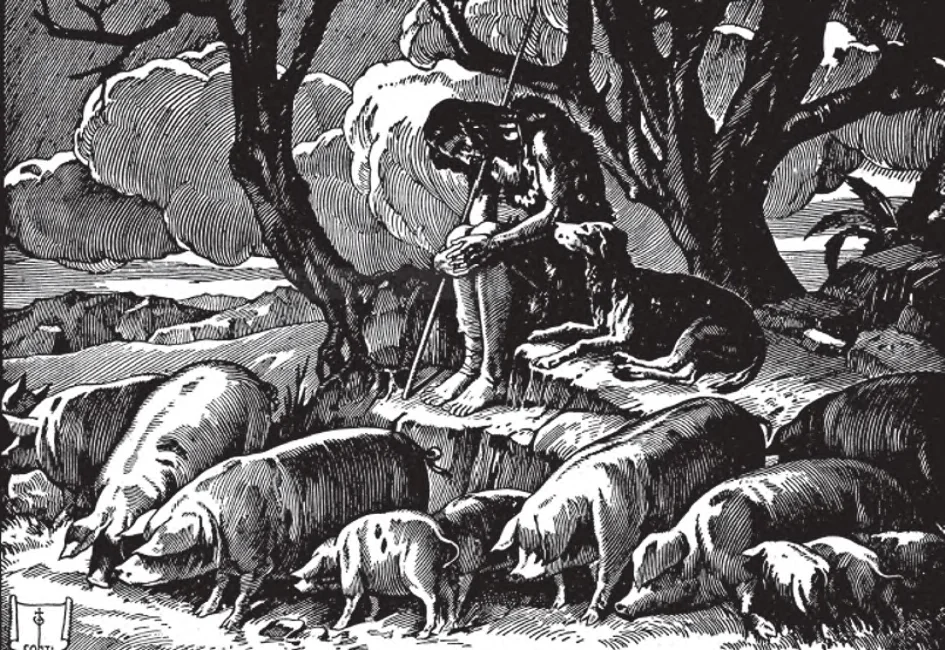

# 146. Pesar pelo Pecado

*Nosso Senhor, falando sobre o perdão de pecados, contou a parábola do Filho Pródigo, que tomou sua herança de seu pai e a desperdiçou num país distante. Mas chegou um tempo em que sofreu dificuldades como cuidador de porcos. Então, sentindo contrição pelo que tinha feito, disse a si mesmo: "Quantos empregados na casa de meu pai têm pão em abundância, enquanto eu pereço aqui de fome! Levantar-me-ei e irei a meu pai, e dir-lhe-ei: Pai, pequei contra o céu e diante de ti. Já não sou digno de ser chamado teu filho; faze-me como um de teus empregados. E levantou-se e foi a seu pai" (Lucas 15:17-20).*

**O que é contrição?**

— Contrição é pesar sincero por ter ofendido Deus e ódio pelos pecados que cometemos, com um firme propósito de não pecar mais.

> "O Senhor está perto dos que têm o coração contrito" (Sl. 33:19).

Deus não nos perdoará nenhum pecado, seja mortal ou venial, a menos que tenhamos verdadeira contrição por ele. Sem verdadeira contrição mil confissões não nos aproveitarão nada exceto para adicionar a nossos pecados. A menos que haja pesar pelos pecados não há perdão.

> Como exemplos de verdadeira contrição, temos Maria Madalena, que caiu aos pés de Jesus chorando; São Pedro, que chorou amargamente por ter negado Nosso Senhor; o Rei David, que jejuou e orou, clamando, "Tem piedade de mim, ó Deus... um coração contrito e humilhado não desprezarás."

**Quando o pesar pelo pecado é verdadeira contrição?**

— É verdadeira contrição quando é interior, sobrenatural, suprema, e universal.

1. Nosso pesar é interior quando vem de nosso coração, não meramente de nossos lábios.

> Um dia um homem esbarrou numa velha carregando uma cesta cheia de vegetais. Sua cesta foi derrubada de sua mão e o conteúdo derramou-se na rua, rolando em todas as direções. O homem curtamente murmurou, "Desculpe", e seguiu seu caminho, dizendo impacientemente a si mesmo, "Deveria haver uma lei contra velhas saindo às ruas." Enquanto isso, a velha foi deixada para apanhar seus vegetais como pudesse. O pesar deste homem não era interior: estava apenas em seus lábios.

2. Nosso pesar é sobrenatural quando, com a ajuda da graça de Deus, surge de motivos que brotam da fé e não meramente de motivos naturais. Se estamos arrependidos de nossos pecados porque ofendem a Deus Que é tão bom e perfeito ou porque tememos Seus castigos ou a perda do céu, nossa contrição é sobrenatural.

> Um ladrão foi levado ao tribunal. Tinha sido pego por causa de um cão de guarda na casa na qual tinha entrado. O ladrão disse a si mesmo quando foi sentenciado à prisão: "Estou arrependido de jamais ter entrado naquela casa. Da próxima vez certificarei de roubar apenas daquelas casas que não têm cães." A contrição deste homem não era sobrenatural, mas natural. Estava arrependido apenas porque foi pego e punido. Outros motivos naturais são a perda de saúde, reputação ou bens.

3. Nosso pesar é supremo quando odiamos o pecado acima de todo outro mal e estamos dispostos a suportar qualquer coisa antes que ofender a Deus no futuro pelo pecado.

> Uma criança disse ao padre: "Padre, penso que não tenho contrição suficiente por meus pecados. Quando ofendo minha mãe, choro amargamente, porque a amo. Mas quando confesso meus pecados, não choro de todo." O padre perguntou: "Cometerias um pecado apenas para agradar tua mãe, a quem amas tanto?" Rapidamente a criança respondeu: "Padre, não!" A contrição desta criança é suprema ou soberana. Pesar pelo pecado não é julgado pela quantidade de lágrimas que derramamos, mas pela firmeza de nossa vontade em resolver fazer emendas e evitar o pecado porque ofende a Deus.

4. Nosso pesar é universal quando estamos arrependidos de cada pecado mortal que podemos ter tido a infelicidade de cometer. Se cometemos cinco pecados mortais e estamos contritos por apenas quatro, mesmo que confessamos todos, nem um é perdoado.

> Um homem está arrependido de que ao atacar seu inimigo tinha matado a esposa, o servo e o filho também; mas não de que tinha assassinado seu inimigo ele mesmo. Não obtém absolvição por nenhum dos assassinatos.

**Por que devemos ter contrição pelo pecado venial?**

— Devemos ter contrição pelos pecados veniais porque é desagradável a Deus, merece castigo temporal e pode levar ao pecado mortal.

1. Pecado venial é desagradável a Deus e nos mantém fora do céu, ainda que temporariamente. Se realmente amamos a Deus, evitaríamos todo sinal de pecado separando-nos d'Ele.

> As manchas do pecado venial podem parecer muito leves para nós de fato; mas quando postas contra a pureza da Bondade Infinita tornam-se manchas escuras. Podemos perceber como Deus olha o mais leve dos pecados veniais quando lembramos quão severamente puniu Seus santos, como por exemplo Moisés, por apenas um pecado muito leve de pensamento.

2. Pelo pecado venial incorremos em castigo temporal, que deve ser compensado seja aqui na terra ou nas chamas do purgatório.

> Mesmo a leve perda de temperamento ou desconforto surgindo do pecado venial não é compensada por qualquer alívio ou prazer que possamos obter dele. E incorreremos nos sofrimentos do purgatório e separação de Deus?

3. Pecado venial é um passo para o pecado mortal. Causa descuido em relação aos pecados, e leva-nos à preguiça em relação às boas obras. Tendo esfriado em nosso zelo, começamos a negligenciar pequenas faltas e logo consideramos as maiores com indiferença.

> E assim, sendo descuidados sobre o pecado venial, caímos no pecado mortal "pouco a pouco". Nenhum homem caiu subitamente no vício; o vício é um hábito de pecado.

4. Pecado venial priva-nos de muitas graças pelas quais poderíamos merecer mais ajuda e amor de Deus. Ao ir à Confissão, e se temos apenas pecados veniais para confessar, devemos estar arrependidos de pelo menos um deles ou de algum pecado de nosso passado que confessamos; do contrário a confissão não é válida.

**Por que devemos ter contrição pelo pecado mortal?**

— Devemos ter contrição pelo pecado mortal porque é o maior de todos os males, ofende gravemente a Deus, mantém-nos fora do céu, e condena-nos para sempre ao inferno.

> Pecado é o maior de todos os males porque seus efeitos duram mais tempo e tem os resultados mais terríveis. Saúde abalada, pobreza e outros males materiais duram apenas por um tempo; na morte todos terminarão para sempre e teremos nossa libertação deles. Mas o pecado? Os males surgindo do pecado mortal, além daqueles que nos perseguem nesta vida, nos perseguirão até a eternidade.

**O que é um ato de contrição?**

— É uma oração pela qual expressamos a Deus nosso pesar e detestação do pecado.

1. Um ato de contrição pode ser tão curto quanto isto: "Ó meu Deus, estou arrependido com todo meu coração por ter-Vos ofendido, porque sois todo bom!"

> "Tem piedade de mim, ó Deus, tem piedade de mim, pois minha alma confia em Ti" (Sl. 56:2).

2. Um ato de contrição é suficiente para perdoar pecados veniais. Podemos portanto ir à Santa Comunhão sem confissão se não temos pecado mortal, após dizer tal ato.

> Contudo, é melhor ir à confissão pelo menos a cada duas semanas se somos comungantes frequentes e temos apenas pecados veniais. A confissão dá graças especiais não obtidas através de um ato de contrição.
