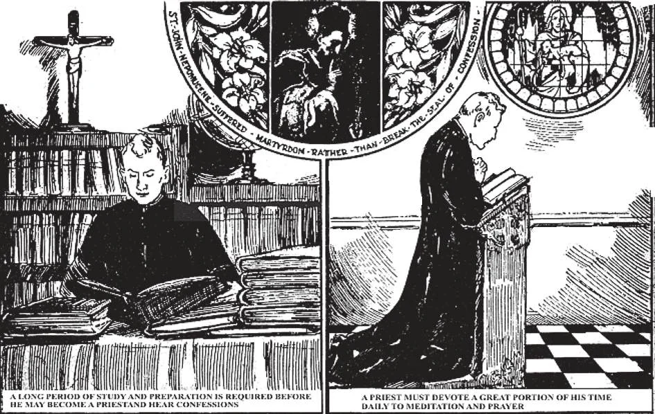

# 152. O Sigilo da Confissão

*1. Antes de um homem ser ordenado padre e permitido ouvir confissões, deve passar por um longo período de cuidadoso estudo e preparação. Fará três ou pelo menos dois anos de Filosofia e quatro anos de Teologia, Direito Canônico, História Eclesiástica e Sagrada Escritura. Esta longa e detalhada preparação usualmente não atrairia uma classe baixa de homens.*

*2. Após alguém ser ordenado padre, é continuamente lembrado de seus deveres não apenas por seus superiores, mas por sua meditação e oração diárias. Todo padre é obrigado a dizer o Breviário cada dia. Estes deveres espirituais trazem a graça de Deus sobre o padre e servem para fortalecê-lo para ser fiel a seus sagrados deveres, sendo um dos mais importantes guardar o sigilo da confissão, o segredo sacramental.*

**O que é o "sigilo da confissão"?**

— É a mais solene obrigação de um padre de manter secreto o que lhe foi revelado na confissão.

1. O padre não pode quebrar este sigilo da confissão mesmo para salvar sua própria vida, ou para evitar uma grande calamidade. Deve agir como se não tivesse ouvido nada na confissão. É por isto que um senso de vergonha ou medo de dizer nossos pecados nunca deve levar-nos a esconder pecados mortais na confissão.

> Para o fim do décimo quarto século, Venceslau, Rei da Boêmia, ordenou a São João Nepomuceno ser afogado no rio Moldau. O rei tinha tentado fazer o Santo revelar-lhe o que a rainha tinha dito na confissão e o santo tinha firmemente recusado, apesar de induções e ameaças. Centenas de anos depois, durante o processo de canonização, a língua do santo foi encontrada incorrupta e parecia uma língua viva.

2. O sigilo da confissão deve ser observado mesmo num tribunal de justiça, pois a lei divina é mais alta que a lei humana.

> No início do décimo nono século, um padre jesuíta de Nova York, Padre Kohlman, foi chamado ao tribunal para testemunhar. Um casal estava em julgamento por ter recebido bens roubados. Supunha-se que Padre Kohlman tivesse conhecimento do assunto através do confessionário, pois tinha restaurado os bens roubados ao legítimo dono. No tribunal, o padre recusou-se a testemunhar e foi portanto julgado por desacato ao tribunal. Contudo, não foi punido, e logo depois uma lei de Nova York foi passada isentando padres de revelar em tribunal qualquer conhecimento obtido na confissão.

> Tal lei, contudo, está longe de ser universal e a posição de um padre que recusa revelar matéria confessional num tribunal de lei não é segura.

3. Seria um pecado mortal para um padre divulgar mesmo o pecado venial de uma pessoa que soube através da confissão. A penalidade por violar o sigilo da confissão é excomunhão reservada ao Papa, além de severas penalidades eclesiásticas. De tempos em tempos ouvimos de padres que apostatam, mas nunca ninguém caiu tão baixo quanto a quebrar o sigilo da confissão.

> Este incidente aconteceu na França durante tempos medievais. O capelão de um castelo uma noite ouviu uma batida em sua porta e, abrindo-a, viu um homem que disse que desejava ir à confissão. O capelão ouviu a confissão durante a qual o homem revelou que naquela mesma noite lideraria um assalto contra o castelo, tendo sido escolhido para executar um plano. O capelão tentou dissuadi-lo, mas em vão. Tendo sido negada absolvição a ele, o homem partiu. O capelão passou a noite numa agonia de pavor. Contudo, permaneceu no castelo, e não disse a ninguém do que tinha ouvido no confessionário, mas preparou-se para a morte. Ao amanhecer ouviu uma batida e admitiu o homem da noite anterior. O homem disse: "Desejei estar convencido de que padres realmente observam o sigilo do confessionário, pois sou um grande pecador. Toda a noite vigiei para ver se informarias a outros ou deixarias o castelo para salvar-te. Agora não mais duvido do sigilo do confessionário e quero confessar todas as minhas ações perversas."

4. O penitente, contudo, pode dar ao padre permissão para fazer uso do que revelou na confissão. Naquele caso, o padre pode fazê-lo, embora seja aconselhado ser muito cuidadoso, para prevenir acusação injusta concernente ao sigilo do confessionário.

> Inimigos da Igreja têm constantemente tentado atacar o sigilo da confissão, para quebrar esta regra da Igreja. Até agora, pela graça de Deus Que vigia sobre Sua Igreja, estes inimigos falharam.

**Os penitentes estão obrigados pelo sigilo da confissão?**

— Penitentes não estão de modo algum obrigados pelo sigilo da confissão; mas são aconselhados a abster-se de falar sobre o que o padre lhes diz no confessionário.

1. Penitentes devem evitar falar sobre o conselho dado, a penitência, etc.

> Uma razão para isto é que se entendemos ou representamos mal o que o padre nos disse, ele não tem modo de defender-se. Além disso, cada penitente é diferente dos outros. Conselho ou penitência dada por um confessor a um pode não ser bom para outro; assim como um médico prescreve diferentes medicinas para seus pacientes.

2. Se ouvimos algo sendo dito no confessionário, estamos estritamente obrigados ao sigilo.

**Somos livres para escolher nosso confessor?**

— Sim, somos absolutamente livres para escolher o confessor que gostamos.

1. É aconselhável ter um confessor regular. Deste modo, ele torna-se bem familiarizado com nosso caráter e estado de consciência. É assim capacitado a dirigir-nos melhor, a dar-nos conselho e instrução espiritual mais efetivos.

> Um confessor é como um médico. Se um homem doente consulta um médico diferente cada semana e segue as direções de nenhum, não pode esperar muita melhoria em saúde. Similarmente, um penitente que move-se de um confessor para outro dificilmente pode obter o conselho de que precisa.

2. Devemos escolher um confessor hábil, e seguir suas direções fielmente. Contudo, para a paz de nossa consciência, não devemos hesitar em mudar confessores. Não devemos tornar-nos tão apegados a um quanto a ser incapazes de confessar a outro padre.

> Se mudamos confessores, nunca devemos sem necessidade mencionar ao novo o que nossos antigos confessores nos aconselharam. Poderia trabalhar uma injustiça ao confessor prévio, que não pode defender-se.

3. Alguns escondem pecados mortais na confissão por um senso de vergonha diante de seu confessor ordinário. Tais pessoas devem ir e confessar a outro padre.

> Devem também lembrar que o padre, que representa Cristo Mesmo, está obrigado pelo sigilo da confissão nunca revelar qualquer coisa dita a ele no confessionário.

4. Aqueles que têm vergonha de confessar a qualquer padre devem lembrar que um dia terão seus pecados revelados, para sua eterna confusão, diante de toda a humanidade. "Mostrarei tua nudez às nações e tua vergonha aos reinos" (Naum 3:5). Não é melhor revelar nossos pecados agora a apenas um homem, que não precisa conhecer o penitente, e está além disso obrigado pelo segredo sacramental? Não é melhor confessá-los agora ao padre do que queimar no inferno por toda a eternidade?

> Além disso, o padre está pronto para receber penitentes gentilmente. É uma alegria do sacerdócio ter penitentes fazendo confissões sinceras e mostrando uma firme determinação de ser convertido do pecado. Deus Mesmo disse, "Haverá alegria no céu por um pecador que se arrepende, mais do que por noventa e nove justos que não têm necessidade de arrependimento" (Lucas 15:7).
