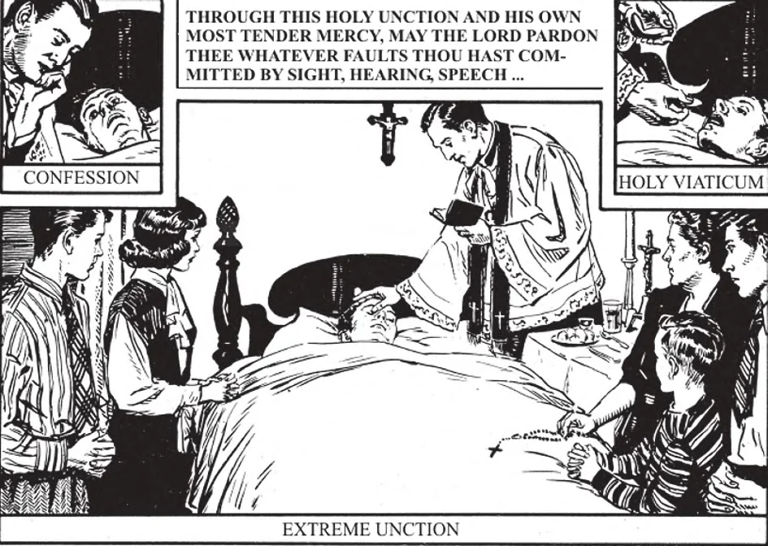

# 156. O Sacramento da Extrema-Unção

*Milhares morrem cada ano sem o benefício do Sacramento da Extrema-Unção. Se nossa fé significa algo para nós, deve ensinar-nos que o momento da morte é de suprema importância. Pode decidir se estaremos para sempre com Deus no céu ou se sofreremos eternamente no inferno. Devemos ver que os muito doentes recebam Extrema-Unção para ajudá-los a enfrentar seu Juiz.*

**O que é Extrema-Unção?**

— Extrema-Unção é o sacramento que, através da unção com óleo abençoado pelo padre e através de sua oração, dá saúde e força à alma, e às vezes ao corpo, quando estamos em perigo de morte por doença, acidente ou velhice.

1. Foi para curar os doentes e consolar os aflitos que Nosso Senhor operou muitos de Seus milagres. Os Evangelhos nos dão vívidas imagens d'Ele enquanto ia fazendo o bem e "curando toda doença e toda enfermidade entre o povo" (Mat. 4:23).

> "E quando o sol se punha, todos os que tinham doentes de várias doenças os traziam a Ele. E Ele impunha as mãos sobre cada um deles e os curava" (Lucas 4:40). Assim hoje, Cristo vem a nós no Sacramento da Extrema-Unção e, se for para o bem de nossa alma, cura-nos de nossa doença, dizendo-nos, como disse a tantos outrora, "Levanta-te, sê curado."

2. Quando Nosso Senhor primeiro enviou os Apóstolos, "expulsavam muitos demônios e ungiam com óleo muitos doentes e os curavam" (Marcos 6:13).

> Estas palavras da Sagrada Escritura implicam a instituição por Nosso Senhor do Sacramento da Extrema-Unção. Então, antes de Sua Ascensão, prometeu a Seus discípulos certos sinais maravilhosos que deveriam acompanhar e seguir aqueles que cressem n'Ele: "Em Meu nome expulsarão demônios... imporão as mãos sobre os doentes e eles se recuperarão."

3. É uma certeza que os Apóstolos conferiram Extrema-Unção, como diretamente recomendado e promulgado para o uso dos fiéis na Epístola de São Tiago.

> "Está alguém entre vós doente? Chame os presbíteros da Igreja e orem sobre ele, ungindo-o com óleo em nome do Senhor. E a oração da fé salvará o doente e o Senhor o levantará e, se estiver em pecados, ser-lhe-ão perdoados" (Tg. 5:14-15).

4. O sinal exterior ou cerimônia é a unção com óleo abençoado, ao mesmo tempo que as palavras são pronunciadas: "Por esta santa unção e Sua própria mui terna misericórdia, perdoe o Senhor quaisquer faltas que tenhas cometido pela visão (audição, fala, etc.)"

> O padre unge com óleo consagrado em forma de cruz os cinco sentidos: olhos, ouvidos, narinas, lábios, mãos, e pés. A unção dos pés pode ser omitida se houver alguma razão especial. Em caso de urgente necessidade, a unção pode ser feita apenas na testa e as palavras da forma tornadas mais curtas.

5. Apenas um padre pode administrar a Extrema-Unção.

**Quem deve receber a Extrema-Unção?**

— Todos os católicos que atingiram o uso da razão e estão em perigo de morte por doença, acidente ou velhice devem receber a Extrema-Unção.

1. Como o propósito primário do sacramento é restaurar a alma enfraquecida pelo pecado e tentação, aqueles que nunca foram capazes de pecar não podem recebê-lo. Daquí idiotas e crianças sob a idade da razão não podem receber Extrema-Unção.

> Como o perigo de morte deve surgir de dentro, soldados indo à batalha, prisioneiros prestes a ser executados, passageiros num navio prestes a naufragar, etc., não podem receber o sacramento.

2. O sacramento pode ser recebido apenas uma vez na mesma doença. Se a pessoa se recupera e cai seriamente doente uma vez mais, pode receber o sacramento novamente, mesmo que a doença seja a mesma doença.

> O sacramento deve ser administrado assim que houver perigo de morte. Aqueles que atendem pessoas doentes não devem esperar até que a pessoa esteja realmente morrendo antes de chamar o padre. Geralmente, a restauração à saúde frequentemente operada pela Extrema-Unção não é produzida miraculosamente, daí a recepção do sacramento não deve ser adiada.

3. Extrema-Unção é um sacramento dos vivos. Daquí a pessoa deve estar no estado de graça. Antes de sua recepção, portanto, é costume ir à confissão, a menos que incapaz de fazê-lo.

> Extrema-Unção, que significa "Última Unção", é assim chamada porque é a última das unções sacramentais usadas pela Igreja, não porque deva ser adiada até o último momento quando os doentes estão no ponto de morte.

**Quais são os efeitos do sacramento da Extrema-Unção?**

— Os efeitos do sacramento da Extrema-Unção são:

1. Um aumento da graça santificante.

> Extrema-Unção age espiritualmente, como o óleo age materialmente; fortalece, cura e auxilia a alma. Os efeitos do óleo no corpo são bem conhecidos: óleo é esfregado em atletas para dar-lhes maior energia e supleza; óleo tem poder curativo para feridas.

2. Conforto na doença e força contra a tentação.

> Dá a alguém graças para consolá-lo e fortalecê-lo contra a tentação. Obtém resignação à vontade de Deus, fortaleza para sofrer e confiança na misericórdia de Deus. Este sacramento frequentemente efetua uma grande mudança na pessoa doente: onde ela estava previamente impaciente e difícil de agradar, torna-se resignada às dores de sua doença.

3. Preparação para entrada no céu pela remissão de nossos pecados veniais e a limpeza de nossas almas dos restos de pecado. Quando a pessoa não se recupera, se recebe o sacramento com perfeitas disposições, parte, e mesmo toda, das penas temporais pode ser-lhe perdoada.

> Remove pecados veniais e pecados mortais não perdoados que alguém é incapaz de confessar, se tem atrição por eles. Remove os restos de pecado, que são: fraqueza de vontade e más inclinações que são resultados de pecado passado.

4. Saúde do corpo quando isto é bom para a alma.

> Extrema-Unção frequentemente restaura à saúde. Muitas vezes a paz de espírito que segue a confissão, e o conhecimento que Extrema-Unção reconciliou alguém com Deus, reagem beneficamente sobre o corpo de uma pessoa doente e causam a restauração de sua saúde.

**Quando a Extrema-Unção tira o pecado mortal?**

— Extrema-Unção tira o pecado mortal quando a pessoa doente está inconsciente ou de outro modo não ciente de que não está propriamente disposta, mas fez um ato de imperfeita contrição.

> Uma pessoa inconsciente pode receber Extrema-Unção. Se é culpada de pecado mortal e tem atrição por ele e cai inconsciente antes da chegada do padre, Extrema-Unção restaurá-la-á à graça santificante. Contudo, se recuperar, é obrigada a confessar seus pecados assim perdoados.
