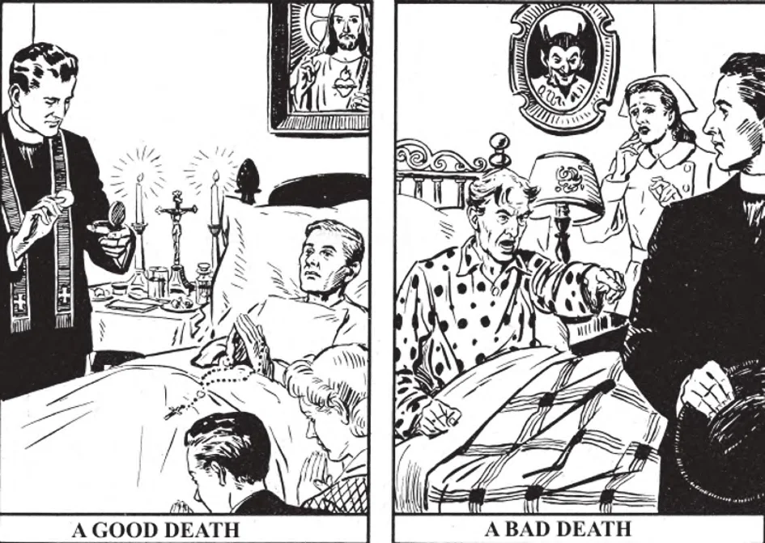

# 157. Os Últimos Sacramentos



*Uma boa vida é usualmente uma garantia de uma morte feliz. Aquele que viveu todos os seus dias num esforço para agradar a Deus não é provável que se torne um pecador impenitente no último momento.*

*2. Uma vida má é usualmente uma previsão de uma morte má. Um pecador endurecido recusa os Últimos Sacramentos. Oremos todos a Deus para nos livrar de uma morte má.*


**Quais são os Últimos Sacramentos?**

— São os sacramentos administrados a uma pessoa perigosamente doente e incluem Confissão, Viático e Extrema-Unção.

1. A pessoa doente primeiro faz sua confissão, então recebe a Santa Eucaristia no Viático e finalmente é dada a Extrema-Unção.

> Extrema-Unção é um remédio; e como a medicina é para os vivos, não os mortos, assim aqueles mortos em pecado não lucrarão deste remédio espiritual. Contudo, se o paciente é fisicamente incapaz de confessar, a Igreja aceita a intenção e administra Extrema-Unção sem confissão.

2. Quando uma pessoa está perigosamente doente, devemos chamar o padre para administrar-lhe os Últimos Sacramentos. É muito errado adiar chamar o padre até que a pessoa já esteja no ponto de morte. Enquanto sua mente está clara, pode preparar-se para os Últimos Sacramentos melhor, lucrar mais deles.

> Quando Extrema-Unção é dada enquanto a pessoa ainda está forte, há mais probabilidade de recuperar-se. Temos uma obrigação séria, se estamos cuidando de uma pessoa doente, de chamar o padre no momento em que há perigo de morte. Exceto em casos de emergência, o pároco da paróquia à qual a pessoa doente pertence ou os curas ou assistentes do pároco devem ser chamados para administrar os Últimos Sacramentos.

3. Algumas pessoas não chamam o padre para administrar os Últimos Sacramentos porque temem que o paciente fique assustado e piore.

> Isto é um grande erro pois observação atual provou que uma pessoa doente está sempre mais calma e pacífica após a visita do padre. Nosso Senhor instituiu a Extrema-Unção para aquietar e confortar os doentes, não os mortos.

4. É aconselhável chamar o padre para visitar os doentes em qualquer doença séria, mesmo que não haja aparente perigo de morte. É dever do padre visitar os doentes e administrar os sacramentos de que precisam.

> "Meu filho, em tua doença não te negligencies, mas ora ao Senhor e Ele te curará" (Eclo. 38:9).

5. Podemos ajudar uma pessoa doente cuidando e consolando-a. Cada dia devemos fazer com ela e por ela atos de fé, esperança e caridade. Acima de tudo, devemos ajudá-la a sentir absoluta resignação à vontade de Deus.

> É um erro tentar ajudar uma pessoa perigosamente doente conversando sobre tópicos mundanos ou contando fofocas ou oferecendo falsas esperanças de recuperação.


**Como devemos ajudar uma pessoa doente a preparar-se para os Últimos Sacramentos?**

— Devemos ajudar uma pessoa doente a preparar-se para os Últimos Sacramentos tanto espiritual quanto corporalmente.

1. Antes do padre chegar devemos ajudar o paciente a preparar-se para sua Confissão. Digamos com ele atos de contrição e ejaculações para mantê-lo unido a Deus.

2. O rosto, mãos e pés do paciente devem ser esponjados com uma toalha molhada.

> Deve estar pronto junto ao pé da cama, à direita, uma mesa com um pano branco limpo. Sobre ela deve haver um crucifixo, duas velas acesas, alguma água benta e um copo de água fresca com uma colher de sopa. Deve também haver um guardanapo limpo, um pires com seis bolas de algodão e um pedaço de pão macio ou uma ou duas fatias de limão para as mãos do padre, para limpar a unção. Uma bacia de água e uma toalha devem estar próximas, para que o padre possa lavar suas mãos após a unção.

O seguinte é um diagrama mostrando a disposição:

```
              Pé da Cama

              2   1   3

                Corporal

              8   +   7

              4   5   6

              Cabeceira
```

1. crucifixo
2. velas
4. copo de água
5. colher
6. frasco de água benta
7. guardanapo dobrado
8. pires com seis bolas de algodão e um pequeno pedaço de pão macio

3. À chegada do padre, se ele está carregando o Santíssimo Sacramento, devemos encontrá-lo com uma vela benta acesa, em silêncio.

> O próprio padre traz o corporal, sobre o qual põe a píxide contendo o Santíssimo Sacramento.


**Como podemos ajudar uma pessoa moribunda?**

— Podemos ajudar uma pessoa moribunda com oração.

1. Devemos ajoelhar-nos perto da cama do paciente e recitar as orações pelos moribundos, que podem ser encontradas na maioria dos livros de oração. Devemos sugerir-lhe curtas ejaculações que possa facilmente repetir, pelo menos em sua mente. Devemos recitar com ele especialmente aquelas orações que são enriquecidas com indulgências plenárias para a hora da morte.

> A bênção papal com indulgência plenária anexada é ganha dizendo o santo Nome de Jesus. Se incapaz de dizê-lo, a pessoa deve pelo menos pensá-lo e com contrição beijar um crucifixo abençoado.

2. A seguinte oração é enriquecida com uma indulgência plenária na hora da morte: "Ó meu Deus, eu agora neste momento pronta e voluntariamente aceito de Tua mão qualquer tipo de morte que desejares enviar-me, com todas as suas dores, penalidades, tristezas."

Uma pessoa em boa saúde que recita esta oração no estado de graça, após confissão e comunhão, pode ganhar uma indulgência plenária para ter efeito na hora da morte.

> Se refletirmos que uma indulgência plenária ganha com próprias disposições significa que a alma irá direto do leito de morte ao Céu, seríamos mais zelosos em ajudar os moribundos a ganhar uma.

3. Durante a agonia, devemos aspergir a cama e a pessoa moribunda com água benta. Aqueles ao redor devem orar, em vez de agitar-se ou mostrar pesar demasiado.

> A primeira coisa que podemos oferecer imediatamente a Deus em alívio da alma de um ente querido é um ato de resignação à Sua santa vontade. Digamos humildemente, "Senhor, seja feita Tua vontade!" Naqueles lugares onde o belo costume é praticado, o "sino de passagem" deve ser mandado tocar, para que outros cristãos possam orar pela alma partida.


**Em caso de morte súbita ou inesperada, um padre deve ser chamado?**

— Em caso de morte súbita ou inesperada, um padre deve ser chamado sempre, porque absolvição e Extrema-Unção podem ser dadas condicionalmente por algum tempo após a morte aparente.

> Se uma pessoa está aparentemente morta e não recebeu os Últimos Sacramentos, devemos imediatamente chamar o padre. Uma pessoa pode continuar a viver duas ou três horas após a morte ter aparentemente ocorrido, especialmente se é súbita. Naquele caso Extrema-Unção aproveitará sua alma.
