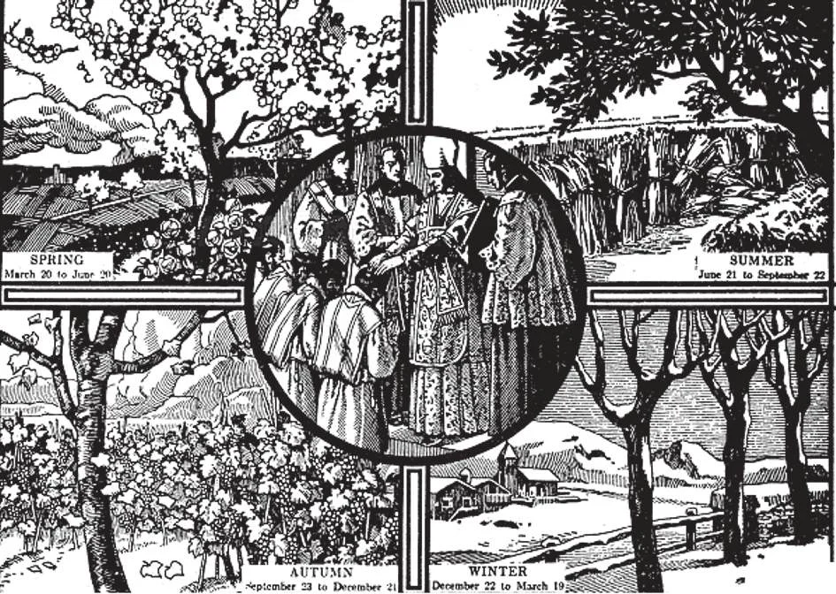
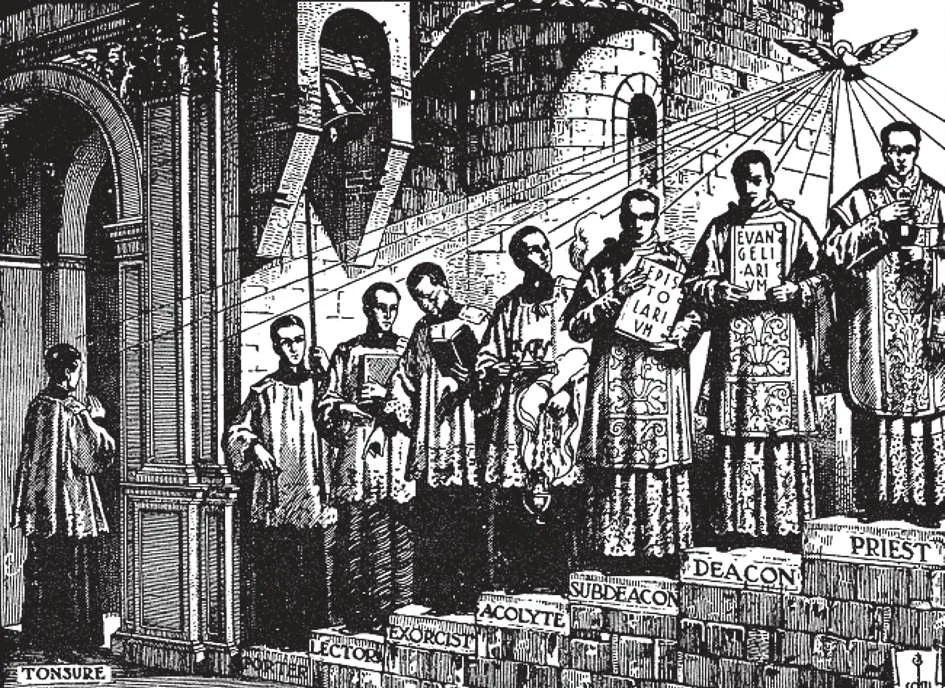

# 160. Ordens Maiores e Menores

*No início das quatro estações — Primavera, Verão, Outono e Inverno — os Dias de Têmporas são celebrados para implorar as bênçãos de Deus sobre os frutos da terra; aqueles dias são igualmente destinados como ocasiões especiais para orar pelo clero. Os Dias de Têmporas são as quartas, sextas e sábados seguintes a 13 de dezembro, o primeiro Domingo da Quaresma, Pentecostes e 14 de setembro. Ordenações ocorrem nos Sábados de Têmporas. Dias de Têmporas são dias de penitência, jejum e abstinência.*

**Quais são as ordens maiores?**

— As ordens maiores são: subdiaconato, diaconato e sacerdócio.

1. O subdiaconato é ainda uma preparação para o Sacramento da Ordem e é de instituição eclesiástica. Um subdiácono está comprometido ao celibato perpétuo e à recitação diária do Ofício Divino.

> O subdiácono apresenta a água na Missa Alta, canta a epístola, traz os vasos ao altar, segura a patena durante o cânon e dá o beijo da paz ao coro. Na prática, hoje tudo isto é feito por um padre.

2. O diaconato é o mais baixo grau no Sacramento da Ordem. O diácono recebe graça sacramental.

> O diácono assiste os padres na Santa Missa, lê ou canta o Evangelho, prega; na Missa Alta incensa o celebrante e o coro, dá o pão do altar, verte vinho no cálice, tira a pala e a põe, recebe o beijo da paz, etc. Hoje, aquele que realiza estas cerimônias é geralmente um padre, embora durante a função divina seja denominado diácono.

3. O sacerdócio é o segundo grau no Sacramento da Ordem. O episcopado, que é o mais alto grau no Sacramento, é a plenitude do sacerdócio. Assim padres podem ser classificados em dois graus: (a) padres, e (b) bispos.

> (a) Aqueles que pela ordenação ao sacerdócio têm poder de oferecer a Santa Missa, administrar o Batismo solene, e Extrema-Unção; mas que precisam de jurisdição para a Penitência e administração do Matrimônio e um indulto para a Crisma, exceto quando, agindo como "ministros extraordinários", administram a Crisma àqueles em perigo de morte por doença grave.

> (b) Aqueles do episcopado possuindo o poder adicional de administrar a Crisma e a Ordem.

4. As ordenações de um diácono e um padre e a consagração de um bispo são apenas três graus num único sacramento, que confere ordens para cada grau.

> Por meio do Sacramento da Ordem, as graças ganhas pelo sacrifício de Cristo devem ser aplicadas aos fiéis de todos os tempos. "Como o Pai Me enviou, também Eu vos envio" — para os mesmos fins: glorificar a Deus e levar os homens à salvação; pelos mesmos meios: através da oração e ensino; nas dificuldades e contra obstáculos, e com a promessa de vitória última: "E Eu vos constituo meu reino, assim como Meu Pai Me constituiu, para que comais e bebais à minha mesa em meu reino; e vos assentareis sobre tronos, julgando as doze tribos de Israel" (Lucas 22:29-30).

*Como introdução à Ordem, um candidato recebe a tonsura. As ordens menores seguem: porteiro, leitor, exorcista e acólito. Então vêm as ordens maiores: subdiácono, diácono e padre. Finalmente, em sua consagração, um bispo recebe a plenitude do sacerdócio.*

**Quais são as ordens menores?**

— As ordens menores são as fileiras mais baixas do clero, através das quais aspirantes são preparados para receber o santo sacerdócio: porteiro, leitor, exorcista e acólito.

1. Ordens menores foram instituídas pela Igreja nos primeiros dias quando homens de mérito notável realizavam certos ofícios. Não são um sacramento, mas apenas passos preparatórios às ordens maiores.

> Para as ordens menores, os símbolos de ofício são entregues ao aspirante, com palavras acompanhantes constituindo a forma. Dado ao (a) porteiro está uma chave, com o direito de guardar as portas da igreja; (b) leitor, um livro com o direito de ler certas passagens da Sagrada Escritura quando ordenado por padre ou bispo; (c) exorcista, o livro de exorcismos, com o direito de exorcizar espíritos maus; e (d) acólito, um castiçal, com o direito de carregar luzes e dar vinho e água na Santa Missa.

2. Ordens menores são precedidas pela tonsura, uma cerimônia de cortar parte do cabelo, para denotar admissão no santo ministério.

> Pela tonsura, um clérigo é incardinado ou designado à diocese à qual pertencerá aquando de sua ordenação. Não pode mudar para outra diocese sem o consentimento de seu bispo e o bispo da diocese para a qual deseja transferir-se.
