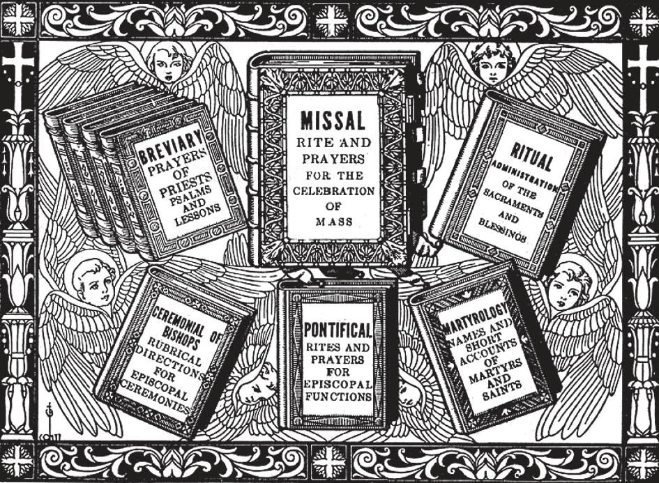

# 161. Poderes e Deveres dos Padres

*Rúbricas ou regras para a própria execução dos serviços da Igreja, para a exata conduta de qualquer função litúrgica. As rúbricas da Igreja estão contidas no Missal, Breviário, Ritual, Pontifical e Cerimonial. Em livros, rúbricas são impressas em vermelho, para clareza e distinção. Os principais livros litúrgicos do Rito Latino são seis: O Missal contém todas as orações e cerimônias usadas para a Missa, para cada dia do ano. O Breviário é o livro de oração dos padres, contendo o Ofício Divino sem canto. O Ritual contém todos os serviços necessários a um padre que não estão no Missal ou Breviário, como a administração dos sacramentos. O Pontifical e Cerimonial são os livros dos Bispos. Contêm os ritos para funções episcopais como Missa Pontifical, Crisma, ordenações, consagração de altares, etc. O Martirológio é um calendário ampliado dando nomes e curtas descrições das vidas dos principais santos comemorados em cada dia do ano, em diferentes partes do mundo católico.*

**Quais são os efeitos da ordenação ao sacerdócio?**

— Os efeitos são:

1. Um aumento da graça santificante.

> Um dos propósitos de Deus para chamar um homem ao sagrado ministério é tê-lo oferecendo o Santo Sacrifício da Missa. Isto é um ofício mui alto, para a realização do qual Deus certamente dá graça e mais graça.

2. Graça sacramental, através da qual o padre tem a ajuda de Deus em seu sagrado ministério.

> Os deveres dos ministros de Deus são inúmeros e difíceis; devem ter graça sacramental. Deus Que sabe isto bem, certamente fornece cada graça necessária para o Sacramento da Ordem.

3. Um caráter, durando para sempre, que é uma participação no sacerdócio de Cristo e que dá ao padre poderes sobrenaturais.

> Uma vez que um homem é ordenado padre, é padre para sempre. O sacramento imprime uma marca indelével na alma; não pode portanto ser repetido.

**Quais são os principais poderes sobrenaturais do padre?**

— Os principais poderes sobrenaturais do padre são: mudar pão e vinho no Corpo e Sangue de Cristo no Santo Sacrifício da Missa e perdoar pecados no sacramento da Penitência.

1. A um padre é dado o poder de celebrar Missa e administrar os sacramentos exceto Ordem e Crisma. Um Bispo pode administrar todos os sacramentos: tem a "plenitude de poder", sendo feito sucessor dos Apóstolos.

> Os padres que apostatam ou são suspensos ou excomungados ainda permanecem padres. Retêm o poder, embora não a autoridade, do sacerdócio. Por exemplo, têm o poder de dizer uma verdadeira Missa, embora pecassem gravemente se assim o fizessem. Contudo, não podem perdoar pecado, exceto no caso dos moribundos; absolvição é um poder judicial e precisa de jurisdição.

2. Os cismáticos padres Gregos receberam suas ordens de bispos validamente ordenados. Portanto, mesmo que não estejam unidos à Igreja Católica, têm o poder de dizer Missa.

> Quando estes padres cismáticos retornam à unidade da Igreja, não são reordenados.

3. Exceto pelas igrejas cismáticas, nenhuma denominação não católica tem tido bispos validamente ordenados; nenhuma tem verdadeiros padres.

> Várias destas denominações não católicas chamam alguns de seus ministros "bispos"; mas são-no apenas em nome, pois não foram validamente ordenados. E assim com seus outros ministros; não são padres, já que não receberam ordens válidas.

**Quais são as duas classes de padres?**

— São: padres seculares e padres religiosos.

1. Padres seculares (ou diocesanos) são aqueles que pertencem a uma diocese. Estão obrigados a obedecer ao bispo e não podem mudar de uma diocese para outra sem o consentimento dos bispos de ambas as dioceses.

> Padres seculares estão geralmente encarregados das paróquias; isto é, atuam como padres paroquiais ou pastores (também chamados reitores).

2. Padres religiosos (ou regulares) são aqueles que são membros de ordens religiosas ou congregações, como os Agostinianos, Beneditinos, Dominicanos, Franciscanos, Jesuítas, Redentoristas, Salesianos, etc. Religiosos estão obrigados pelos três votos evangélicos de pobreza, castidade e obediência. Votam obediência a seus superiores e vivem em comunidade com seus irmãos.

> Nem todos os membros de comunidades religiosas são padres. Muitos tomam os votos religiosos mas não recebem o Sacramento da Ordem: isto é, não são ordenados. Então os chamamos irmãos.

**Quais são os principais deveres de um padre?**

— Os principais deveres de um padre são: viver em celibato e recitar o Ofício Divino diariamente; outros deveres variam de acordo com a função empreendida ou posição mantida.

1. O voto sacerdotal de celibato é tomado quando um homem é recebido no subdiaconato. Padres católicos não se casam, em imitação do Próprio Cristo. Os Apóstolos, após serem chamados ao ministério, deixaram tudo que tinham. Elias, Eliseu, Jeremias e São João Batista viveram em celibato.

> Um padre é ordenado para o exclusivo serviço de Deus: seus talentos, seu tempo, sua própria vida pertencem ao Seu serviço. São Paulo diz: "Aquele que não é casado cuida das coisas do Senhor, de como agradar a Deus. Enquanto, aquele que é casado cuida das coisas do mundo, de como agradar à sua esposa; e está dividido" (1 Cor. 7: 32-33).

2. Um padre deve ler o Ofício Divino, uma série de orações, no Breviário; para isto aproximadamente uma hora é necessária cada dia.

> O Ofício está em ordem prescrita e fixa, incluindo salmos, cânticos, escritos dos profetas do Antigo Testamento e de Apóstolos e Padres da Igreja, passagens dos Evangelhos, hinos e orações especiais em honra da Santíssima Mãe e dos Santos. A leitura do Ofício Divino não tem apenas valor devocional como oração; tem também um valor prático, em refrescar a memória do padre no que diz respeito a muito do que aprendeu, mantendo-o mentalmente alerta, melhor qualificado para seus deveres.

3. Um pastor deve estar pronto para visitar os moribundos a qualquer hora do dia ou da noite, mesmo que o paciente esteja sofrendo de uma doença contagiosa. Deve instruir seu povo e guardá-lo de dano. Um pastor é o pastor de seu rebanho.

> Deve construir e manter uma igreja, um convento, uma escola. Deve ouvir confissões hora após hora enquanto houver necessidade. Deve administrar os sacramentos, dizer Missa, atender aos pobres, etc.

4. Religiosos ou regulares padres geralmente dedicam-se à oração e às obras espirituais e corporais de misericórdia. Estão encarregados de escolas, hospitais, orfanatos e outras instituições de caridade. Organizam missões e retiros e engajam-se em trabalho de imprensa e propaganda religiosa.

> Religiosos são usualmente empregados pelo Papa como missionários para converter os pagãos. Em muitos casos, também atuam como padres paroquiais.
