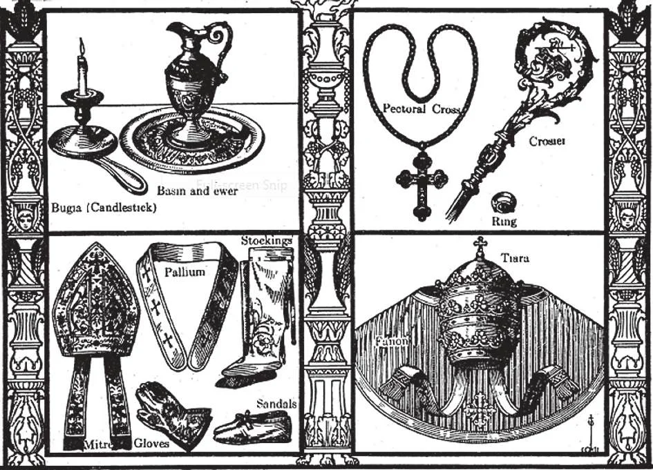

# 162. Dignidade do Sacerdócio

*Sacerdócio é a mais alta dignidade na terra. A dignidade de um padre supera a de imperadores, e mesmo de anjos. Nenhum anjo pode converter pão no Corpo de Cristo pelo mero poder de sua palavra; nem pode qualquer anjo perdoar pecado. O padre está entre Deus e o homem. É o representante de Deus, o embaixador de Deus. Portanto qualquer honra que prestamos ao padre, rendemos a Deus Mesmo. São Francisco de Assis disse que se encontrasse um anjo e um padre ao mesmo tempo, saudaria o padre primeiro.*

**Por que os católicos devem mostrar reverência e honra ao padre?**

— Católicos devem mostrar reverência e honra ao padre porque ele é o representante do Próprio Cristo e o dispensador de Seus mistérios.

1. A dignidade de um padre é mais alta que qualquer dignidade terrestre, pois ele é o representante de Deus. Tem poder que os mais poderosos governantes civis não possuem. O mais humilde padre por sua palavra pode invocar Deus sobre o altar e converter pão e vinho no Corpo e Sangue de Cristo. Pode dizer ao pecador, "Eu te absolvo" e a alma do pecador é salva do inferno. Que dignidade terrestre pode comparar-se com isto? Nem mesmo a Santíssima Virgem possuiu o poder de perdoar pecados, de conceder absolvição que apaga a própria culpa do pecado.

> Mesmo o conquistador pagão, Alexandre o Grande, respeitou os ministros de Deus, reconhecendo sua dignidade como Seus representantes. Numa de suas expedições militares veio a Jerusalém. O povo estava em estado de grande temor, e ofereceu orações para obter proteção divina. O sumo sacerdote com o resto do clero, vestidos em seus paramentos cerimoniais, finalmente foi encontrar o rei, para implorar misericórdia. Quando Alexandre viu o sumo sacerdote, inclinou-se profundamente diante dele, enquanto todos presentes ficaram cheios de surpresa. Ao ser depois perguntado por um de seus generais por que tinha se humilhado tanto diante de um que tinha conquistado, o rei respondeu, "Não prestei reverência ao homem, mas a Deus, de Quem ele é padre."

2. Devemos ao padre reverência devida à sua dignidade como representante de Cristo. Mesmo se a vida de um padre não corresponde aos requisitos de seu ofício, devemos dar respeito; isto oferecemos ao seu ofício.

> O padre é "alter Christus" — outro Cristo, Nosso Senhor o chama "uma cidade construída sobre uma colina", o "sal da terra". Está no mundo, mas não é dele. São Francisco de Sales disse dos padres: "Fecharei meus olhos a suas faltas e apenas verei neles os representantes de Deus."

*A bugia é o castiçal que um bispo usa na Missa. Usa uma bacia e jarro especiais para lavar suas mãos no altar. Usa uma cruz peitoral e usa o báculo em ocasiões solenes como quando administra a Crisma. Seu anel, uma pedra de ametista, é beijado pelos fiéis em sinal de respeito. Usa a mitra das Missas Pontificais, assim como luvas, meias de seda e sandálias para combinar com seus paramentos. O pálio é enviado pelo Papa a um arcebispo após ter tomado posse de sua sé metropolitana. É usado sobre os ombros. O fanon é uma capa de ombros que somente o Papa pode usar. Tem uma cruz de ouro bordada na frente e é usada quando o Santo Padre diz solene Missa Alta. É o único que tem direito de usar a tiara, uma tripla coroa sobrepujada por uma cruz.*

3. Quando encontramos um padre, devemos saudá-lo: mulheres e moças devem curvar-se, e homens e rapazes devem levantar seus chapéus.

> Não devemos fofocar sobre o padre, mesmo se notarmos algo que não gostamos nele; caluniar um padre é sacrilégio. Aquele que põe mãos violentas sobre um padre é excomungado.

4. Em reconhecimento de sua dignidade e do respeito e sustento que lhe devemos, não devemos negligenciar ajudar nosso padre, com dinheiro ou outros meios, como ensinar catecismo, cuidar da limpeza e decoração da igreja, e ajudar com despesas. Um bom modo de ajudar o padre é juntar-se às organizações paroquiais que forma, como Ação Católica e unidades da Confraria da Doutrina Cristã, sodalícios, ligas, etc.

**Há necessidade de padres?**

— Há grande necessidade de padres em toda parte, pois o Cristianismo é impossível sem padres.

1. Muitos países têm apenas alguns padres. Apenas cerca de um terço da população mundial é cristã, principalmente porque não há padres suficientes.

> Há bons católicos que conhecem sua religião, mas não podem praticá-la propriamente e receber os sacramentos tão frequentemente quanto gostariam, porque não há padre para administrar-lhes. Muitos são indiferentes ou juntaram-se a igrejas falsas; não tiveram instrução suficiente, por falta de padres.

2. Precisamos de padres para irem como missionários a terras não cristãs. Devemos mostrar nossa gratidão pela graça da fé ajudando a espalhá-la entre pessoas menos afortunadas.
