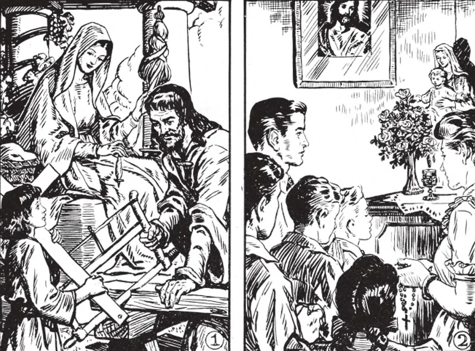

# 164. Deveres da Vida Matrimonial

*1. Toda família católica deve ter a Sagrada Família de Nazaré, Jesus, Maria e José, como seu modelo e viver em santidade e amor mútuo.*

*2. Toda família deve preservar o costume de ter orações em família em alguma hora da manhã ou tarde, orando como um, numa unidade de culto.*

**Qual é o principal dever de marido e mulher no estado matrimonial?**

— O principal dever de marido e mulher no estado matrimonial é ser fiel um ao outro e prover de todo modo para o bem-estar dos filhos que Deus possa dar-lhes.

1. Marido e mulher devem confortar e apoiar-se um ao outro nas atividades de sua vida comum, no cumprimento de seus deveres individuais assim como mútuos, em todos os assuntos importantes, tanto espirituais quanto materiais. "Agora já não são dois, mas uma só carne" (Mat. 19:6).

> A esposa precisa do marido para apoiar-se; o marido precisa de sua mulher para confortar e cuidar dele. O homem é o provedor e a cabeça; a mulher é a rainha e mãe. No verdadeiro casamento cristão não há questão de egoísmo, competição ou superioridade entre os esposos, pois eles dois são "uma só carne".

2. Marido e mulher devem ser fiéis a seus votos matrimoniais; devem fidelidade um ao outro. Devem muito cuidadosamente evitar mesmo a aparência de infidelidade, pois onde ciúme é despertado, a felicidade conjugal termina. Devem suportar as faltas e enfermidades um do outro e não arruinar sua vida doméstica por dissensões.

> A mulher influenciará seu marido para o bem mais efetivamente por silêncio, mansidão e oração do que por resmungar e escandaloso ralhar. O marido deve lembrar que sua mulher também precisa de companhia; não deve estar longe por muito tempo.

3. Os esposos devem sempre viver juntos e ter uma real vida de família cristã. Devem contudo lembrar que todas as relações matrimoniais devem estar de acordo com a lei divina e natural na "fidelidade da castidade".

> Sua afeição não deve ser puramente humana, mas santa e sobrenatural, de acordo com o propósito de seu estado, que foi instituído por Deus. "Pois somos filhos de santos: e não devemos ser unidos juntos como pagãos que não conhecem a Deus" (Tob. 8:5).

4. Por seu tipo e modelos o casamento tem a União Mística entre Cristo e Sua Igreja. O marido deve amar sua mulher como Cristo ama a Igreja, com um amor santo e sobrenatural, como a si mesmo. A mulher deve amar e obedecer seu marido como a cabeça da família.

> "Maridos, amai vossas mulheres, assim como Cristo também amou a Igreja" (Ef. 5:25). "Mulheres, sujeitai-vos a vossos maridos, como convém no Senhor" (Col. 3:19). Ao explicar o significado desta última passagem, Pio XI em sua Encíclica sobre o casamento cristão diz: "Esta sujeição não tira a liberdade que pertence plenamente à mulher tanto em vista de sua dignidade como pessoa humana quanto em vista de seu mui nobre ofício de esposa e mãe e companheira; nem lhe manda obedecer a cada pedido do marido, mesmo se não em harmonia com a reta razão ou a dignidade devida a ela como esposa... Mas proíbe aquela liberdade exagerada que não cuida do bem da família; proíbe que neste corpo que é a família, o coração seja separado da cabeça, para grande detrimento de todo o corpo e perigo próximo de ruína. Pois se o homem é a cabeça, a mulher é o coração e como ele ocupa o principal lugar em governar, ela deve reclamar para si o principal lugar no amor."

**Quais são os deveres dos casados como pais?**

— É grave obrigação dos pais prover por seus filhos e educá-los no amor e temor de Deus. (Veja também páginas 208-209, "Deveres dos Pais")

1. O propósito primário do casamento é a geração e criação de filhos no temor e amor de Deus, para que possam juntar-se a Ele no céu algum dia.

> Já que o propósito primário do casamento é trazer filhos ao mundo, qualquer tentativa de frustrar este propósito enquanto fazendo uso de seus meios é intrinsecamente mau, contra a lei natural e divina e necessariamente um pecado grave. É por isto que tais procedimentos como controle de natalidade, aborto e esterilização são pecados mortais e violações do sacramento.

2. Alguns pais estão em grande esforço para acumular riqueza para legar a seus filhos mas não prestam atenção à sua criação. O melhor legado que podem deixar a seus filhos é o amor de Deus.

> A educação religiosa da criança depende principalmente da mãe. Uma mãe que gasta seu tempo fofocando com seus vizinhos, indo de uma função social a outra ou absorvendo-se em diversões inúteis para a negligência de seus filhos tem muito a responder diante de Deus. Quão felizes bons pais estarão quando forem diante do tribunal de Deus e forem capazes de dizer: "Aqueles que Me deste guardei" (João 17:12).

**O controle artificial de natalidade é imoral?**

— Controle artificial de natalidade é imoral, contrário tanto à lei natural quanto divina.

1. Controle artificial de natalidade contravém o propósito primário do casamento e prostitui-o para outros fins.

> A prática de controle de natalidade será, se levada à sua inevitável conclusão, algum dia, como um escritor sarcástico comenta, "entregar o país aos animais". Em muitos países a taxa de natalidade está agora no negativo. Nações desaparecerão.

2. Deus severamente pune mesmo nesta vida aqueles que praticam "controle de natalidade". Resulta em esterilidade, vício, fraqueza da vontade, etc., além de doenças físicas.

> Aquele que tenta circunvir a Deus não pode escapar ao castigo, tanto nesta vida quanto na próxima. O único modo lícito de prevenir o nascimento e limitar o número de filhos é não usar os direitos matrimoniais. Se numa formal e explícita estipulação antes do casamento, um homem diz a uma mulher (ou vice-versa): "Caso-me contigo, desde que não tenhamos filhos", este casamento não é válido. É contra a lei natural de Deus, confirmada e reforçada pela Igreja no Cânon 1013, que diz: "O fim primário do casamento é a procriação e educação da prole." Se este fim é deliberadamente excluído, não pode haver casamento.

**O aborto é mau?**

— Aborto direto é mau, um pecado grave, contrário à lei de Deus; aborto indireto pode ser permitido.

1. Aborto direto é cometido quando o feto é intencionalmente removido do ventre da mãe antes de ser capaz de levar uma vida separada, mesmo se isto fosse feito no período muito mais inicial da gravidez. Aborto direto é equivalente a assassinato; aqueles culpados dele ou que cooperam seja física ou moralmente incorrem em excomunhão.

> Aborto direto não pode ser permitido mesmo para salvar a vida de uma mãe. Se o feto ou o bebê é matado propositadamente porque por não fazê-lo a mãe poderia morrer, isto é aborto direto. Estima-se que em muitos países, uma gravidez em três termina em aborto.

2. Aborto indireto pode ocorrer quando, embora não pretendido, a morte do feto segue alguma operação ou outro tratamento realizado na mãe. Tais tratamentos e operações são permitidos apenas quando é certo que tanto mãe quanto criança de outro modo morreriam. Em tais casos, a criança deve receber Batismo.

> Para estar certo das circunstâncias, um médico católico consciencioso deve ser consultado.
