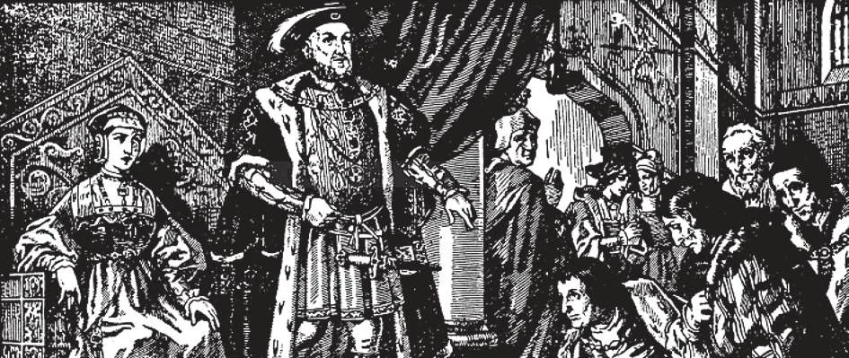

# 165. Divórcio

*Henrique VIII, rei da Inglaterra, pediu ao Papa que lhe concedesse um divórcio de sua legítima esposa, Catarina de Aragão, para que pudesse casar com Ana Bolena. O rei tinha prestado valiosos serviços à Igreja. Se o Papa recusasse, a Inglaterra seria certamente mergulhada na heresia. Mas o Papa Clemente VII manteve-se firme. Nem mesmo para salvar a Inglaterra para a Igreja podia quebrar a lei de Deus. A única resposta que deu foi: "Non possumus; não tenho autoridade para anular a lei divina." Como resultado, Henrique VIII abandonou sua obediência e, intento em seus maus desejos e cedendo a suas paixões, revoltou-se da Igreja. Este foi o início da Igreja Protestante da Inglaterra.*

**O que se entende pela unidade do sacramento do Matrimônio?**

— Pela unidade do sacramento do Matrimônio entende-se que o marido não pode durante a vida de sua mulher ter outra mulher, nem a mulher durante a vida de seu marido ter outro marido.

1. O casamento cristão é uma união entre apenas um homem e uma mulher. Deus criou apenas um homem e uma mulher no princípio; e assim então havia unidade no casamento.

> Sob a Lei Mosaica, o divórcio era em alguns casos permitido, para evitar males maiores, porque após a Queda a revelação primitiva tinha-se tornado obscura aos homens. Mas quando Cristo veio, retirou esta permissão absolutamente e restaurou o casamento à sua unidade original, dizendo: "Não lestes que o Criador, desde o princípio, os fez macho e fêmea e disse: por esta causa o homem deixará pai e mãe e se unirá à sua mulher e os dois serão uma só carne? Portanto agora já não são dois, mas uma só carne. O que portanto Deus uniu, o homem não separe... Moisés, por causa da dureza de vosso coração, permitiu-vos repudiar vossas mulheres; mas não foi assim desde o princípio" (Mat. 19: 4-8).

2. O casamento cristão é um estado sagrado e holy agradável a Deus. São Paulo o compara à união mística entre Cristo e Sua Igreja. Como Cristo é um e a Igreja é uma, assim o casamento é entre um homem e uma mulher. Como Cristo e a Igreja estão inseparavelmente unidos, assim o casamento é indissolúvel. Faz as partes contratantes "dois numa só carne".

> São Paulo disse: "Isto é um grande mistério — digo em referência a Cristo e à Igreja" (Ef. 5: 32). Cristo é a cabeça da Igreja; assim é o homem a cabeça da mulher. A Igreja está sujeita a Cristo; assim deve a mulher ser obediente a seu marido. Cristo nunca abandona a Igreja e a Igreja é sempre fiel a Cristo; assim um homem e sua mulher devem ser fiéis um ao outro.

3. O importante objeto do casamento é prover para a devida criação de filhos. Isto não poderia ser atingido se o divórcio fosse permitido.

> O que seria das crianças se os pais fossem livres para separar-se a seu lazer? Registros de cortes mostram que muitos jovens criminosos vêm dos lares quebrados de pais divorciados. Divórcio destrói a família e algum dia, se não detido, destruirá o Estado.

4. Se o caráter indissolúvel do Matrimônio é bem entendido, mesmo se, como pode frequentemente acontecer, marido e mulher discordarem, sua tendência seria reconciliar-se, não correr à corte de divórcio.

> A preservação do caráter sagrado do casamento é vital à sociedade; ceda ao divórcio e destruição de toda vida social virá. Divórcio é uma brecha na parede da civilização, uma força destrutiva na moralidade. Hoje dois em cinco casamentos terminam em divórcio. Começando com causas de adultério, agora em muitos lugares divórcio pode ser obtido em quase qualquer fundamento; tornou-se apenas uma desculpa para mudar de parceiros. É isto Matrimônio?

**O que é divórcio?**

— Divórcio é uma separação legal de pessoas casadas; como geralmente entendido hoje, é um completo rompimento do vínculo matrimonial dando às partes o direito de casar com outras pessoas.

1. Nosso Senhor elevou o casamento do natural ao nível sobrenatural, fazendo dele um santo sacramento. E este consumado casamento sacramental nunca pode ser dissolvido, exceto pela morte de uma das partes; nunca pode haver tal coisa aprovada pela Igreja como divórcio.

> O casamento de pessoas não batizadas não é sacramental, embora possa ser válido. O casamento válido de duas pessoas batizadas é sempre sacramental, sejam elas católicas ou não católicas. Por esta razão o casamento válido de dois não católicos batizados realizado de modo autorizado é sempre um sacramento. Isto é facilmente entendido quando lembramos que nem pastor nem oficial é o ministro do sacramento do Matrimônio; não conferem realmente o sacramento. As partes contratantes são elas mesmas os ministros e conferem o sacramento uma à outra.

2. Cristo definitiva e estritamente proibiu o cortar, o romper do vínculo matrimonial. Ninguém pode interpretar mal Seu significado: "Todo aquele que repudia sua mulher e casa com outra comete adultério; e aquele que casa com uma mulher que foi repudiada de seu marido comete adultério" (Lucas 16: 18).

> "Por esta causa o homem deixará pai e mãe e se unirá à sua mulher e os dois serão uma só carne. Portanto agora já não são dois, mas uma só carne. O que portanto Deus uniu, o homem não separe" (Marcos 10: 7-9).

3. O vínculo do sacramento do matrimônio dura até a morte do marido ou mulher. Casamento cristão é indissolúvel, exceto pela morte. Divórcio, isto é, o rompimento do vínculo matrimonial, com o direito de recasar, nunca é permitido. Pela lei de Deus, o vínculo unindo marido e mulher só pode ser dissolvido pela morte.

> "E disse-lhes:... Qualquer que repudiar sua mulher e casar com outra comete adultério contra ela; e se a mulher repudiar seu marido e casar com outro, comete adultério" (Marcos 10: 11-12). "Qualquer que repudiar sua mulher, salvo por causa de fornicação, faz que ela cometa adultério; e aquele que casar com a repudiada comete adultério" (Mat. 5: 32).

4. Nenhum poder na terra pode quebrar um casamento cristão. A indissolubilidade do casamento não é uma lei ordenada pela Igreja, mas por Deus. A Igreja não pode e não irá mexer com as leis de Deus. Como São Paulo disse:

> "Aos casados, não eu, mas o Senhor, ordena que a mulher não se aparte do marido e, se se apartar, que fique sem casar ou se reconcilie com o marido. E que o marido não repudie a mulher" (1 Cor. 7: 10-11).

5. Nem mesmo para evitar as mais sérias calamidades pode a Igreja sancionar divórcio.

> Quando Nicolau I era Papa, o Rei de Lorena, Lotário II, fez o Imperador Luís enviar um exército a Roma para assustar o Papa Nicolau a dar-lhe um divórcio de sua mulher. Mas o Papa não concedeu o divórcio. Napoleão o Grande apelou ao Papa Pio VII para anular o casamento que seu irmão Jerônimo tinha contraído com a Srta. Patterson de Baltimore. O Papa enviou a seguinte resposta após minuciosa investigação: "Vossa Majestade entenderá que sobre a informação até agora recebida por Nós, não está em Nosso poder pronunciar uma sentença de nulidade. Não podemos proferir um juízo em oposição às regras da Igreja e Não poderíamos, sem depor aquelas regras, decretar a invalidade de uma união que, segundo a Palavra de Deus, nenhum poder humano pode separar."

6. Um casamento não consumado entre duas pessoas batizadas ou entre uma batizada e outra não batizada é dissolvido seja pela profissão religiosa solene de qualquer parte ou por dispensa papal por causa muito grave.

> Em contraste com a atitude dos Papas sobre divórcio foi a ação tomada pelos "reformadores" Protestantes, Lutero, Melanchthon, etc., quando Filipe, Landgrave de Hesse, desejava ter duas esposas ao mesmo tempo. Por dezesseis anos Filipe tinha sido casado com Christiana, filha do Duque da Saxônia e o casal tinha sido abençoado com vários filhos. Logo após a explosão Protestante, Filipe tornou-se atraído por Margaret Saal, uma dama de honra em sua casa. Não aplicou, contudo, por um divórcio dos líderes Protestantes mas desejou que sancionassem outro casamento, para que pudesse ter duas esposas, Christiana e Margaret, ao mesmo tempo. Os "reformadores" Protestantes deram esta resposta a Filipe: "Se Vossa Alteza está resolvido casar com uma segunda esposa, julgamos que deve ser feito privadamente... Assim toda oposição e escândalo serão evitados. Ainda, não devemos estar ansiosos sobre o que o mundo dirá, desde que a consciência esteja em repouso. Assim aprovamos e Vossa Alteza tem, neste escrito, nossa aprovação."
