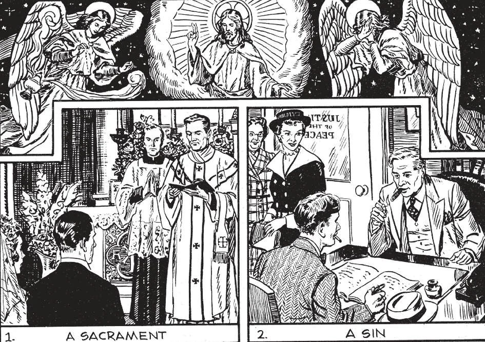

# 166. Leis da Igreja sobre o Casamento

*A ilustração (1) mostra um casal sendo casado diante de um padre, com duas testemunhas. Este é o único verdadeiro casamento para católicos; é um sacramento; (2) mostra um casamento mau; para católicos não é um sacramento, mas um mero contrato diante de autoridades civis. Se uma ou ambas das partes são católicas, um casamento contraído apenas de acordo com as leis civis é inválido, nulo e sem efeito. O Estado não pode fazer católicos marido e mulher; pode apenas registrá-los como tais.*

**Por que somente a Igreja Católica tem o direito de fazer leis regulando os casamentos de pessoas batizadas?**

— Somente a Igreja Católica tem o direito de fazer leis regulando os casamentos de pessoas batizadas porque somente a Igreja tem autoridade sobre os sacramentos e sobre matérias sagradas afetando pessoas batizadas.

1. Somente a Igreja tem autoridade sobre matérias sagradas. A Igreja é a guardiã, a custodiante dos sacramentos, os meios de graça para os homens. Por esta conta, a Igreja deve salvaguardar estes sacramentos.

> Deus atribuiu aos governos seculares o dever de administrar coisas materiais; mas à Sua Igreja deu poder e autoridade sobre matérias espirituais. "Dai portanto a César o que é de César e a Deus o que é de Deus."

2. O casamento não é apenas um sacramento, mas também um contrato. A Igreja, portanto, pode interferir com este contrato, estabelecendo leis; assim como o governo civil regula certos contratos civis como vinculantes ou nulos.

**Que autoridade tem o Estado concernente aos casamentos de pessoas batizadas?**

— Concernente aos casamentos de pessoas batizadas, o Estado tem a autoridade de fazer leis concernentes a seus efeitos que são meramente civis.

1. O Estado pode fazer leis sobre os aspectos do casamento que são puramente materiais, como leis concernentes ao arquivamento do contrato matrimonial, leis sobre propriedade conjugal, leis sobre isenções de imposto de renda segundo o número de filhos que um casal casado tem.

> "O que portanto Deus uniu, o homem não separe" (Mat. 19: 6). Por estas palavras Cristo Nosso Senhor restaurou o casamento à sua unidade e indissolubilidade originais; de modo que não há poder na terra que possa dissolver um casamento que tenha sido validamente contraído e consumado. Os divórcios civis concedidos pelo Estado a cristãos, dando-lhes direito de recasar não podem ser reconhecidos pela Igreja. O Estado não tem direito de legislar em contradição à lei divina.

2. Católicos devem, contudo, obedecer às leis do Estado sobre casamento desde que não contradigam leis de Deus ou da Igreja.

> Mas se algumas leis não estão exatamente de acordo com princípios católicos, católicos devem trabalhar para ter melhores leis, adequadas ao pleno exercício de suas obrigações religiosas.

**Qual é a lei ordinária da Igreja a ser observada no casamento de um católico?**

— A lei ordinária da Igreja a ser observada no casamento de um católico é esta: Um católico pode contrair um verdadeiro casamento apenas na presença de um padre autorizado e duas testemunhas.

1. As leis da Igreja requerem que um católico seja casado na presença do padre paroquial ou do bispo da diocese ou de um padre delegado por qualquer deles e diante de duas testemunhas. Católicos estão absolutamente proibidos de contrair casamento exceto diante de um padre da Igreja e duas testemunhas.

> Há apenas uma exceção a esta lei. Se o pastor ou o bispo ou o padre delegado por qualquer deles não pode ser obtido sem grande inconveniente:

(a) Em perigo de morte, o casamento pode ser contraído válida e licitamente diante de duas testemunhas; mesmo se não há perigo de morte o mesmo pode ser feito, desde que se preveja que a condição acima durará por um mês. Assim o casal está verdadeiramente casado e recebe o Sacramento do Matrimônio.

> A ação deve ser escrita, assinada e o documento dado ao bispo ou pastor quando vier. Nenhum católico deve dar este passo incomum exceto por uma extraordinariamente grave razão.

(b) Se qualquer outro padre está disponível, mesmo se não é o pastor ou o coadjutor, deve ser chamado para assistir ao casamento; mas o casamento é válido mesmo se contraído apenas diante das duas testemunhas. — (Cânon 1098).

2. Nenhum católico pode ser casado fora da Igreja. Católicos que passam pela forma de casamento diante de um juiz de paz não estão casados.

> Apenas fizeram um contrato civil. Portanto, se vivem juntos como marido e mulher, pecam contra o Sexto e Nono Mandamentos. Seu contrato legal pode salvá-los da cadeia, mas não os salvará do inferno. Se têm filhos, estes são registrados como ilegítimos nos registros batismais.

3. Se católicos tentam casar diante de um ministro não católico, não apenas cometem pecado mas são excomungados da Igreja. Não estão casados.

> São excluídos dos sacramentos, não podem ser padrinhos para batismo e crisma e não podem receber sepultamento cristão. Sua excomunhão dura até que vão à confissão, recebam absolvição do bispo e se casem diante de um padre católico, se devem viver como esposos.

4. Um padre em sua própria diocese pode realizar a cerimônia de casamento fora de sua própria paróquia apenas com a permissão do padre paroquial ou bispo do lugar.

> Um padre em sua própria paróquia ou um bispo em sua própria diocese pode casar pessoas não residentes ali, com a permissão de seu pastor ou bispo. Um católico que habitou dentro dos limites de uma certa paróquia por um mês é considerado como pertencendo a ela; também se tem um real lugar de residência nela, com a intenção de permanecer.

**Quando a Igreja declara uma separação de um casal validamente casado?**

— A Igreja declara uma separação de um casal validamente casado por causa muito grave, como adultério, heresia, ameaças à vida de qualquer um, etc.

1. A separação declarada pela Igreja não corta o vínculo matrimonial válido; nenhuma das partes pode casar novamente até a morte da outra. Se a causa cessar, devem viver juntos novamente.

> A parte ofendida deve obter a sanção do bispo antes da separação. A necessidade de separação raramente surgirá quando ambos marido e mulher são bons católicos práticos que seriamente consideraram as responsabilidades do matrimônio antes de embarcar nele e que o fizeram com oração e as bênçãos da Igreja. Quem tem confiado em Deus e O encontrou surdo à súplica?

2. O único "divórcio" permitido na Igreja Católica é uma separação, sem direito de casar com qualquer outra pessoa.

> Não que a Igreja force um casal que não pode concordar em paz a continuar vivendo junto. Tanto quanto a separação inclui direitos de propriedade, católicos são requeridos obter permissão eclesiástica para iniciar processos para um divórcio civil. Uma vez que o divórcio é concedido, se o casamento tinha sido um vínculo sacramental consumado, o contrato permanece de todo outro modo; e nenhuma das partes pode entrar em casamento com outra pessoa.
