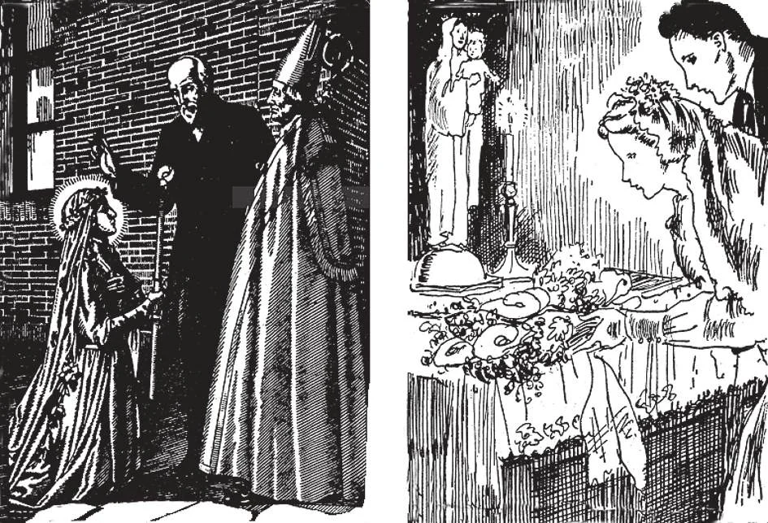

# 169. Namoro e Noivado

*É um pecado para pais desencorajar, opor-se ou impedir o legítimo desejo de seu filho de escolher um estado de vida para si mesmo. A primeira imagem mostra o pai de Santa Teresinha do Menino Jesus, dando-lhe sua bênção antes que ela entrasse no Carmelo. Pais cujos filhos têm uma vocação religiosa devem imitar este bom pai. E aqueles cujos filhos escolhem entrar no estado matrimonial devem abençoá-los igualmente, como Nossa Santíssima Mãe certamente deve estar abençoando o par de recém-casados acima, que oferecem o buquê nupcial a seus pés. Seu período preparatório de namoro foi governado por prudência.*

**Qual é o propósito do namoro?**

— Namoro é um tempo de preparação para o casamento, o tempo de escolher um parceiro de vida; requer prudência e sabedoria.

1. É apenas quando pessoas jovens atingiram a idade própria e estão situadas de modo a poder suportar as responsabilidades do estado matrimonial que o namoro deve engajar sua atenção. Então o jovem e a moça podem frequentar a companhia um do outro a fim de descobrir se fariam companheiros adequados para a vida.

> Rapazes e moças ainda na escola devem dedicar seu tempo a seus estudos e tais coisas apropriadas a sua idade, como jogos e inocentes divertimentos. É totalmente fora de lugar para jovens negligenciar seus estudos a fim de desperdiçar seu tempo em assuntos de menino-e-menina que na melhor hipótese terminam em nada.

2. É perfeitamente apropriado para um jovem pagar suas atenções a várias moças ao mesmo tempo e para uma moça receber tais atenções de vários jovens ao mesmo tempo. Isto é precisamente porque namoro é o tempo de escolher, para descobrir quem fará o parceiro mais adequado para a vida.

> Namoro deve ser conduzido sem segredo; moças devem cuidar de homens que mantêm seus "casos de amor" em segredo.

3. A duração do período de namoro deve ser entre seis meses e dois anos, não mais longo. Casamento é uma séria e sagrada responsabilidade e não deve ser apressado sob a influência de uma atração física ou paixão. Mas namoro, quando os parceiros prospectivos estão tão frequentemente na companhia um do outro, não deve ser grandemente prolongado, para evitar possíveis sérias consequências.

> "Casai-vos às pressas, arrependei-vos a lazer", diz um sábio adágio. Casamentos fugitivos são geralmente escandalosos mesmo pecaminosos: de qualquer modo são fortes tentações ao pecado. E assim o são namoros prolongados.

**O que deve guiar a escolha durante o namoro?**

— Deve-se certificar de que a pessoa que ele ou ela deseja casar é um católico praticante e possui o caráter para fazer um bom companheiro e ajudante na vida.

1. A pessoa escolhida deve ter as qualificações mentais e espirituais necessárias para a parceria permanente, as disposições para harmonizar com os parceiros prospectivos.

> Se jovens lembrarem que casamento é para a vida, exercerão maior prudência no namoro. Com aquela prudência, pela graça de Deus, um homem pode certamente encontrar uma parceira da qual pode ser dito: "Ela é uma ajuda semelhante a si mesmo e um pilar de descanso" (Eclo. 36:26).

2. Pode-se melhor julgar o caráter e virtudes de um futuro esposo na igreja e em casa que no piso de salões de baile. O conselho, "Escolhei vosso parceiro no coroamento da comunhão" é muito sadio.

> Uma realizada moça estava noiva para casar com um proeminente jovem. No dia antes do casamento, uma festa foi dada na casa da moça. A conversa voltou-se para religião; o jovem falou com aberto desprezo de todas as crenças, vangloriando-se de ser uma pessoa de "mente aberta" do século 20 e livre de todas "noções medievais" e cerimoniais "inventados por padres".

> A moça, chocada além da medida, gentilmente protestou, rogando-lhe não falar de tal modo. Mas ele riu dela, dizendo que significava cada palavra que disse e mais e que ela logo o bastante desaprenderia seu "absurdo religioso".

> A moça então disse, "Não posso casar com um homem que não respeita Deus e religião, pois certamente não respeitará sua mulher." Assim o noivado foi quebrado e uma digna moça liberta de uma vida que teria sido uma agonia e um perigo para ela.

3. É errado e tolo casar por beleza, riquezas ou honras apenas. Devemos antes buscar e principalmente buscar a qualidade da alma da pessoa.

> Afinal, beleza, riquezas e honras passam rapidamente. Podem mesmo ser perdidas no dia do casamento. Mas uma boa alma é bela à vista de Deus e vive para sempre.

**O que é noivado ou esponsais?**

— Noivado ou esponsais é uma mútua promessa de casamento, implicando casamento numa data próxima.

> Um noivado não deve durar mais que alguns meses. Assim que a promessa de casar é feita, uma data definida para o casamento deve ser marcada.

1. É dever dos jovens consultar seus pais sobre seu casamento. Em casos onde pais são extraordinariamente irracionais, jovens devem consultar seu confessor sobre o assunto.

> Geralmente, os pais estão certos sobre as boas ou más perspectivas de um casamento proposto.

2. O noivado pode ser formalmente entrado por um contrato por escrito assinado por ambas as partes, com o padre paroquial ou Bispo ou dois outros como testemunhas. Tal formal noivado tem a força de um contrato civil.

> Embora tais formalidades de esponsais sejam raras em nossos dias e não há estrita necessidade para elas, devem ser encorajadas, especialmente em casos onde apressadas alianças são temidas.

3. Durante tanto o namoro quanto o noivado, o casal deve respeitar-se e evitar indevidas familiaridades; isto é uma penhora de uma casta e feliz vida matrimonial. O melhor preservativo da virtude é Deus Mesmo; e assim aqueles preparando-se para casamento devem frequentar os sacramentos da Penitência e Santa Eucaristia.

> Tudo entre um casal noivo deve ser às claras. Devem revelar um ao outro francamente tudo pertencente a sua situação financeira, relações sociais e matérias relacionadas à saúde. Deste modo, previnem futuras querelas e miséria.

4. Durante o intervalo entre o noivado e o casamento, o casal deve cuidadosamente considerar o passo que estão prestes a dar e fazer boa preparação para sua vida conjugal, por frequentemente implorar a bênção de Deus.

> Como o noivado não deve ser apressadamente entrado, assim não deve ser precipitadamente quebrado. Ainda, se após algum tempo qualquer parte torna-se seriamente convencida de que o casamento seria um erro, o noivado deve ser rompido. Respeito humano ou outras considerações não devem ser permitidos comprometer futura felicidade.
