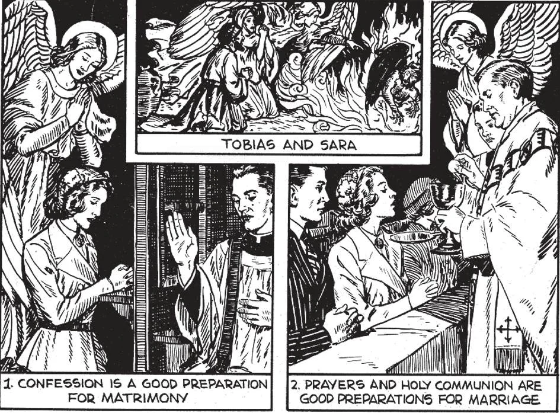
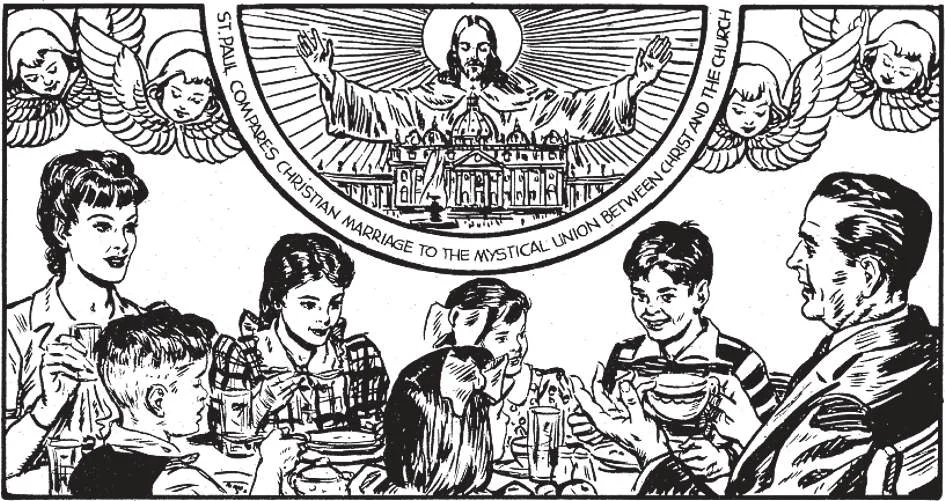

# 170. Preparação para o Casamento

*Aqueles que entram no matrimônio devem imitar as boas disposições de Tobias e Sara (3), que começaram sua vida matrimonial com oração e viveram cada dia na presença de Deus. Antes de receber o sacramento do matrimônio, o casal deve fazer uma muito boa confissão (1), para estar no estado de graça. Na Missa Nupcial, devem receber Nosso Senhor (2), para que Ele possa honrar seu casamento com Sua Divina Presença.*

**O que deve fazer um casal que decidiu casar-se?**

— Um casal que decidiu casar-se deve separadamente aparecer, com certidão de batismo, diante do padre paroquial da noiva, para o exame canônico.

1. Isto deve ser feito cerca de um mês antes do casamento projetado, para permitir tempo para a publicação das proclamações. Com a mão sobre os Evangelhos, a parte contratante jura que a verdade está sendo dita; então responde às perguntas feitas pelo pastor.

> As principais perguntas concernem disposições para a recepção do sacramento: o Batismo, Primeira Comunhão e Crisma da parte contratante, e impedimentos. Se houver quaisquer impedimentos, uma dispensa, se possível, deve ser arranjada. Se houver impedimento dirimente ao qual não pode ser dada uma dispensa, o casamento não pode ocorrer.

2. O exame canônico certifica-se de que as partes contratantes sabem o que estão fazendo e o fazem de sua própria livre vontade. Deste modo, a Igreja mostra sua solicitude por seus membros; cada possível precaução é tomada para que todos possam entrar no estado do matrimônio plenamente preparados e salvaguardados.

> Após o exame canônico, a licença de casamento deve ser obtida e outros requisitos do Estado cumpridos, como exames de sangue, etc.

**Quais são as "proclamações de matrimônio"?**

— As proclamações de matrimônio são uma pública proclamação de um casamento pretendido, feita na Missa principal em três Domingos sucessivos ou dias de festa, na igreja ou igrejas às quais a noiva e o noivo pertencem.

1. O propósito das proclamações é descobrir impedimentos, evitar casamentos secretos, e fornecer àqueles interessados uma oportunidade de intervir, se desejarem fazê-lo.

> Nisto, a Mãe Igreja mostra sua solicitude por seus filhos, evitando casamentos apressados, fazendo seu melhor para assegurar uma santa e válida união. Dispensa das proclamações é concedida por urgentes razões.

2. Se qualquer parte viveu, após atingir a idade matrimonial canônica, por seis ou mais meses fora da comunidade na qual o casamento deve ser celebrado, o bispo pode também requerer a publicação das proclamações no outro lugar ou lugares.

> Por permissão do ordinário, as proclamações, em vez de serem lidas, podem ser afixadas na porta da igreja.

3. Se alguém sabe de qualquer impedimento a um casamento proposto, está obrigado em consciência a torná-lo conhecido ao pastor ou outro clero concernente; do contrário é culpado de pecado.

> Ordinariamente, a cerimônia de casamento não é realizada até três dias após a última publicação das proclamações.

*O casamento cristão é uma santa união, abençoada por Deus, entre um homem e uma mulher. É uma indissolúvel e pura relação, como a união entre Cristo e Sua Igreja. Como o padre diz ao homem ao final do ritual matrimonial Toledano, "Dou-vos uma companheira, não uma serva; amai-a como Cristo ama Sua Igreja." A união é para a vida, para melhor ou pior.*

**O que a cerimônia de casamento inclui?**

— Em sua plenitude, a cerimônia de casamento inclui: o contrato nupcial, a Missa nupcial, e a bênção nupcial.

1. Matrimônio é tanto um sacramento quanto um contrato. Em todos os outros sacramentos, o ministro ordinário é do clero; no Matrimônio, porque é um contrato, os ministros são as partes concernentes, a noiva e o noivo.

> Quando o homem e a mulher primeiro oferecem-se um ao outro para casamento, a primeira condição de um contrato é cumprida. Quando a oferta é aceita, a segunda condição é cumprida. E na cerimônia do Matrimônio, quando o homem e a mulher dão livre e mútuo consentimento, o contrato é selado. O contrato é consumado quando os direitos mutuamente trocados são primeiro exercidos.

2. As palavras na cerimônia de casamento pelas quais o homem e a mulher expressam mútuo consentimento de tomar-se um ao outro como marido e mulher constituem a parte essencial do sacramento; selam o contrato matrimonial.

> O padre está presente apenas como o representante da Igreja, uma necessária testemunha para a salvaguarda do contrato matrimonial e para implorar a bênção de Deus sobre o par. É realmente apenas a mais importante das testemunhas, o intermediário da Mãe Igreja.
