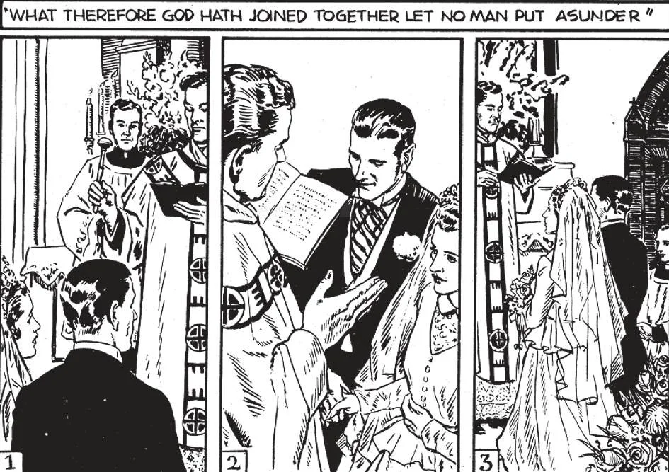

# 171. A Cerimônia de Casamento

*O ato principal do sacramento do matrimônio é a expressão de mútuo consentimento. Após este ato o casal une as mãos e o padre os abençoa com água benta. (1) As partes contratantes ouvem a Missa Nupcial, recebendo a Santa Comunhão. Por este ato de unir-se com Jesus na Santa Eucaristia, convidam-No a seu casamento, para abençoá-los, como o casal em Caná fez outrora. Durante a Missa a Bênção Nupcial (3) é dada. "Possa seu consórcio ser para ela um jugo de amor."*

**Quais são as cerimônias do contrato nupcial?**

— As cerimônias do contrato nupcial não são idênticas em toda a Igreja; aqui descrevemos aquelas usadas neste país, de acordo com o Ritual Romano.

1. A prática geral é ter a cerimônia realizada ao pé do altar, imediatamente antes da celebração da Missa. O noivo fica à direita da noiva, com as testemunhas próximas, enfrentando o padre.

> Esta é a única ocasião em que leigos são permitidos permanecer no santuário; bancos são preparados para noivo e noiva, assim como para os padrinhos ou testemunhas, se a Missa deve ser dita.

2. O padre lê em voz alta as instruções sobre casamento. Então dirigindo-se ao homem por nome, o padre pergunta: "N, queres tomar N, aqui presente por tua legítima esposa, segundo o rito de nossa Santa Mãe a Igreja?" O noivo responde: "Quero."

> Voltando-se para a noiva, o padre pergunta: "N— queres tomar N— aqui presente por teu legítimo esposo, segundo o rito de nossa Santa Mãe a Igreja?" A noiva responde: "Quero." Este é o ato principal do Sacramento. Após isto, mesmo se o resto das cerimônias for interrompido, o casamento é válido, vinculante.

3. Ao mando do padre, o casal une suas mãos direitas. Então comprometem-se um ao outro formalmente, repetindo após o padre: "Eu, N.N, tomo-te, N.N, por minha legítima esposa (esposo), para ter e guardar, 'daqui em diante, para melhor, para pior, para mais rico, para mais pobre, na saúde e na doença, até que a morte nos separe."

> O padre, em Latim, pronuncia as palavras de sanção e bênção: "Eu vos junto em casamento, em nome do Pai e do Filho e do Espírito Santo. Amém." Ao falar, faz sobre o casal o sinal da cruz, então os asperge com água benta.

4. O padre então abençoa o anel, um símbolo de fidelidade, e o asperge com água benta. Dá-o ao noivo, que o põe no terceiro dedo da mão esquerda da noiva, enquanto diz: "Com este anel eu te desposo e empenho-te minha fé."

> O padre recita alguns versículos e o Pai-Nosso em Latim, o casal juntando-se nesta última oração em sua própria língua. Finalmente é dita uma oração pedindo a proteção de Deus sobre aqueles agora unidos nos santos laços do Matrimônio. Então, enquanto o casal e testemunhas permanecem no santuário, a Missa Nupcial é dita.

**O que é uma Missa Nupcial?**

— Uma Missa Nupcial é uma Missa que tem orações especiais para implorar a bênção de Deus sobre o casal casado.

1. É de fato muito lamentável que em nosso país comparativamente poucos casamentos são celebrados com a Missa Nupcial. Quantas bênçãos o casal perde, quando a Missa é omitida!

> O casamento à tarde e noite está tornando-se mais uma ocasião mundana da moda que uma cerimônia religiosa. Matrimônio, o grande Sacramento Cristão, está sendo transformado num contrato civil. Não é de admirar que um crescente número de casamentos termine em divórcio. Hoje mais importância parece ser dada às festividades seguindo a cerimônia de casamento que à própria cerimônia.

2. Católicos podem melhor obter a bênção de Deus sobre seu casamento sendo casados numa Missa Nupcial e recebendo a Santa Comunhão devotamente. A Igreja provê uma especial Missa para os casamentos de seus membros; esta Missa Nupcial tem orações especiais implorando a bênção de Deus para o casal casado. Pode ser dita em quase qualquer dia, fora das importantes festas.

> O estado matrimonial precisa de abundância de graças; não deveria cada meio disponível ser tomado para obter aquelas graças? A Igreja outorga graças ao par casado, não apenas através do Sacramento, mas também através da Missa Nupcial, a recepção da Santa Comunhão naquela Missa e a Bênção Nupcial durante a Missa.

3. A Missa Nupcial é cheia de belos excertos da Bíblia, expondo a santidade e dignidade da união que o homem e a mulher contraíram. Através, a bênção de Deus é invocada.

> O Evangelho da Missa é de São Mateus: "O que Deus uniu o homem não separe." A Comunhão é do Salmo 127: "Eis que assim será abençoado todo homem que teme o Senhor; e possas ver os filhos de teus filhos: paz sobre Israel."

4. A Igreja autoriza a cerimônia nupcial aparte da Missa Nupcial; mas urge a todos os católicos estar unidos em casamento com as graças daquela Missa, com sua bela liturgia.

> Isto é por que, exceto por grave razão, casamentos não devem ser celebrados durante o Advento e Quaresma; pois então a Missa Nupcial e bênção são proibidas. As "estações fechadas" ou "tempos proibidos" estendem-se do início do Advento até o Dia de Natal e da Quarta-Feira de Cinzas até o Domingo de Páscoa, inclusive. Mas a celebração, como distinguida da solenização (com plena liturgia), é sempre permitida. Se a Missa por alguma razão não pode ser dita no dia do casamento, deve ser dita no dia seguinte ou assim que possível.

**Quando é dada a Bênção Nupcial?**

— A Bênção Nupcial é dada durante o Cânon da Missa, após o Pater Noster; é dirigida mais à mulher que ao homem.

1. Com a Verdadeira Presença diante deles, o padre volta-se, enfrenta o casal e imparte a Bênção Nupcial. É de singular beleza, invocando a graça de Deus sobre a união e orando pela noiva.

> Apenas numa outra ocasião (quando o bispo abençoa os santos óleos na Missa da Quinta-Feira Santa) é o Cânon da Missa assim interrompido em sua parte mais solene. Isto é parte da oração pela noiva: "Possa seu consórcio ser para ela um jugo de amor e paz. Fiel e casta, possa casar em Cristo e ser uma imitadora de santas mulheres. Possa ser amável a seu marido, como Raquel; sábia, como Rebeca; longeva e fiel, como Sara... Possa ser frutífera em prole, aprovada e inocente... Por Cristo nosso Senhor. Amém."

2. A Bênção Nupcial pode ser recebida por uma mulher apenas uma vez. Assim se foi dada a ela num casamento prévio, não pode ser dada a ela novamente se tornar-se viúva e recasar. Não é dada fora da Missa sem dispensa.

> Perto do final da Missa, logo antes da bênção usual, o padre admoesta o casal sobre os deveres da vida matrimonial e ora para que possam gozar paz, frutificação e felicidade eterna. Aspergindo a noiva e o noivo com água benta, abençoa ambos.
