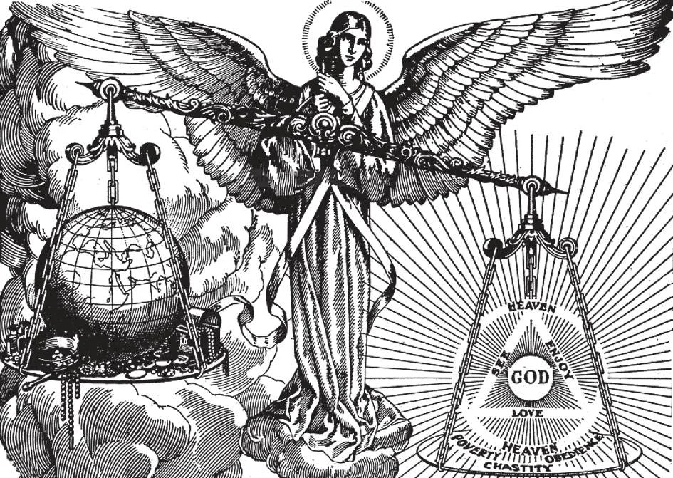

# 174. Os Conselhos Evangélicos

*Aqueles que seguem os conselhos evangélicos de pobreza, castidade e obediência desistem dos prazeres do mundo para servir e amar a Deus mais plenamente. Põem em prática a ideia por trás destas palavras da Sagrada Escritura: "Que aproveita ao homem se ganhar o mundo inteiro e sofrer a perda de sua própria alma?" Deus dá mais peso aos Conselhos que às riquezas.*

**O que nosso Salvador especialmente recomenda que não é estritamente comandado pela lei de Deus?**

— Nosso Salvador especialmente recomenda a observância dos Conselhos Evangélicos — pobreza voluntária, castidade perpétua e obediência perfeita.

1. "Evangélico" aqui significa contido nos Evangelhos; estes conselhos de perfeição são claramente expostos na Sagrada Escritura.

> São chamados conselhos porque são um convite e não um comando; todos são convidados mas ninguém é forçado. "Nem todos podem aceitar este ensino; mas àqueles a quem foi dado" (Mat. 19: 11).

2. Por meio dos conselhos evangélicos as três principais más tendências do homem — avareza, sensualidade e orgulho — são destruídas, capacitando-o a elevar-se mais livremente a Deus.

> Boas obras são suaves remédios para estas más tendências. Oração cura orgulho; jejum cura sensualidade; e esmola cura avareza. Mas os conselhos evangélicos são um remédio radical para estes três males. Obediência subjuga orgulho; castidade destrói sensualidade; e pobreza apaga avareza.

3. Os conselhos evangélicos, contudo, não são em si mesmos perfeição. São apenas os melhores meios para atingir perfeição.

> Se adotamos os conselhos mas não os seguimos ou fazemos sacrifícios por eles, estamos longe de perfeição.

**O que é pobreza voluntária?**

— Pobreza voluntária é a renúncia de todas as possessões terrenas, por amor de Deus.

1. Cristo aconselhou pobreza voluntária: "Se queres ser perfeito, vai, vende o que tens e dá aos pobres" (Mat. 19: 21).

> Nosso Senhor Mesmo foi extremamente pobre. Um estábulo foi Seu local de nascimento; uma pobre mulher foi Sua Mãe; um carpinteiro foi Seu pai adotivo. Não tinha onde reclinar Sua cabeça.

2. Dar esmolas segundo seus meios é o dever de cada cristão. Mas pobreza voluntária significa a renúncia, por amor de Deus, não apenas de parte mas de toda nossa propriedade terrena e sofrer as dificuldades da pobreza.

**O que é castidade perpétua?**

— Castidade perpétua consiste em abster-se de casamento e todos os desejos impuros.

1. Cristo aconselhou perfeita castidade: "Aceite-o quem pode" (Mat. 19: 12). Cristo Mesmo foi perfeitamente casto e virginal. Sua mãe foi uma virgem. Amou crianças, que são virginais.

> "Ora, concernente às virgens, não tenho mandamento do Senhor: contudo dou uma opinião... Aquele que não é casado cuida das coisas do Senhor, de como agradar a Deus. Enquanto, aquele que é casado cuida das coisas do mundo, de como agradar à sua mulher; e está dividido. E a mulher não casada e a virgem pensa nas coisas do Senhor, para que seja santa no corpo e no espírito. Enquanto a que é casada pensa nas coisas do mundo, de como agradar ao seu marido" (1 Cor. 7: 25, 32-34).

2. O sexto e nono mandamentos de Deus obrigam-nos a viver vidas castas e evitar impureza. Mas castidade vitalícia e perfeita significa além do sacrifício de algo lícito: casamento.

> O cuidado de uma família pode absorver um homem em interesses materiais, para detrimento de seu bem espiritual. Lembremo-nos do que São Paulo disse.

**A perfeita castidade é especialmente agradável a Deus?**

— Sim, perfeita castidade é uma virtude mui agradável a Deus.

1. Quando Deus desejou dar uma Mãe mortal a Seu Filho, Deus escolheu a mais pura das filhas de Judá, uma virgem, Maria. Quando quis um protetor para a Santíssima Virgem e seu futuro Filho, Deus escolheu um virgem, José, o mais casto dos homens. Cristo Mesmo foi um virgem e o Apóstolo que mais amou, aquele que se recostou sobre Seu peito na Última Ceia e a quem confiou Sua Mãe da cruz, foi também um virgem, São João Evangelista.

> "Ó quão bela é a geração casta com glória, pois a memória dela é imortal: porque é conhecida tanto com Deus quanto com os homens" (Sab. 4: 1).

2. Padres e membros de comunidades religiosas, tanto homens quanto mulheres, estão obrigados ao celibato e perfeita castidade. Celibato é o estado de ser não casado.

> São Paulo elogiou o estado de celibato: "Digo aos não casados e às viúvas, é bom para eles se assim permanecem, mesmo como eu" (1 Cor. 7: 8). Disse: "Aquele que dá sua virgem em casamento faz bem e aquele que não a dá faz melhor" (1 Cor. 7: 38).

3. Mesmo os pagãos reconhecem e honram a virtude da castidade virginal. Se os pagãos respeitam aqueles que preferem virgindade ao estado matrimonial, quanto mais devem os cristãos respeitar aqueles que, de motivos sobrenaturais, escolhem viver uma vida de castidade!

> Na pagã Roma seis virgens, chamadas as Virgens Vestais, foram nomeadas para manter o chamado fogo sagrado ardendo sobre o altar no templo de Vesta. Estas virgens usualmente vinham ao templo aos dez anos de idade e permaneciam lá por trinta anos. Durante aquele tempo estavam proibidas de casar. Os Romanos acreditavam que as Virgens Vestais traziam-lhes boa fortuna e obtinham para eles a proteção de seus deuses. Tratavam as Virgens Vestais com o maior respeito. Eram-lhes concedidas honras militares em público. Se um criminoso, em seu caminho para execução, acontecia encontrar uma Virgem Vestal, era imediatamente perdoado. As virgens recebiam os melhores lugares onde quer que iam; eram vestidas em brancas vestes. Se uma Virgem Vestal quebrava seu voto de castidade, era sepultada viva.

**O que é obediência perfeita?**

— Obediência perfeita é a completa sujeição de própria vontade à de um superior.

1. Cristo aconselhou perfeita obediência. Disse a Seus Apóstolos: "Segue-Me." Disse ao jovem rico: "Se queres ser perfeito, vai, vende o que tens e dá aos pobres... e vem, segue-Me" (Mat. 19: 21), isto é, "Vem e serás guiado por Mim em todas as coisas."

> Cristo foi perfeitamente obediente a Seu Pai celestial. Nunca buscou Sua própria vontade mas sempre a vontade do Pai Que O enviou. Foi obediente a Sua Mãe e a São José.

2. Todos os homens estão obrigados a render cristã obediência a seus superiores segundo seu estado. Crianças devem obedecer a seus pais; cidadãos devem obedecer às autoridades civis; todos devem obedecer a seus superiores espirituais. Mas esta obrigação deixa-nos livres em muitas coisas; não vincula todas nossas ações. Obediência perfeita por outro lado requer-nos obedecer em tudo. É o maior sacrifício que podemos dar a Deus.

> Se jejuamos, damos esmolas ou perdemos nossa reputação por amor de Deus, apenas damos uma parte de nós mesmos. Mas se damos perfeita obediência, sacrificamos nossa vontade; damos tudo que temos. Não temos nada mais para dar.
