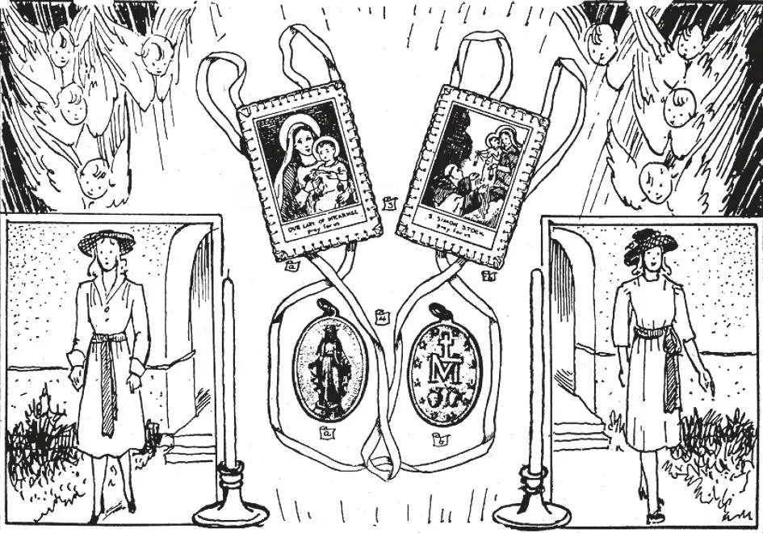

# 179. Objetos Abençoados de Devoção

*A ilustração (1) mostra uma moça vestindo o abençoado vestido de Nossa Senhora de Lourdes. É branco, com uma faixa azul amarrada na frente. (2) mostra uma vestindo o abençoado vestido de Nossa Senhora Maria Auxiliadora dos Cristãos. É rosa coral, com uma faixa azul-pó amarrada num laço ao lado esquerdo. Todos os vestidos abençoados devem ser modestos, com mangas compridas e decotes fechados. A ilustração (3) é um escapulário de Nossa Senhora do Carmo. Após ser imposto, pode ser substituído por uma propriamente abençoada medalha de escapulário. (4) mostra as duas faces da Medalha Milagrosa. Nossa Senhora mesma revelou o desenho para ela.*

**Quais são os objetos abençoados de devoção mais usados pelos católicos?**

— Os objetos abençoados de devoção mais usados pelos católicos são: água benta, velas, cinzas, palmas, crucifixos, medalhas, terços, escapulários e imagens de Nosso Senhor, da Santíssima Virgem e dos santos.

1. A bênção dada pela Igreja faz água benta de especial eficácia. Devemos sempre fazer o sinal da cruz, sempre que possível com água benta; por ela ganharíamos cem dias de indulgência.

> Água benta é posta às portas de todas as igrejas e capelas para usarmos quando entramos e saímos. Devemos também tê-la às portas de todos nossos quartos em nossas casas. Água benta é usada em muitas bênçãos da Igreja, para os mortos, para a consagração de igrejas, etc.

2. Velas são usadas na Igreja tanto quanto água benta. Representam Cristo, a "Luz do Mundo." Velas são abençoadas na Festa da Purificação ou Dia de Candelária, em memória das palavras de Santo Simeão chamando Cristo a "luz de revelação aos Gentios" (Lucas 2:32). Velas são uma duradoura oração, erguendo seu apelo ao céu em nosso benefício.

> Quando queimamos velas junto aos corpos ou túmulos de nossos mortos, oramos para que possam ser admitidos logo na luz do céu, a visão de Deus. Queimamos velas diante de imagens dos santos, como um símbolo das virtudes com as quais foram dotados, e como uma súplica por ajuda através de sua intercessão. A vela acesa em nosso Batismo denota a luz do Espírito Santo, que então recebemos, e recorda as palavras de Cristo, "Assim brilhe vossa luz diante dos homens para que vejam vossas boas obras e deem glória a vosso Pai no céu" (Mat. 5:16). Sobre o altar, as velas significam a presença de Cristo, a Luz do Mundo, Que desce sobre ele na consagração.

3. Cinzas são abençoadas na Quarta-Feira de Cinzas, e marcadas nas testas dos fiéis, para lembrá-los das palavras de Deus a Adão: "No suor de teu rosto comerás pão até que retornes à terra da qual foste tomado; pois pó és e ao pó retornarás" (Gên. 3).

> Ao cruzar nossas testas com cinzas na Quarta-Feira de Cinzas, o padre diz: "Lembra-te, homem, que és pó e ao pó retornarás."

4. Palmas são abençoadas no Domingo precedente à Festa de Páscoa, em comemoração da entrada de Nosso Senhor em Jerusalém antes de Sua Paixão, quando foi recebido com alegria e aclamado com Hosanas.

> Durante a bênção das palmas, o padre ora para que aqueles que as recebem e guardam sejam preservados de pecado e perigo. É costume pendurar em alguma parte de nossas casas as abençoadas palmas que recebemos no Domingo de Ramos. A palma é um símbolo de vitória sobre o pecado, de triunfal entrada no céu.

5. Nenhuma igreja, altar, cemitério ou instituição católica está sem a cruz ou crucifixo; nenhuma casa deve estar sem ele.

> Nenhum católico morre sem o crucifixo; e ninguém deve viver sem carregá-lo em alguma parte de sua pessoa. Quando olhamos para ele, lembramos o infinito amor de Deus por nós; com a cruz de Cristo Ele provou este amor. (Veja página 191.)

6. As mais comumente usadas medalhas são as medalhas de escapulário e a Medalha Milagrosa. As medalhas de escapulário são substitutas para os escapulários de pano. A Medalha Milagrosa foi revelada por Nossa Senhora à Irmã Catarina Labouré, uma Irmã da Caridade. A Santíssima Virgem apareceu-lhe na postura agora mostrada na medalha, com a ejaculação "Ó Maria, concebida sem pecado, rogai por nós que recorremos a vós" ao seu redor. A Santíssima Virgem ordenou à Irmã Catarina fazer uma medalha segundo aquele modelo, prometendo àqueles que a usariam grandes bênçãos.

> O reverso da medalha, também revelado por Nossa Senhora, tem a letra M sobrepujada por uma cruz, os dois Sagrados Corações de Jesus e Maria, e doze estrelas. As muitas curas, bênçãos temporais e graças espirituais recebidas em poucos anos por aqueles que primeiro usaram a medalha fizeram-na conhecida como a Medalha Milagrosa. A festa de Nossa Senhora da Medalha Milagrosa é celebrada em 27 de novembro.

7. Os mais comumente usados escapulários são o escapulário marrom e o escapulário azul. (a) O escapulário marrom é a insígnia da Confraria do Carmo. Espera-se que os membros digam o ofício, mas para leigos isto pode ser mudado para três Ave-Marias, que podem ser parte de suas orações diárias. Apenas padres com as próprias faculdades podem impor o escapulário marrom.

> No ano 1250, a Santíssima Virgem apareceu a São Simão Stock, então geral da Ordem Carmelita. Deu-lhe um escapulário, prometendo que todo aquele que o usasse e vivesse piedosamente escaparia da danação, teria sua proteção em todos os perigos, e seria logo liberado do Purgatório. O original escapulário foi desenhado para pendurar sobre a cabeça, na frente e atrás, como muitos religiosos ainda o usam, formando parte de seu hábito.

(b) O escapulário azul é uma devoção em honra à Imaculada Conceição de Nossa Senhora. Requer que os portadores vivam uma vida de castidade segundo seu estado, orem pela conversão de pecadores.

> Há além disto outros escapulários como os das Sete Dores, da Santíssima Trindade e da Paixão. Todos estes cinco escapulários podem ser substituídos por uma propriamente abençoada medalha, uma face da qual tem a imagem do Sagrado Coração de Jesus e a outra face a imagem de Nossa Senhora sob qualquer título. A medalha pode substituir apenas após o escapulário de pano ter sido imposto.

8. Um Agnus Dei é um disco de branca cera estampado com a imagem de um cordeiro e cruz (representando Cristo); é solenemente abençoado pelo Papa, e distribuído em Roma no Sábado após Páscoa.

> Antigamente, o Agnus Dei era dado apenas aos recém-batizados que o carregavam em suas pessoas, em honra ao "Cordeiro de Deus."

9. Os mais comumente usados abençoados vestidos são aqueles em honra a Nossa Senhora de Lourdes, Nossa Senhora das Dores, da Imaculada Conceição, do Carmo, Maria Auxiliadora dos Cristãos, Santo Antônio e São José. Estes vestidos são usados como uma promessa, ou para obter algum especial favor. Seu uso não é vinculante sob pena de pecado.

> Embora estes abençoados vestidos não estejam exatamente no auge da moda, ainda seu uso deve ser encorajado como um lembrete a nossas moças para vestir-se modestamente sempre; todos devem ser membros desta Legião de Modéstia. A fórmula para abençoar um vestido está no Ritual Romano: "Benedictio Vestis et Cinguli." Mesmo se alguém que prometeu usar um abençoado vestido falha em cumprir sua promessa, não comete pecado. Apenas perde as graças que de outro modo teria recebido pela fiel cumprimento de sua promessa.
