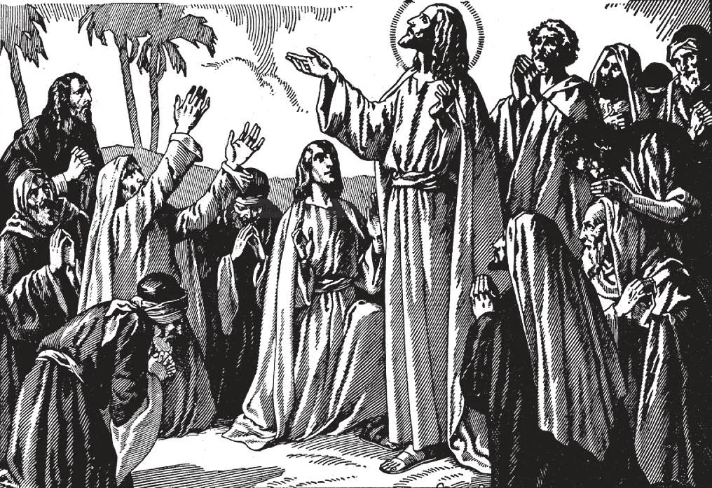

# 183. O "Pai-Nosso"

*"E aconteceu que enquanto estava orando num certo lugar que quando cessou um de Seus discípulos disse-Lhe 'Senhor ensina-nos a orar' (Lucas 11: 1). Nosso Senhor portanto ensinou a Seus discípulos o 'Pai-Nosso.' Jesus continuou: 'E Eu vos digo pedi e ser-vos-á dado; buscai e achareis; batei e ser-vos-á aberto. Pois todo que pede recebe; e quem busca acha; e a quem bate ser-lhe-á aberto' (Lucas 11: 9-10).*

**Por que o 'Pai-Nosso' é a melhor de todas as orações?**

— O Pai-Nosso é a melhor de todas as orações porque é a Oração do Senhor ensinada por Jesus Cristo Mesmo; uma oração de perfeito e desinteressado amor.

1. O "Pai-Nosso" foi ensinado por Cristo Mesmo a nós através de Seus Apóstolos a seu pedido. Tem uma introdução e sete petições.

> O Pai-Nosso contém petições para todas as necessidades de alma e corpo. É ao mesmo tempo uma oração de louvor petição e contrição.

2. No "Pai-Nosso" não apenas oramos em nome de Jesus mas em Suas próprias palavras. É adequado a cada classe e condição de homens do mais simples ao mais sábio.

> Desta oração mais que de qualquer outra a promessa de Nosso Senhor vale: "Se pedirdes ao Pai algo em meu nome Ele vo-lo dará" (João 16: 23).

3. Ao dizer o "Pai-Nosso" oferecemo-nos inteiramente a Deus e pedimos d'Ele as melhores coisas não apenas para nós mas também para nosso próximo. Nenhuma oração significa tanto em tão poucas palavras.

**Por que nos dirigimos a Deus como "Pai Nosso que estais nos céus?"**

— Nos dirigimos a Deus como "Pai Nosso que estais nos céus" porque pertencemos a Ele nosso amoroso Pai Que nos criou e vigia sobre nós Que nos adota através da graça santificante como Seus filhos e Que nos destina a viver para sempre com Ele no céu nosso verdadeiro lar.

1. "Pai Nosso que estais nos céus" é a introdução. Nela Nosso Senhor ensinou-nos a ser como pequenas crianças chamando Deus "Pai."

> Assim mostramos nosso amor e confiança n'Ele. Dizemos "Nosso" e não "Meu" porque oramos não apenas por nós mas por todos os homens. "Somos filhos de Deus" (Rom. 8: 16).

2. Dizemos "Que estais nos céus" para lembrar a nós mesmos que no céu está o trono de Deus e lá também está nosso verdadeiro Lar.

> "Na casa de meu Pai há muitas mansões" (João 14: 2).

**Por que oramos quando dizemos "santificado seja o Vosso nome?"**

— Quando dizemos "santificado seja o Vosso nome" oramos para que Deus possa ser conhecido e honrado por todos os homens.

> Esta é a primeira petição. É posta primeira para ensinar-nos que devemos pôr a glória de Deus primeira acima de todas as outras coisas. "Louvai o nome do Senhor" (Sl. 112: 1).

**Por que oramos quando dizemos "venha a nós o Vosso reino?"**

— Quando dizemos "venha a nós o Vosso reino" oramos para que o reino da graça de Deus possa ser espalhado por todo o mundo para que todos os homens possam vir a conhecer e entrar na verdadeira Igreja e viver como dignos membros dela e que finalmente todos possamos ser admitidos ao reino da glória de Deus.

> Esta é a segunda petição no Pai-Nosso. Aqui reconhecemos Deus como o Rei e Senhor da criação. Pedimos que todos O reconheçam como tal que Ele possa estender Seu cuidado e providência a todos que Seu reino na terra a Igreja possa espalhar-se e que possamos ter vida eterna após a morte.

**Por que oramos quando dizemos "seja feita a Vossa vontade assim na terra como no céu?"**

— Quando dizemos "seja feita a Vossa vontade assim na terra como no céu" oramos para que todos os homens possam obedecer a Deus na terra tão voluntariamente quanto os santos e anjos O obedecem no céu.

> Esta é a terceira petição. Por ela oramos por ajuda para cumprir todos os desejos a vontade de Deus. Devemos fazer a vontade de Deus sendo fiéis a Seus comandos e sendo pacientes e resignados sob provações pois nenhuma dor pode nos acontecer sem a permissão de Deus. "Aquele que faz a vontade de meu Pai entrará no reino do céu" (Mat. 7: 21).

**Por que oramos quando dizemos "o pão nosso de cada dia nos dai hoje?"**

— Quando dizemos "o pão nosso de cada dia nos dai hoje" oramos para que Deus nos dê cada dia tudo que é necessário para sustentar a material vida de nossos corpos e a espiritual vida de nossas almas.

> Esta é a quarta petição. A palavra "diário" mostra que se espera que peçamos cada dia pois o "pão" que pedimos é apenas para um dia. Somos permitidos pedir favores temporais desde que não sejam contrários à vontade de Deus.

**Por que oramos quando dizemos "perdoai-nos as nossas ofensas assim como nós perdoamos a quem nos tem ofendido?"**

— Quando dizemos "perdoai-nos as nossas ofensas assim como nós perdoamos a quem nos tem ofendido" oramos para que Deus perdoe os pecados pelos quais O ofendemos e dizemos a Ele que perdoamos nossos semelhantes que nos ofenderam.

> Esta é a quinta petição. Por ela concordamos em perdoar do mesmo modo que Deus nos perdoa todos que nos ofenderam. Assim não podemos esperar que Deus nos perdoe se não perdoamos outros. "Se perdoardes aos homens suas ofensas vosso Pai celestial também vos perdoará vossas ofensas. Mas se não perdoardes aos homens nem vosso Pai vos perdoará vossas ofensas" (Mat. 6: 14-15).

**Por que oramos quando dizemos "e não nos deixeis cair em tentação?"**

— Quando dizemos "e não nos deixeis cair em tentação" oramos para que Deus sempre nos dê a graça de superar as tentações ao pecado que nos vêm do mundo da carne e do diabo.

> Esta é a sexta petição. Tentações nos vêm (1) do mundo outras pessoas e coisas desta terra cheias de vaidades: (2) da carne isto é de nossa própria fraca e corrupta natureza: e (3) do diabo o maligno cuja única alegria é arrastar almas ao pecado. Devemos fazer nossa parte em resistir à tentação sendo vigilantes contra ela e evitando as ocasiões de pecado. "Orai para que não entreis em tentação" (Mat. 26: 41). "Deus é fiel e não permitirá que sejais tentados além de vossas forças" (1 Cor. 10: 13).

**Por que oramos quando dizemos "mas livrai-nos do mal?"**

— Quando dizemos "mas livrai-nos do mal" oramos para que Deus sempre nos proteja de dano e especialmente de dano a nossas almas.

> Esta é a sétima e última petição no Pai-Nosso. Implora a Deus salvar-nos de todo dano à alma e corpo especialmente do pecado.

**O que é meant pela palavra "Amém" com a qual terminamos o "Pai-Nosso?"**

— Pela palavra "Amém" com a qual terminamos o Pai-Nosso é meant "Assim é" ou "Assim seja"; a palavra expressa nossa confiança que todas nossas petições serão concedidas.

> No "Pai-Nosso" da Missa Amém é dito pelo padre para indicá-lo como a resposta de Deus às petições significando: "Estai seguro que ouço vossa oração."
