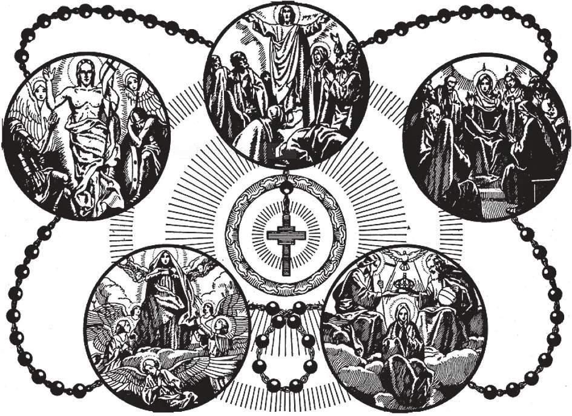

# 185. O Rosário

*O Rosário é dividido nos mistérios gozosos dolorosos e gloriosos. Nos mistérios gozosos meditamos sobre: (1) a Anunciação; (2) A Visitação; (3) O Nascimento de Jesus; (4) A Apresentação; e (5) O Achamento no Templo. Nos mistérios dolorosos meditamos sobre (1) A Agonia no Jardim; (2) O Açoitamento; (3) A Coroa de Espinhos; (4) O Carregamento da Cruz e (5) A Crucificação. Nos mistérios gloriosos meditamos sobre (1) A Ressurreição; (2) A Ascensão; (3) A Descida do Espírito Santo; (4) A Assunção; e (5) A Coroação da Santíssima Virgem.*

**O que é o Rosário?**

— O Rosário é uma oração em honra à Santíssima Virgem consistindo de cento e cinqüenta Ave-Marias e quinze Pai-Nossos acompanhados por meditação sobre a vida paixão e glória de Cristo.

1. Nos primeiros séculos do Cristianismo havia muitos eremitas que não podiam ler os salmos no saltério. Então costumavam substituir um Pai-Nosso e uma Ave-Maria por cada salmo. Para notar o número usavam pedras ou sementes enfiadas num cordão.

> A palavra rosário significa uma grinalda ou coroa de rosas. Cada oração dita no Rosário é uma espiritual rosa oferecida a nossa Santíssima Mãe.

2. São Domingos foi o primeiro a tornar geral o costume de substituir 150 Ave-Marias pelos 150 Salmos.

> Quando no décimo terceiro século a heresia assolava o sul da França e norte da Itália o Santo Padre nomeou São Domingos para pregar contra as heréticas doutrinas. Quando após exercer grande esforço Domingos viu mui poucos resultados orou à Santíssima Virgem e usou o rosário como um meio para a conversão dos hereges. Por este método que foi em toda parte bem-vindo sua campanha tornou-se um completo sucesso.

3. O Rosário é uma poderosa oração para obter a graça de Deus através da intercessão da Santíssima Virgem. Quão inúmeras são as conversões conhecidas e desconhecidas que tiveram seu início na devoção do Rosário! Padres e religiosos assim como outros devotos cristãos fazem uma prática de recitá-lo diariamente.

> Em tempos de perigo e calamidade o Rosário tem sido o meio pelo qual miraculosa ajuda foi obtida. Este foi o caso nas guerras com os Turcos a vitória de Lepanto (1571) e a libertação de Viena (1683). Foi em ação de graças por estas vitórias sobre os Maometanos que o Santo Padre instituiu a festa do Santo Rosário no primeiro Domingo de Outubro.

4. A própria simplicidade do Rosário faz dele uma oração para crianças. Por esta razão é a oração dos pequenos e humildes e mui agradável aos olhos de Deus.

> Um dos devotos do Rosário foi aquele grande missionário São Francisco Xavier. Onde quer que ia pregava esta devoção. Por mais ocupado ou fatigado que estivesse nunca omitia dizer o Rosário cada dia. Costumava carregar seu rosário ao redor de seu pescoço abertamente em honra à Santíssima Mãe.

5. Ao mesmo tempo o rosário é uma oração de contemplação: as verdades descobertas da meditação sobre os mistérios apresentados nunca podem ser esgotadas mesmo pelos mais aprendidos.

> Frequentemente São Francisco Xavier era chamado a distantes missões para atender os doentes e administrar os sacramentos aos moribundos. Como era impossível para ele atender a tantos de uma vez costumava enviar rosários aos doentes aconselhando-os a orar e se não podiam usar as contas ao redor de seu pescoço. Assegurava aos doentes que ou melhorariam inteiramente ou sentir-se-iam melhor até que pudesse chegar de modo que não morressem sem os sacramentos. Esta promessa era sempre cumprida: os pacientes usando o rosário como São Francisco Xavier recomendava sempre recebiam tempo para viver pelo menos até que o santo missionário chegasse e administrasse os Últimos Sacramentos.

**Como é dito o Rosário?**

— Ordinariamente apenas um terço do Rosário é dito: cinqüenta Ave-Marias e cinco Pai-Nossos orados numa corda de contas deslizada através dos dedos.

> O Rosário combina oração vocal com mental. É um resumo das mais importantes partes dos Evangelhos uma mui útil e poderosa oração. Católicos não devem falhar em dizer pelo menos cinco dezenas do Rosário cada dia.

1. Ordinariamente começamos o Rosário dizendo o Credo dos Apóstolos. Então dizemos um Pai-Nosso três Ave-Marias e um Glória ao Pai para o aumento de fé esperança e caridade. Esta é a introdução mas não é necessária para o ganho da indulgência.

> Muitas indulgências são anexadas ao Rosário. Por cada Pai-Nosso e Ave-Maria uma indulgência de quinhentos dias pode ser ganha se dito num propriamente indulgenciado rosário.

2. Dizemos os Pai-Nossos nas grandes contas e as Ave-Marias nas pequenas contas. Um Pai-Nosso e as dez Ave-Marias seguintes são chamadas uma dezena. Cinco dezenas fazem o terço de contas. É costume fechar cada dezena com um Glória ao Pai.

> Enquanto recitando o Rosário cada um deve segurar seu próprio rosário em sua mão e tocar as contas enquanto diz as orações. Se vários estão dizendo o Rosário juntos apenas um precisa ter um rosário em sua mão para regular o número de orações.

3. Enquanto dizemos cada dezena devemos meditar sobre um mistério de nossa fé. O Rosário é dividido nos mistérios gozosos dolorosos e gloriosos cada honrando respectivamente a vida a paixão e a glorificação de Nosso Senhor.

> A objeção é frequentemente feita por não católicos de que o Rosário não é uma louvável oração porque nele uma oração a Ave-Maria é repetida tão frequentemente. Em resposta a esta objeção diríamos que aquele que tem um sentimento muito no coração geralmente repete uma e outra vez certas palavras que dão expressão àquele sentimento. Notai uma criança implorando por algo. Além disto esta prática tem a própria Sagrada Escritura e mesmo Nosso Senhor por modelo: nos Salmos as palavras "Sua misericórdia dura para sempre" são repetidas em apenas um salmo até vinte e sete vezes; os anjos insinuam que seu cântico de "Santo santo santo Senhor Deus dos exércitos" é incessante; no Jardim Nosso Senhor repetiu Sua oração.

**O que é a Ladainha da Santíssima Virgem?**

— A Ladainha da Santíssima Virgem é uma oração na qual os mais gloriosos títulos são dados à Mãe de Deus como sua intercessão é invocada.

> A Ladainha é uma sucessão de gloriosas e simbólicas saudações. Nela a chamamos Rosa Mística porque a beleza de sua alma cumpriu a profecia "Fui exaltada como uma palmeira em Cades e como uma roseira em Jericó" (Eclo. 24:18). Dirigimo-nos a ela como Torre de David e Torre de Marfim porque ergue-se acima de todos os homens em beleza e força de alma. É chamada Casa de Ouro porque Deus Mesmo habitou dentro dela como num Templo. É a Arca da Aliança porque como continha as tábuas da Lei Mosaica assim continha o Legislador de todos Deus. É invocada como a Porta do Céu porque através dela entramos no reino celestial. É nossa Estrela da Manhã que ilumina nosso caminho para Casa para Deus.

A Ladainha da Santíssima Virgem é frequentemente dita para terminar o Rosário. Esta Ladainha é também chamada a Ladainha de Loreto nomeada após a italiana cidade de Loreto onde a santa casa de Nazaré agora está.
