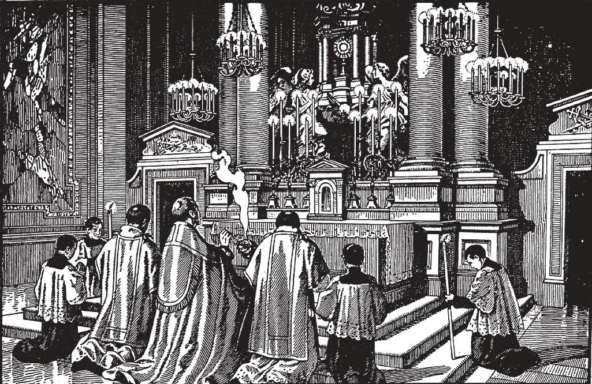

# 186. Práticas Religiosas

*1. Quando passamos diante de uma imagem de Nosso Senhor Nossa Senhora ou dos Santos devemos mostrar nossa reverência curvando-nos diante dela. 2. Ao entrar ou sair do lugar onde o Santíssimo Sacramento está exposto ou enquanto a Santa Comunhão está sendo distribuída devemos fazer uma dupla genuflexão isto é ajoelhar sobre ambos os joelhos e curvar-se em adoração a Deus ali diante de nós. 3. Quando entramos ou saímos da igreja ou passamos diante do tabernáculo onde o Santíssimo Sacramento está reservado devemos genuflectir sobre o joelho direito como um ato de adoração a nosso oculto Senhor. Ao genuflectir o joelho deve tocar o chão e não meramente ser dobrado.*

**Que tipos de práticas religiosas são observadas na Igreja?**

— Há dois tipos de práticas religiosas observadas na Igreja: as ordinárias e as extraordinárias.

1. As práticas ordinárias ocorrem em regularmente designados tempos. São os regulares serviços realizados na igreja paroquial aos Domingos e dias santos e durante dias de semana tanto de manhã quanto à tarde.

> Aos Domingos e dias santos em todas as igrejas paroquiais uma ou mais Missas são ditas segundo o número de padres e o tamanho da paróquia. Em cada daquelas Missas um sermão é pregado. Em muitas paróquias há especiais serviços como a recitação do Rosário ou bênção do Santíssimo Sacramento. Em dias de semana uma ou mais Missas são ditas. Especialmente em Maio Junho e Outubro há usualmente exposição do Santíssimo Sacramento e a recitação do Rosário. Missas são ditas à tarde com a aprovação do bispo.

2. As extraordinárias ou especiais devoções ocorrem apenas em especiais ocasiões. Algumas delas são: Bênção exposição do Santíssimo Sacramento a Via-Sacra procissões novenas missões e retiros congressos devoção ao Sagrado Coração etc.

*Cada vez que o Santíssimo Sacramento é solenemente exposto devemos gastar algum tempo em oração diante dele. Ao final da exposição a Bênção com o Santíssimo Sacramento é dada. No momento da bênção devemos olhar para a Sagrada Hóstia e dizer: "Meu Senhor e Meu Deus" então curvar-nos em adoração e fazer o sinal da Cruz.*

**Em que consiste a devoção ao Sagrado Coração de Jesus?**

— A devoção ao Sagrado Coração de Jesus consiste em atos de amor e reparação pelas muitas ofensas cometidas contra Ele.

1. Já que Jesus Cristo é tanto Deus quanto homem Sua humanidade sendo inseparável de Sua divindade é digna de adoração. Esta adoração não é visada à humana natureza mas à divina pessoa de Cristo. De modo similar quando beijamos a mão de nossa mãe não prestamos nossa reverência à sua carne mas a ela como nosso progenitor.

> Embora devoção ao Sagrado Coração de Jesus fosse conhecida em antigos tempos tornou-se disseminada como resultado das revelações Nosso Senhor fez a Santa Margarida Maria Alacoque para o fim do décimo sétimo século. Através dela Ele fez doze promessas àqueles que praticassem a devoção a Seu Sagrado Coração.

2. Entre as doze promessas de Nosso Senhor em favor dos devotos de Seu Coração está: "Prometo no excesso da misericórdia de Meu Coração que seu todo-poderoso amor concederá a todos aqueles que recebem comunhão na primeira sexta-feira de cada mês por nove consecutivos meses a graça do final arrependimento e que não morrerão sob Meu desagrado nem sem os sacramentos e que Meu Coração será seu seguro refúgio naquela última hora."

> A devoção da Primeira Sexta-feira surgiu desta promessa de Nosso Senhor especialmente a devoção das nove Primeiras Sextas-feiras. Quando veneramos o Sagrado Coração devemos lembrar Seu grande amor por nós fluindo daquele Coração e tentar fazer alguma retribuição por aquele amor.

3. Para fazer esta devoção das nove Primeiras Sextas-feiras bem devemos fazer uma muito boa confissão e receber a Santa Comunhão oferecendo tudo que somos e tudo que temos ao Sagrado Coração de Jesus. Todos devem fazer esta devoção pelo menos uma vez por si mesmos. A promessa é feita por Nosso Senhor Jesus Cristo e Ele sempre cumpre Suas promessas.

> Todo o mês de Junho é consagrado ao Sagrado Coração. Em muitas igrejas cada dia em Junho o Rosário é recitado e a Ladainha do Sagrado Coração dita. A devoção ao Sagrado Coração tem trazido preciosos resultados. Tem encorajado a prática da frequente Comunhão. Nenhuma casa católica deve estar sem uma imagem do Sagrado Coração prominentemente exibida.

Outras devoções a Nosso Senhor Jesus Cristo são: aquelas à Sua Paixão ao Santo Nome às Cinco Chagas e ao Preciosíssimo Sangue.
