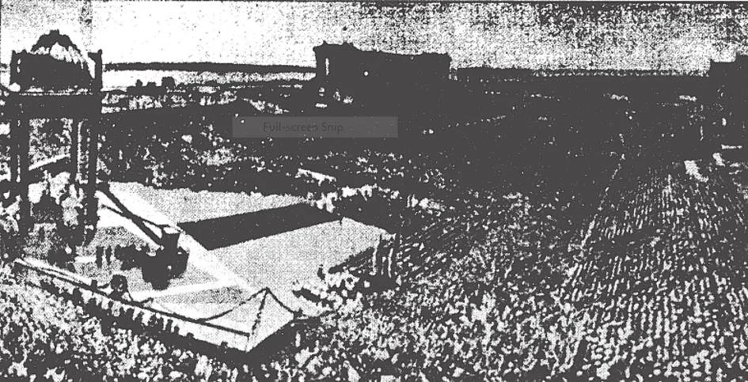

# 187. Devoções ao Santíssimo Sacramento

*O 28º Congresso Eucarístico Internacional realizado em Chicago em Junho de 1926 foi um dos maiores religiosos eventos na história dos EUA. O Congresso foi realizado no Soldiers Field um imenso estádio com capacidade de 350.000. Doze Cardeais sobre 500 Arcebispos e Bispos seis mil Padres dez mil Irmãs e centenas de milhares de pessoas reuniram-se em Chicago por quatro dias para honrar Jesus na Santa Eucaristia. No último dia a solene procissão ocorreu nos terrenos do grande Seminário de Mundelein. Sobre 900.000 fiéis reuniram-se para honrar Nosso Senhor Eucarístico. O Cardeal Legado do Santo Padre carregou o sagrado ostensório. Este Congresso de devoção e oração marcou um contraste à usual comercial e ocupada vida daquela grande cidade. Mesmo o Presidente dos Estados Unidos enviou seu pessoal representante. Cada dois anos mais ou menos o mundo católico reúne-se em tal Internacional Congresso para honrar Nosso Senhor na Santa Eucaristia. Alguns Congressos foram: Cartago em 1930 Dublin em 1932 Buenos Aires em 1934 Manila em 1937 Budapeste em 1938 Barcelona em 1952 e Rio de Janeiro em 1956. É considerado uma grande honra para uma cidade ser escolhida para um Internacional Congresso Eucarístico. Diferentes nações sempre competem pela honra de ser anfitriãs de nosso Santíssimo Senhor durante um Internacional Congresso. A ilustração é uma vista do Dia das Mulheres durante o Internacional Congresso Eucarístico em Chicago em 1926.*

**Quais são as mais importantes devoções a Jesus no Santíssimo Sacramento?**

— As mais importantes devoções a Jesus no Santíssimo Sacramento são: visitas Bênção Exposição do Santíssimo Sacramento a Devoção das Quarenta Horas e Congressos Eucarísticos.

1. Devemos fazer visitas para honrar Jesus no Santíssimo Sacramento. Se possível devemos fazer pelo menos uma diária visita. Ao passar uma igreja devemos entrar se apenas por meio minuto para saudá-Lo Que sempre espera pacientemente e ansiosamente por nós.

> O Cardeal Belarmino enquanto ainda estudante costumava pagar uma visita ao Santíssimo Sacramento cada vez que passava uma igreja. Quando foi perguntado por que fazia isto respondeu "Seriam maus modos passar pela casa de um amigo sem uma palavra de saudação." A porta da igreja está sempre aberta para admitir-nos um constante convite a nós para visitar Nosso Senhor Que chama "Vinde a mim todos que trabalhas e estais sobrecarregados e Eu vos darei descanso" (Mat. 11: 28).

2. Bênção do Santíssimo Sacramento é uma devoção durante a qual a Santa Eucaristia é exposta orações são ditas e a bênção é dada. Usualmente dura de dez minutos a meia hora.

> Quando o Santíssimo Sacramento está exposto a *Salutaris Hostia* ou *Ave Verum* é usualmente cantada. Logo antes da bênção ser dada o *Tantum Ergo* é cantado. O Santíssimo Sacramento é incensado quando primeiro exposto e durante o *Tantum Ergo*.

3. Exposição do Santíssimo Sacramento consiste em colocar a sagrada Hóstia num ostensório a alguma altura sobre o altar para a adoração dos fiéis. O Santíssimo Sacramento é solenemente exposto em certas ocasiões como após a paroquial Missa nos serviços à tarde aos Domingos e dias santos na festa de Corpus Christi etc. O número de acesas velas a menos que haja especial concessão não deve ser menos que doze. Durante a exposição alguém deve sempre estar de guarda na igreja.

> Uma toda-noite vigília é mantida diante do Santíssimo Sacramento no Repositório na noite de Quinta-Feira Santa. Em muitos lugares uma toda-noite vigília é também realizada na Véspera de Ano Novo. É usual exceto para extraordinários casos orar diante do solenemente exposto Sacramento de joelhos. Se é descortês sentar na presença de um terreno rei quanto mais o é diante do Filho de Deus!

4. A Devoção das Quarenta Horas é uma devoção ao Santíssimo Sacramento em memória das quarenta horas durante as quais o Corpo de Jesus permaneceu no Santo Sepulcro após Seu sepultamento na Sexta-Feira Santa até Sua ressurreição na Páscoa.

> A devoção dura quarenta horas durante as quais revezamentos de adoradores tomam turnos oferecendo orações e meditação a Cristo na Santa Eucaristia solenemente exposta. A devoção começa no primeiro dia com Santa Missa em honra ao Santíssimo Sacramento. Ao final da Missa há uma solene procissão e o Santíssimo Sacramento é exposto sobre o trono no altar-mor. A devoção termina com outra Missa. Durante as quarenta horas nenhuma Missa de réquiem pode ser dita na igreja.

**O que é um Congresso Eucarístico?**

— Um Congresso Eucarístico é uma reunião de católicos que convoca para o propósito de dar pública adoração à Santa Eucaristia.

> O primeiro Congresso Eucarístico foi realizado em Lille França em 21 de Junho de 1881.

1. Estes congressos visam promover devoção a nosso Senhor na Santa Eucaristia para honrá-Lo no memorial que nos deixou. Visam discutir meios pelos quais tornar conhecido o dom de Cristo aos homens. Podem ser locais provinciais diocesanos nacionais ou internacionais. Nacionais Congressos são realizados num número de nações cada poucos anos.

> Os exercícios do congresso incluem diárias Missas atendidas por todos os participantes diárias comunhões conferências etc. Às vezes os participantes são divididos em várias seções para melhores discussões e organização.

2. O mais importante destes congressos é o Internacional Congresso Eucarístico. Foi iniciado em 1892 e ocorre cada dois anos. O lugar é selecionado por um permanente comitê com a aprovação do Santo Padre. É costume para o Papa nomear um Legado usualmente um Cardeal aos Internacionais Congressos; ele preside sobre as mais importantes funções como o representante do Santo Padre.

> Estes internacionais congressos atendidos por centenas de milhares são mui agradáveis a Nosso Senhor na Eucaristia. Esta satisfação Ele mostra pelos frutíferos resultados de tais congressos. A espiritual vida dos participantes é renovada! e não raramente muitos que tornaram-se indiferentes à Fé renovam seu fervor. O espetáculo da devoção e piedade de tantos adorando o Sacramento é um edificante espetáculo para não católicos milhares dos quais são convertidos. A nação selecionada para o congresso é especialmente abençoada.

3. Internacionais Congressos Eucarísticos foram realizados: Roma em 1922 Amsterdã em 1924 Chicago em 1926 Sydney em 1928 Cartago em 1930 Dublin em 1932 Buenos Aires em 1934 Manila em 1937 e Budapeste em 1938. É seguramente um sinal de honra para uma cidade ser escolhida sede de um Internacional Congresso Eucarístico. O 35º Internacional Congresso deveria ter sido realizado em Nice França em 1940 mas foi suspenso por causa da guerra.

> De todos os Internacionais Congressos Eucarísticos aquele de Manila foi provavelmente o mais internacional peregrinos vindo para representar cinqüenta e quatro nações da Ásia Europa Américas e Austrália. No último dia a solene procissão do Santíssimo Sacramento ocorreu ao longo da Dewey Boulevard junto ao mar terminando no monumental altar no Novo Luneta. É oficialmente estimado que sobre 600.000 pessoas reuniram-se para esta última cerimônia para honrar nosso Senhor Eucarístico.

**O que são Congressos Católicos?**

— Congressos Católicos são públicas conferências ou reuniões de católicos para ou devocionais ou práticos propósitos. Alguns Congressos como Congressos Eucarísticos são principalmente devocionais; outros visam tomar conselho e propor passos para encontrar necessidades da Igreja. Contudo estes congressos não tomam parte ou interferem com o governo da Igreja que reside exclusivamente nos bispos.

> Eles meramente cooperam apoiam fazem sugestões para tornar tal governo mais efetivo. Cada congresso deve ter a autorização do bispo.
