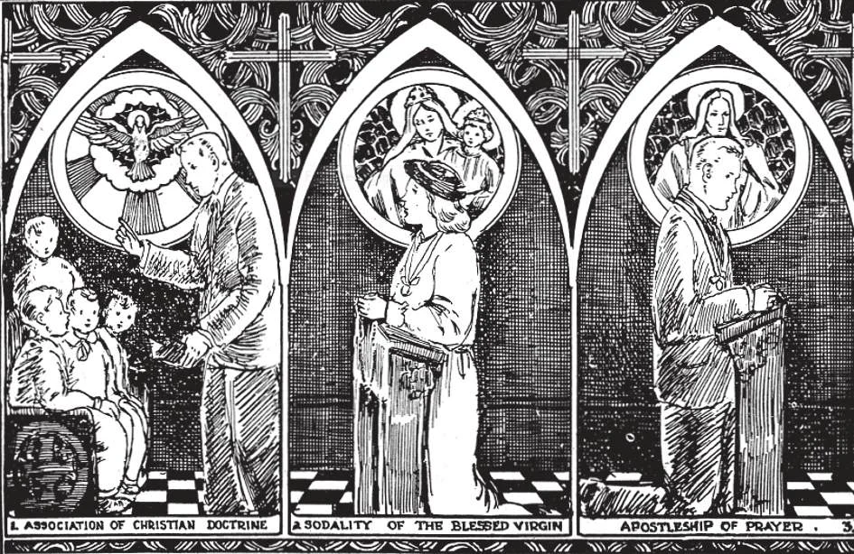

# 190. Associações Religiosas

*A ilustração (1) mostra um jovem, membro da Confraria da Doutrina Cristã. Esta importante sociedade deveria ser estabelecida em todas as paróquias. Na Sodálite de Nossa Senhora (2), os membros homenageiam a mais pura de toda a humanidade e se esforçam por imitar suas virtudes, especialmente a da castidade. Suas atividades nas paróquias incluem o ensino do catecismo. Um membro do Apostolado da Oração (3) visa ajudar a promover a glória de Deus em união com o Sagrado Coração de Jesus*

**O que são associações religiosas para os leigos?**

— Associações religiosas para os leigos são sociedades sob controle eclesiástico direto, estabelecidas para a santificação pessoal, para obras de caridade e para outros fins semelhantes. As associações religiosas são geralmente classificadas em: (1) terceiras ordens seculares; (2) confrarias; e (3) sociedades piedosas. Além disso, há associações que não têm um propósito distintamente religioso, mas todos os membros devem ser católicos piedosos.

> Destas últimas, os Cavaleiros de Colombo são os mais conhecidos e numerosos, uma sociedade fraternal de benefícios mútuos de homens católicos, com meio milhão de membros nos Estados Unidos, Canadá, Alasca, México, Cuba e Porto Rico.

**O que são terceiras ordens seculares?**

— Terceiras ordens seculares são sociedades de leigos afiliadas a ordens religiosas organizadas, fundadas para algum trabalho devocional ou ativo para a maior honra e glória de Deus.

> O objetivo das Terceiras Ordens é fazer com que a vida religiosa das ordens religiosas penetre nos lares, de modo que, em imitação de seus irmãos das Primeira e Segunda Ordens, os leigos no mundo possam aspirar a uma maior perfeição, embora não estejam obrigados por quaisquer votos sob pena de pecado.

As Terceiras Ordens são como ordens religiosas, sendo ramos destas às quais estão afiliadas. Têm um tempo de prova similar ao noviciado, uma regra e um hábito. A regra não é obrigatória sob pena de pecado. O hábito não é usado em público sem permissão.

> Há muitas Terceiras Ordens, como: Agostiniana, Beneditina, Carmelita, Dominicana, Franciscana, São Pio X, etc. Os membros das Terceiras Ordens são "irmãos", compartilhando dos méritos e da vida espiritual das primeiras e segundas ordens de religiosos.

**O que são confrarias?**

— Confrarias são sociedades de leigos erigidas por autoridade eclesiástica para o fomento de obras de piedade e caridade.

> As regras das confrarias não são obrigatórias sob pena de pecado. Contudo, se as regras não forem observadas, as graças especiais e indulgências a elas anexadas não são concedidas. As confrarias com o direito de afiliar associações similares a si mesmas são denominadas arquiconfrarias. Aqui listamos alguns exemplos de nossas maiores confrarias.

1. A **Confraria da Doutrina Cristã**, por ordem da Santa Sé, deve ser instituída em todas as paróquias, para promover um maior conhecimento e prática mais assídua da Fé Católica. Os meios utilizados são: classes de instrução, clubes de estudo e discussão, instrução domiciliar, e educação religiosa de não-católicos.

2. A **Sociedade do Santo Nome** visa promover o devido amor e reverência ao Santo Nome de Deus e de Jesus. {Ver página 199.}

3. A **Sociedade da Sagrada Família** é uma arquiconfraria que visa santificar as famílias cristãs. Homens, mulheres, e crianças podem todos tornar-se membros.

> Esta arquiconfraria tem cerca de cinco milhões de membros em todo o mundo.

**O que são sociedades piedosas?**

— Sociedades piedosas são associações de leigos que têm os mesmos objetivos que as confrarias, mas não possuem ereção canônica solene.

> Algumas sociedades piedosas têm como objetivo principal a santificação pessoal; algumas adotam práticas particulares de devoção; e outras se interessam por certas boas obras, como aulas de catecismo, arrecadação de fundos para a religião, etc. São denominadas de vários modos: uniões piedosas, sodálites e ligas.

1. O **Apostolado da Oração** (Liga do Sagrado Coração) promove a glória de Deus e a santificação de seus membros pela realização de todas as orações e boas obras em união com o Sagrado Coração de Jesus. Para se tornar membro, basta ter o nome registrado em um centro afiliado e receber o certificado de admissão. Há três graus de membros, com deveres espirituais correspondentes. As devoções mais comuns desta associação são a oferta da manhã e a devoção das primeiras sextas-feiras.

> A oferta da manhã é formulada assim: "Ó Jesus, pelo Coração Imaculado de Maria, ofereço-Vos todas as minhas orações, obras e sofrimentos deste dia, em união com o Santo Sacrifício da Missa em todo o mundo, em reparação pelos meus pecados, pelas intenções de todos os nossos associados e em particular pelas do Vosso Sagrado Coração neste mês." Somente nos Estados Unidos, o Apostolado da Oração tem 6.000.000 de membros.

2. A Legião de Maria é uma Associação de católicos, com a sanção da Igreja e a liderança de Maria Imaculada, Mediadora de todas as Graças. É uma Legião modelada após o exército da antiga Roma, para o serviço na guerra perpetuamente travada pela Igreja contra o mundo e seus poderes malignos, para realizar a Glória de Deus e a salvação das almas como seu fim último. A santificação pessoal é, todavia, o primeiro fim, bem como o meio principal para realizar o fim último, como o movimento do Espírito Santo, isto é, ter a graça divina é seu princípio motor.

> Além das outras associações religiosas, a Legião é notada por seu sistema intensamente ordenado. Tanto assim que é também a medida para a perfeição da adesão. Os membros são obrigados a comparecer a reuniões semanais por cerca de 60-90 minutos, e são designados para fazer trabalho apostólico por duas horas por semana. A Legião é uma combinação dos mais altos ideais, ação organizada e prontamente atingível por todos. A Legião de Maria teve tanto sucesso em todo o mundo, como bem testado nas mais difíceis perseguições da Igreja.

3. A **Confraria do Santíssimo Rosário** é uma associação religiosa para o fim de promover a devoção do Rosário. Os membros são obrigados a recitar quinze dezenas do rosário cada semana; isto não obriga sob pena de pecado.

> Para formar o "rosário vivo", quinze membros unem-se todos os meses para dividir entre si (geralmente por sorteio) as quinze dezenas do rosário. Diariamente, ao longo do mês, cada um recita a dezena que lhe coube em sorte. Assim, entre os quinze do grupo, o rosário inteiro é recitado todos os dias.

4. A **Sociedade de São Vicente de Paulo** é estabelecida para o socorro dos pobres e negligenciados; suas obras são uma personificação viva das obras de misericórdia corporais e espirituais. Somente homens católicos com mais de 18 anos são aceitos como membros. Cada um recebe uma família pobre para visitas semanais.

> Os membros honorários não têm famílias pobres sob seus cuidados especiais; mas fazem uma oferta anual de uma quantia fixa para as obras da Sociedade. A Sociedade gasta milhões de dólares todos os anos com os pobres. Há numerosas e dignas associações missionárias aprovadas, ativamente engajadas em trabalho missionário. Os bons católicos devem procurar pertencer a algumas delas, a fim de ajudar na propagação de sua Fé.
