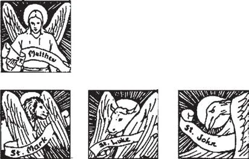

# 192. Simbolismo da Igreja

--.-- TODO: Add remaining images

**O que é simbolismo?**

— Simbolismo é a atribuição de um significado oculto a coisas externas, particularmente para expressar ideias religiosas.

> Pelo simbolismo, o homem apreende a realidade; a arte em todas as suas formas é a expressão simbólica de ideias indescritíveis, a manifestação positiva da beleza absoluta. É por isso que a cerimônia, que nada mais é senão uma representação simbólica, é vital para a vida do homem, cujos desejos mais elevados concernem à apreensão do último fim.

1. O simbolismo é inestimável, porque expressa ideias de outra forma completamente indescritíveis. Por exemplo: podemos expressar a ideia de eternidade em palavra ou imagem? No entanto, com que facilidade a ideia é representada pelo símbolo do círculo — algo sem começo, sem fim.

> Da mesma forma, não podemos explicar em volumes por mais numerosos que sejam a definição de Um só Deus em Três Pessoas; não podemos desenhar uma imagem dessa ideia. E, no entanto, tracemos um triângulo equilátero, e por esse símbolo a ideia é definitivamente transmitida: Três Pessoas co-iguais, co-eternas, contudo um só Deus.

2. Por um sinal familiar, um símbolo conta uma história; é uma marca de identificação. Expressa com exatidão e beleza certas verdades religiosas. Não é um fim em si mesmo, mas um meio para um fim: um símbolo usa a arte para os propósitos da religião.

> Um símbolo não deve ser uma representação de algo, mas sim um representante. Por exemplo, um homem não é símbolo de Nosso Senhor; mas um cordeiro com um estandarte repousando sobre um livro com sete selos, sim. E o verdadeiro simbolismo deve sempre ser entendido como representativo. Pois quando o símbolo é tomado como a própria coisa representada, então temos idolatria, um pecado contra o mandamento de Deus. Se adorarmos o próprio cordeiro, e não Jesus Cristo, então isso é idolatria. Deve-se, porém, entender claramente que o mandamento proíbe a adoração do símbolo, não o símbolo em si.

3. O simbolismo é essencial a todo tipo de culto religioso. O Antigo Testamento está repleto dele, formando a base do nosso simbolismo cristão, pelo qual apreendemos através dos nossos sentidos uma beleza e verdade absolutas dadas por Deus.

> O propósito dos símbolos é educativo: ajudar o homem a apreender o Infinito. Poucos sabiam ler; os livros eram caros e copiados à mão. A pregação nas enormes catedrais não era muito fácil, sem nossos dispositivos modernos. O povo amava a Deus; mas não podia aprender sobre Ele por instrução oral ou escrita. E assim o simbolismo veio em socorro, e as grandes igrejas tornaram-se livros didáticos belamente ilustrados, para todos lerem e compreenderem. O cristão medieval lia em objetos comuns entalhados, fundidos, pintados, bordados ou tecidos, um significado religioso e místico; essa era sua cultura, sua arte. Não devemos, porém, confundir tipos, ou mesmo pinturas, com símbolos. Se nos limitarmos a animais e objetos inanimados, e evitarmos personagens históricos, estaremos seguramente no reino do simbolismo. Moisés no Sinai não é um símbolo, mas um tipo, de Nosso Senhor no Monte. Da mesma forma, Sansão é um tipo de força, e São Jorge de coragem; eles não são símbolos.

4. Desde os tempos mais antigos, a Igreja tem feito uso de símbolos, para fomentar a devoção, ou para representar algum mistério da Fé que precisava ser mantido em segredo dos pagãos. Por exemplo: a Igreja primitiva usava um peixe para representar Cristo; uma cidade, um navio, ou uma mulher com os braços levantados para representar a Igreja.

**Nomeie os símbolos católicos mais comuns.**

— Os seguintes são os mais comuns:

1. Para a Santíssima Trindade: o triângulo equilátero para representar a igualdade bem como a unidade; uma combinação do triângulo com o círculo, para representar além disso a ideia de eternidade; os três círculos entrelaçados de tamanho idêntico; os triângulos entrelaçados, um com o ápice para cima e o outro com o ápice para baixo, formando assim uma estrela de seis pontas, que é um símbolo da criação; dois triângulos entrelaçados combinados com um círculo; o trevo, que é uma variação dos círculos entrelaçados; o trevo com triângulo, outro desenvolvimento dos três círculos com um triângulo equilátero; o trevo com três pontas, outro desenvolvimento.

> Outros símbolos para a Santíssima Trindade são: a triquetra, com arcos iguais do círculo simbolizando igualdade, unidade, eternidade, e indivisibilidade; a triquetra com um círculo; a triquetra com um triângulo; os três peixes dispostos em forma de triângulo.

2. Para Deus Pai: uma mão saindo de um banco de nuvens brilhantes; um olho em um triângulo equilátero; uma estrela de seis pontas, denominada estrela do Criador; as letras hebraicas para a palavra Jeová (Deus), dentro de um triângulo, e cercadas por raios; o yod hebraico dentro de um triângulo, ou dois yods dentro de raios de glória. 3. Para Deus o Espírito Santo: a pomba descendente, embora esta não deva ser muito realista, e deve ser com a chama de fogo tríplice, ou sete chamas; o pergaminho, para mostrar os sete dons; as sete lâmpadas, sete pombas, chama séptupla, candelabro de sete braços; a estrela com sete pontas, ou com nove pontas, para representar os sete dons ou os nove frutos do Espírito Santo. 4. Para Deus o Filho, nosso Salvador Bendito. Estes são quase numerosos demais para mencionar, sendo o mais importante a cruz, com cerca de cinquenta formas em uso. Nosso Senhor é representado por: o Cordeiro de Deus sobre um livro com sete selos, ou com um estandarte de vitória, ou com ambos; o Bom Pastor; a estrela de cinco pontas; o peixe; o pelicano alimentando seus filhotes com seu sangue; a cruz sobre um orbe; a videira; a rocha; o unicórnio; monogramas sagrados.

> O símbolo "Chi Rho" é uma abreviação da palavra Cristo, com as letras gregas X e P, as duas primeiras letras da palavra em grego. Como outros monogramas para Jesus, possui várias formas. Às vezes o Chi Rho é combinado com o Alfa e o Ômega, ou com a cruz grega, ou com a letra N (Nika, significando conquistador). O símbolo IHC é uma abreviação da palavra grega para Jesus. Hoje também se usa IHS. Outra variação é IC XC, para representar Jesus Cristo. INRI significa "Jesus de Nazaré, Rei dos Judeus".

5. Para a Santíssima Virgem: o lírio, símbolo de virgindade e pureza; a flor-de-lis em várias formas; a rosa, branca ou rosa; o coração transpassado; a lua crescente; a coroa com estrelas; uma estrela; seu monograma, a amendoeira florida, a porta fechada, o livro selado.

> Os símbolos dos quatro Evangelistas são: uma cabeça humana para São Mateus, porque seu Evangelho começa com uma relação da ascendência humana de Cristo; um leão para São Marcos, porque o início de seu Evangelho relata a história de São João Batista no deserto, lar de bestas selvagens; um boi para São Lucas, porque este animal era um símbolo de sacrifício, e o Evangelho de São Lucas começa com uma relação do sacerdote Zacarias no Templo; uma águia para São João, porque os versículos de abertura de seu Evangelho levam o leitor em um voo ao Infinito.

> Outros símbolos são: para os Sacramentos — a pia batismal, uma pomba, um cálice, um chicote, um vaso de óleo, mãos unidas e uma estola; para a Palavra de Deus, uma Bíblia aberta, uma luz ardente, uma vela, dois pergaminhos; para a Penitência, um prie-dieu; para o Matrimônio, duas mãos unidas; para as Ordens Sagradas, uma estola, ou um cálice sobre uma Bíblia, com estola dobrada; para a oração, um turíbulo com incenso fumegante; para a música sacra, um ambão; para a Epístola e o Evangelho, um ambão duplo; para a bênção, uma mão erguida sem nimbo. Um estandarte simboliza vitória; uma espada flamejante, a autoridade de Deus; uma coroa, autoridade soberana; duas tábuas de pedra, os Mandamentos; um livro ou pergaminho, a Lei; chaves cruzadas, o poder do Papa.

6. Para a Igreja temos os símbolos de: a arca, o navio, a arca da aliança; a videira; a mulher com o dragão sob os pés; a mulher coroada; a noiva com cálice e livro; a casa sobre a rocha; a cidade sobre o monte; o candelabro; o trigo e o joio; a rede. 7. Símbolos ainda comumente usados são: o ramo de oliveira para a paz; a palma para o martírio; o lírio para a pureza; o halo para a santidade; a rosa para o amor e beleza da alma. A fé, a esperança, e a caridade são representadas por uma cruz, uma âncora, um coração.
