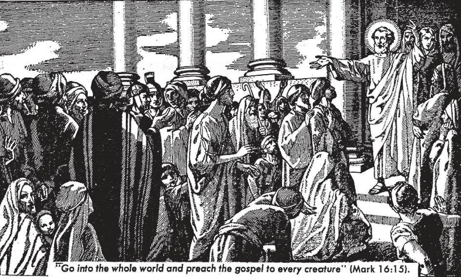

# 193. Conclusão: Por Que Sou Católico

*Estas são as principais cerimônias na consagração de igrejas, uma ocasião solene. O bispo prostra-se junto à entrada e recita a Ladainha de Todos os Santos. Levantando-se, circunda o edifício da igreja três vezes por fora, enquanto asperge as paredes com água benta; cada vez que passa pela porta principal, bate nela com seu báculo. Em seguida, marca o limiar com o sinal da cruz, usando o báculo; depois disso, entra na igreja, ajoelha-se e invoca o Espírito Santo. Em seguida, o bispo traça as letras dos alfabetos grego e latino sobre o pavimento, no qual foram espalhadas cinzas. Ele dá três voltas pelo interior da igreja, aspergindo as paredes com água benta; depois percorre três vezes o centro do edifício de um lado a outro. Segue-se a unção das paredes em doze lugares, onde são colocadas velas. Finalmente, o altar é consagrado. O efeito destas cerimônias e orações é reservar o edifício exclusivamente para o serviço de Deus. O sinal da cruz após a batida na porta significa a força da cruz de Cristo, a quem ninguém pode resistir. As letras dos alfabetos significam que todas as nações, sem exceção, são chamadas à Igreja de Deus. O percorrer de um lado a outro o interior da igreja significa a honra prestada à Santíssima Trindade e à crucificação de Jesus Cristo. As doze velas acesas representam os doze Apóstolos, que espalharam a luz do Evangelho de Cristo.*

**Como é que a nossa razão nos aponta a verdade da religião católica?**

— A nossa razão nos aponta a verdade da religião católica por estes princípios:

1. Existe um Deus (ver páginas 6-29). Basta-nos olhar ao nosso redor e contemplar os céus e as maravilhas da natureza, para termos a certeza de que toda esta ordem e beleza não poderiam ter surgido senão pelo poder onipotente de um Ser inteligente, Deus.

> Quem fez os corpos celestes e os colocou em lugares fixos, e traçou os caminhos que deveriam seguir de idade em idade? Quem fez as árvores e ordenou que plantas particulares brotassem de certas sementes? Quem fez a vida? Quem, senão Deus?

2. A alma do homem é imortal (ver páginas 34-38). O homem pode raciocinar, tirar conclusões abstratas, distinguir entre o certo e o errado. Estes são atos de uma faculdade espiritual, e a alma à qual pertence esta faculdade deve ser espiritual e independente da matéria e, sendo assim, não está sujeita à morte. O homem pode dizer ***Não*** a si mesmo.

> Nenhum outro ser na terra pode fazer as coisas espirituais que o homem pode fazer. Neste mundo, só o homem tem inteligência e livre-arbítrio, portanto só ele tem uma alma imortal.

> Os animais agem apenas por instinto e sensação, que são órgãos do corpo; os animais, portanto, não podem ser imortais.

3. Todos os homens são obrigados a praticar a religião (ver páginas 2-3, 170-171, 186-187). O homem, com sua alma inteligente e imortal, pode conhecer Deus segundo os limites que Deus estabeleceu. Ele sabe que deve a Deus a sua própria existência, que é inteiramente dependente d'Ele. Desta origem e dependência surge o dever do homem de prestar ao seu Criador a honra e adoração devidas, em outras palavras, seu dever de praticar a religião.

> Para ser fiel a Deus, devemos servi-Lo obedecendo aos Seus mandamentos e realizando os Seus desejos; crendo n'Ele, esperando n'Ele, e amando-O com todo o nosso coração. Todas estas coisas aprendemos quando estudamos a nossa religião; todas estas fazemos bem quando somos fiéis na prática da nossa religião.

4. A religião que Deus revelou através de Cristo é digna de crença (ver páginas 14-21, 56-59, 66-75). Nosso Senhor anunciou-Se Filho de Deus e, como tal, pregou Suas doutrinas que Ele exigia que crêssemos. Para provar que era verdadeiramente Deus, Nosso Senhor operou inúmeros milagres.

> Só Deus pode operar milagres, e Ele não pode operá-los para aprovar o que é falso. Os milagres, portanto, operados em favor do ensinamento de Jesus Cristo são provas manifestas de que Seu ensinamento é verdadeiro.

5. Cristo estabeleceu uma Igreja à qual todos são obrigados a pertencer. Ele declarou que todos os homens devem crer e ser batizados, isto é, pertencer à Sua Igreja, para serem salvos. (Ver páginas 94-99)

> Nosso Senhor reuniu em torno de Si um grupo de discípulos e chamou-o de Sua Igreja. Ele prometeu que esta Igreja duraria para sempre. "Quem não crer será condenado" (Marcos 16:16). "Ide, pois, e ensinai a todas as nações, batizando-as em nome do Pai, e do Filho, e do Espírito Santo, ... e eis que estou convosco todos os dias, até a consumação dos séculos" (Mateus 28:19-20).

6. A única verdadeira Igreja de Cristo é a Igreja Católica. Só a Igreja Católica possui as marcas de unidade, santidade, catolicidade, e apostolicidade, marcas da Igreja estabelecida por Jesus Cristo. (Ver páginas 100-107, 132-145.)

> A história da Igreja Católica dá evidência incontestável de força miraculosa, permanência e imutabilidade, mostrando assim ao mundo que está sob a proteção especial de Deus, que disse: "As portas do inferno não prevalecerão contra ela" (Mateus 16:18).

Demos graças a Deus por Seus dons. Podemos melhor mostrar nossa gratidão a Deus por nos ter feito membros da única verdadeira Igreja de Jesus Cristo, agradecendo frequentemente a Deus por esta grande graça, levando uma vida católica edificante e prática, procurando levar outros à verdadeira fé, e ajudando as missões.

> Agradecemos a Deus pelas graças que derrama sobre nós na oração e por nossas boas vidas. Seguindo os mandamentos de Deus e da Igreja e fazendo boas obras, levamos vidas católicas práticas e edificantes; tais vidas são a melhor maneira de levar outros à nossa Fé, se não tivermos meios mais diretos; tais vidas, dizemos, ***"Deo gratias!"***

