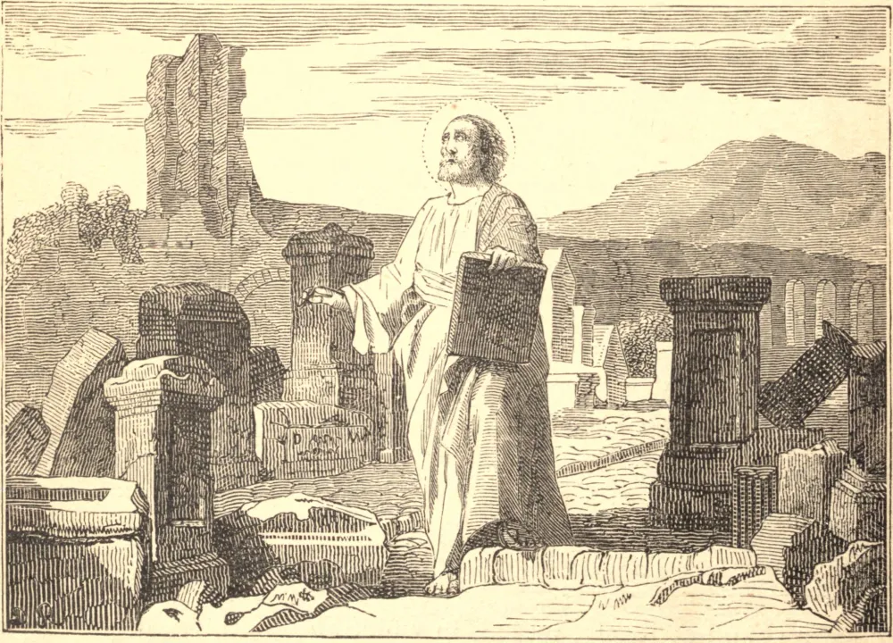

# April 7.—ST. HEGESIPPUS, a Primitive Father

HE was by birth a Jew, and belonged to the Church of Jerusalem, but travelling to Rome, he lived there nearly twenty years, from the pontificate of Anicetus to that of Eleutherius, in 177, when he returned into the East, where he died at an advanced age, probably at Jerusalem, in the year of Christ 180, according to the chronicle of Alexandria. He wrote in the year 133 a History of the Church in five books, from the Passion of Christ down to his own time, the loss of which work is extremely regretted. In it he gave illustrious proofs of his faith, and showed the apostolical tradition, and that though certain men had disturbed the Church by broaching heresies, yet down to his time no episcopal see or particular church had fallen into error. This testimony he gave after having personally visited all the principal churches, both of the East and the West.
